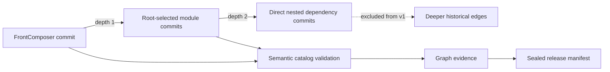
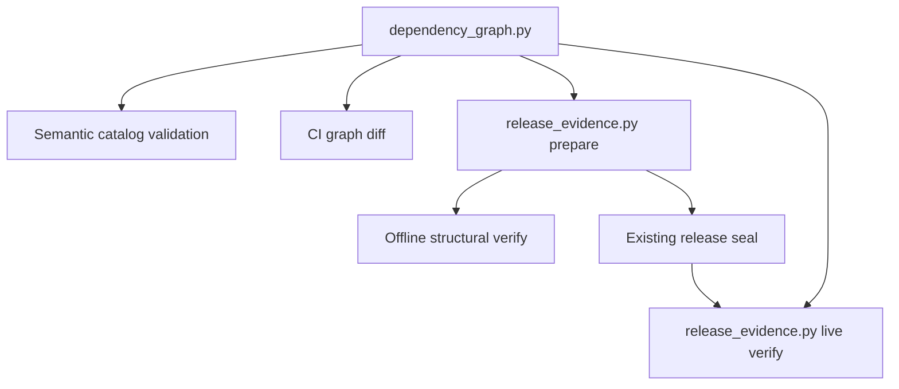

# Architecture Spine — GOV-1 Dependency Provenance

## Design Paradigm

**Bounded committed-object graph.** GOV-1 models dependency provenance from an explicit FrontComposer
commit as a closed-world, depth-bounded graph read from immutable Git objects. Semantic compatibility
is evaluated over selected catalog bytes; exact graph identity is sealed separately as provenance.



## Invariants & Rules

### AD-1 — `[ADOPTED]` v1 graph boundary

- **Binds:** GOV-1 graph collection, CI diffing, manifest preparation, live verification, and fixtures.
- **Prevents:** collectors independently choosing root-only, direct-nested, or historical-transitive scope.
- **Rule:** `hexalith.dependency-graph.v1` contains every gitlink at the explicit FrontComposer root
  commit as depth 1 and every gitlink in each exact root-selected repository commit as depth 2. Edges
  below depth 2 are outside v1. The creation census is evidence (8 + 32 = 40), not a fixed acceptance
  count. Complete historical traversal requires a new schema and approval.

### AD-2 — `[ADOPTED]` committed objects are authoritative

- **Binds:** graph collectors, catalog validators, CI, pre-publication and post-publication verification.
- **Prevents:** provenance changing with the ambient index, nested checkout HEADs, or mutable worktrees.
- **Rule:** accept an explicit repository identity and 40-hex root commit; read trees, committed
  `.gitmodules`, and catalogs from exact Git objects. Never clone candidate URLs, move submodule HEADs,
  or initialize nested submodules to construct evidence.

### AD-3 — `[ADOPTED]` repository resolution is closed-world

- **Binds:** every graph node and edge.
- **Prevents:** candidate-controlled URLs expanding trust or resolving one repository under multiple names.
- **Rule:** resolve only the explicit FrontComposer root identity and identities declared by its root
  `.gitmodules`, and validate both base/candidate mappings against the active, immutable
  FrontComposer-owned policy revision selected by AD-12. HTTPS forbids userinfo, port, query,
  fragment, and percent escapes. SSH/SCP requires
  user `git`, host `github.com`, default port, and exactly `owner/repository`. Strip one terminal `.git`,
  lowercase ASCII, and reject controls, extra/dot segments, duplicate identities/paths, and unsafe paths.

### AD-4 — `[ADOPTED]` v1 edge identity and deterministic order

- **Binds:** collectors, diffs, offline verification, live verification, and test fixtures.
- **Prevents:** duplicate suppression, unstable array order, and incompatible graph digests.
- **Rule:** record every depth-1/2 edge, including self/back-reference edges, before object-read or
  catalog-validation deduplication.
  Edge uniqueness is `(owner_repository, owner_commit, path)`; owner object reads deduplicate by
  `(repository, commit)` without suppressing edges. Each edge
  contains `owner_repository`, `owner_commit`, `path`, `repository`, `commit`, and `depth`; Builds edges
  additionally contain raw-byte `catalog_sha256` and nullable `catalog_contract_version`. Sort by
  `(depth, owner_repository, owner_commit, path, repository, commit)` using ordinal comparison.

### AD-5 — `[ADOPTED]` v1 canonical material and digest

- **Binds:** graph producers, manifest seals, fallback invalidation, and every verifier.
- **Prevents:** two conforming implementations hashing different bytes for the same logical graph.
- **Rule:** the envelope has exactly the members
  `{schema, root:{repository,commit}, edge_count, edges, graph_digest}`; `schema` is exactly
  `hexalith.dependency-graph.v1`, and `edge_count == len(edges)`. `root` has exactly its two named
  members. A non-Builds edge has exactly the six AD-4 members; a Builds edge has exactly those six
  plus `catalog_sha256` and `catalog_contract_version`. Reject missing or unknown members, duplicate
  JSON member names at any nesting level, JSON booleans where integers are required, and depths other
  than integer 1 or 2. Validate an ASCII-only value domain, strict lowercase 40-hex commits, strict
  lowercase 64-hex SHA-256 values, and normalized relative POSIX paths. Until BUILD-CAT-1 defines a
  tighter marker, `catalog_contract_version` is JSON `null` or a 1-64 character ASCII token matching
  `[A-Za-z0-9][A-Za-z0-9._-]{0,63}`. Compute `graph_digest`
  over `{schema, root, edge_count, edges}` using Python-equivalent `ensure_ascii=true`,
  `allow_nan=false`, `sort_keys=true`, and separators `(',', ':')`, encoded as UTF-8 without BOM or
  trailing newline. The existing outer manifest seal binds the entire graph object. This is project
  canonicalization v1, not RFC 8785; a golden digest fixture pins the bytes. V1 accepts only Git SHA-1
  object format and fails closed for another format; a future schema may support Git SHA-256 IDs.

### AD-6 — `[ADOPTED]` compatibility and provenance are separate

- **Binds:** semantic validators, Governance tests, graph evidence, and release classification.
- **Prevents:** commit/catalog fingerprints becoming compatibility allowlists.
- **Rule:** hash raw catalog blob bytes and parse those same bytes for the applicable semantic
  package/import/marker contract. Semantic validity decides compatibility; commit and fingerprint
  changes appear in provenance and graph diff only. The marker is `null` until BUILD-CAT-1 supplies it
  and a separate migration approval makes it mandatory. Blob load/parse/hash caches by Builds
  `(repository, commit)`; semantic evaluation runs for every selector edge or equivalent owner contract
  profile; evidence and diagnostics retain every selector. The Python graph engine is the single
  canonical semantic-policy implementation; C# Governance invokes its machine result and retains
  repository-wide MSBuild ownership assertions rather than reimplementing catalog policy. Every owner
  of a Builds selector must resolve to exactly one semantic profile in AD-12; no implicit/default
  profile is permitted. The seed profile registry is closed over the root and eight root-declared
  identities: FrontComposer, EventStore, Memories, and Parties have named consumer profiles; Builds,
  Commons, PolymorphicSerializations, Tenants, and AI.Tools have an explicit
  `shared-catalog-baseline-v1` profile. A missing owner/profile mapping or unknown rule fails closed.

### AD-7 — `[ADOPTED]` bounded traversal fails closed

- **Binds:** collectors and all verification modes.
- **Prevents:** partial graphs, unbounded resource use, and silent evidence loss.
- **Rule:** within depths 1-2, fail on missing/unavailable objects, missing or duplicate mappings,
  unknown identities, duplicate edges, malformed inputs, unavailable catalogs, or any resource ceiling.
  Inclusive v1 ceilings are 4,096 edges, 64 MiB raw `ls-tree` output per owner commit, 1 MiB per raw
  committed `.gitmodules` blob, and 4 MiB per raw catalog blob. Measure before decoding/parsing and fail
  before consuming beyond the ceiling. Use `cat-file -s` before bounded blob reads and stream
  `ls-tree -r -z --full-tree` bytes/records under both byte and edge ceilings. Boundary fixtures pin
  each limit. A Builds contract-tree materialization for an affected build additionally permits at most
  16,384 regular files, 16 MiB per blob, and 256 MiB summed raw blob bytes; reject symlinks, gitlinks,
  special modes, unsafe paths, and any limit before extraction. Deeper edges are excluded by AD-1, not
  reported as unresolved.

### AD-8 — `[ADOPTED]` CI uses one explicit revision model

- **Binds:** pull-request graph diff and affected-module gates.
- **Prevents:** comparing one candidate SHA while building another or executing candidate-controlled commands.
- **Rule:** for pull requests, use `github.event.pull_request.base.sha` as `event_base`, `github.sha`
  as the exact merge revision already built by primary CI, and compute `merge_base = git merge-base
  event_base github.sha`. Require `merge_base == event_base`; otherwise fail closed instead of silently
  changing the comparison boundary. Diff `event_base` against `github.sha`, record all three revisions,
  and collect/build that same merge revision. For pushes, compare `github.event.before` with
  `github.sha`; a zero/unavailable base takes the fail-closed full-affected path. Diff logical edges by
  `(owner_repository, path, repository)`. Classify depth-1 changes first: added/changed edges build the
  candidate target module and removed edges build FrontComposer root. A changed/removed depth-1 edge
  subsumes every depth-2 change owned by its prior/candidate module, preventing a cascade from scheduling
  a nonexistent candidate owner. Remaining added/changed/removed depth-2 edges build their candidate
  owner; if that owner is absent, collapse to FrontComposer root. Deduplicate by canonical module
  identity; an unchanged graph builds no module. Commands and evidence-only dispositions come from the
  active policy revision and closed matrix below; candidates supply no executable policy. Before each
  build, materialize the exact candidate owner commit in isolation. For an edge-bound catalog, extract
  the bounded regular-file contract tree, including raw catalog bytes, from the exact candidate Builds
  commit into the listed gitlink path, then verify the catalog SHA-256 against the graph; do not
  initialize that nested repository. A self-bound Builds target uses its committed tree/catalog.

### AD-9 — `[ADOPTED]` offline structure and live identity are distinct verification modes

- **Binds:** manifest preparation, sealing, fallback invalidation, pre-publication and post-publication verification.
- **Prevents:** a structurally valid manifest being accepted after repository/catalog drift.
- **Rule:** offline verification parses JSON with duplicate-member rejection, enforces the closed AD-5
  schema, and validates types, uniqueness, ordering, counts, and digest. Live verification additionally
  resolves the sealed root commit, reconstructs the v1 graph, and compares every edge and raw catalog
  hash. V2 fallback approval uses exactly
  `canonical_sha256({"definition": fallback_invalidation_fingerprints,
  "package_set": package_set_fingerprint, "dependency_graph": graph_digest,
  "dependency_policy": policy_sha256, "workflow_definition": workflow_definition_digest})`; graph,
  active policy, and trusted CI/release workflow definitions therefore invalidate fallback. Collection,
  semantic diagnostics, preparation, sealing, offline/live verification, fallback invalidation,
  fixtures, Governance pins, and post-publication verification change atomically. Any failure yields blocked/invalid evidence and
  `publish_authorized=false` before NuGet/GitHub side effects; post-publication verification never
  authorizes a publication after the fact. Prepare, live verify, fallback digest/comparison, and
  prepublish orchestration all receive the same explicit 40-hex root commit; `local` never yields a
  valid governed manifest.

### AD-10 — `[ADOPTED]` acquisition is isolated from collection

- **Binds:** CI graph collection and live release verification.
- **Prevents:** collectors silently depending on ambient object stores or mutating shared checkouts.
- **Rule:** the collector is offline and object-only. CI may acquire exact objects only from the
  explicit root repository and root-declared approved remotes into isolated temporary bare stores.
  It prepares identity-to-object-store maps for both base and candidate, including removed-base edges,
  and passes those maps to collection. It never initializes nested submodules or moves a shared
  checkout. Missing objects after bounded acquisition fail closed.

### AD-11 — `[ADOPTED]` GOV-1 is governance-only

- **Binds:** all GOV-1 implementation tasks and completion evidence.
- **Prevents:** dependency provenance work absorbing runtime, API, packaging, or UX scope.
- **Rule:** GOV-1 changes no runtime/public API behavior, generated output, package inventory,
  dependency versions, or UX. After GOV-1, Story 11.17d reruns its complete promotion lane on the exact
  candidate revision; GOV-1 does not mark that story complete.

### AD-12 — `[ADOPTED]` one versioned trust and semantic policy

- **Binds:** identity/path resolution, semantic profiles, affected-module commands, evaluator trust, limits, and release fingerprints.
- **Prevents:** candidate `.gitmodules`, C# tests, Python code, and workflows independently defining trust or compatibility.
- **Rule:** a FrontComposer-owned versioned `eng/dependency-graph-policy.json` is the single declarative
  policy for trusted repository identity/path mappings, owner semantic profiles, supported module argv,
  evidence-only dispositions, evaluator authorizations, and v1 limits. Base/candidate `.gitmodules`,
  workflows, and action metadata are untrusted candidate data.
  For a PR, the active policy is read from `event_base`; for a push, it is read from the non-zero
  `github.event.before`. Both base and candidate graphs are evaluated with that exact policy revision,
  and evidence records its repository, 40-hex commit, raw-byte SHA-256, and policy schema. A policy
  change cannot authorize itself: it becomes eligible only as the active base policy of a later change.
  A zero/unavailable `before` cannot select trust: it may run full-affected diagnostics, but the gate
  fails and the run is never release-eligible.
  The one-time v1 bootstrap is allowed only when no base policy exists, the dependency graph is
  unchanged, the candidate policy exactly projects this spine's closed seed registries/schema,
  publication remains frozen, and the Release Owner-controlled repository variable
  `HEXALITH_DEPENDENCY_POLICY_BOOTSTRAP_SHA256` equals the exact candidate policy digest approved by the
  Architect + Release Owner in GOV-1 review evidence. The bootstrap record names that authority and
  digest. After that policy lands, base-policy existence makes bootstrap mode permanently unavailable;
  the next run follows the ordinary base/before rule. Bind the policy into `RELEASE_DEFINITION_FILES` and
  `FALLBACK_INVALIDATION_FILES`; bind `.github/workflows/ci.yml`, `eng/dependency_graph.py`, and the
  versioned handoff contract into the release-definition surface as well. Policy changes require
  Governance fixtures and review.

  `evaluator_authorizations` is a closed, sorted registry for stages `ci`, `release`, and
  `post_release`. Each allowed entry contains exactly `{stage,caller,reusable,actions,closure_digest}`.
  `caller` is `{repository,workflow_path,blob_sha256}` so a future local workflow blob can be approved
  before its commit exists. `reusable` is `{repository,workflow_path,commit,blob_sha256}`; every action
  is `{repository,path,commit,blob_sha256}`. External commits are literal lowercase 40-hex values.
  `closure_digest` is the AD-5 canonical SHA-256 of the other four members, and actions sort ordinally
  by `(repository,path,commit,blob_sha256)`. Runtime provenance adds the actual caller commit but must
  project exactly one active-policy authorization. A policy revision may pre-authorize a next closure;
  switching to it happens only in a later change governed by that now-active policy. A well-formed or
  sealed closure absent from this registry fails before CI handoff, release, or verification.

### AD-13 — `[ADOPTED]` release consumes the exact CI-tested revision

- **Binds:** the `workflow_run` caller, reusable release workflow, release evidence, and publication freeze.
- **Prevents:** a successful CI run for one commit authorizing checkout or publication from a later default-branch head.
- **Rule:** the caller passes `github.event.workflow_run.head_sha` as an explicit required 40-hex input;
  the reusable release workflow checks out exactly that input and every preparation, seal, live verify,
  fallback, and publication step consumes it. The reusable workflow itself is referenced by an approved
  immutable 40-hex Hexalith.Builds commit, and that workflow commit plus the caller workflow hash are
  sealed as release definition provenance. The caller also passes the triggering CI run ID; release
  uses a read-only GitHub token and the Actions run/artifact APIs to verify repository
  `Hexalith/Hexalith.FrontComposer`, workflow path `.github/workflows/ci.yml`, event `push`, branch
  `main`, conclusion `success`, run ID, artifact name `dependency-release-handoff`, and
  `head_sha == workflow_run.head_sha`. It then requires the artifact's recorded candidate to equal that
  same SHA before accepting graph/policy coordinates. CI supplies the active policy coordinates selected
  by AD-12; release reloads `eng/dependency-graph-policy.json` from that exact recorded FrontComposer
  commit, verifies the raw SHA-256 and closed policy schema, and reuses it rather than selecting policy
  from the ambient branch. The current `@main` caller
  and reusable workflow contract without a release-commit input are non-conforming, so the REL-4
  publication freeze remains mandatory until the exact-revision seam and its tests exist.

  The artifact contains exactly one duplicate-member-free `dependency-release-handoff.json` with
  `{schema, run, revisions, evaluator, dependency_policy, dependency_graph}`. `schema` is exactly
  `hexalith.dependency-release-handoff.v1`; `run` is exactly
  `{repository, workflow_path, run_id, run_attempt, event, branch, candidate}`; `revisions` is exactly
  `{base, candidate, merge_base}`, where `merge_base` is null for push evidence. `evaluator` is exactly
  `{caller, reusable, actions, definition_digest}` using the workflow-source shapes below. Policy and
  graph use the closed AD-14/AD-5 shapes. `run_id` and `run_attempt` are JSON integers >= 1; release
  handoff requires the literal event `push`, branch `main`, exact canonical repository/workflow paths,
  and lowercase full hashes under the consistency conventions. `evaluator.definition_digest` is exactly
  the AD-5 canonical SHA-256 of `{caller, reusable, actions}`. Release recomputes it, computes the raw
  handoff JSON SHA-256, and requires both values to equal the CI projection in AD-14.

  Primary CI's `domain-ci.yml` reusable reference is a literal active-policy-authorized 40-hex commit. At runtime,
  record and validate its actual caller `github.workflow_ref/github.workflow_sha` and reusable
  `job.workflow_ref/job.workflow_sha`; every transitive action source follows the same closure as release.
  The current CI `domain-ci.yml@main` and its `initialize-build@main`/`dapr-init@main` references are
  non-conforming trusted-evaluator inputs and must not authorize release handoff.

  For release, record and validate the actual caller `github.workflow_ref/github.workflow_sha` and
  reusable `job.workflow_ref/job.workflow_sha`; they must equal the sealed commit/blob coordinates and
  the literal pinned workflow references. Every transitive non-local `uses:` in the release path is a
  literal 40-hex commit. A Builds-owned local action must be checked out at `job.workflow_sha` and invoked
  from that checkout; `initialize-build@main`, `dapr-init@main`, or another mutable transitive reference
  is forbidden. Governance constructs the same static transitive source closure and requires it to
  equal one active-policy authorization.

  The closure is static, not a runtime-path trace: conditions do not remove sources. A
  standard-library `eng/workflow_source_closure.py` reads exact Git blobs and recursively follows every
  literal job/step `uses:` in the caller, reusable workflows, and `action.yml`/`action.yaml` composite
  metadata. Local references resolve inside the same exact repository commit; external action and
  reusable references require literal 40-hex commits and repositories already named by the matching
  active-policy authorization. Acquisition fetches only those exact commits into bounded isolated bare
  stores; workflow/action text never supplies a remote URL. JavaScript actions terminate at their exact
  metadata/repository commit. Docker actions, mutable refs, expressions in `uses:`, ambiguous/missing
  metadata, anchors/aliases/merge keys affecting `uses:`, and unsupported multiline/inline `uses:`
  forms fail closed. Composite cycles fail closed. The closure is capped at depth 16, 256 unique source
  blobs, 1 MiB per workflow/action metadata blob, and 16 MiB total raw metadata; limits are checked
  before decoding. Golden fixtures cover conditional sources, a local composite with external
  descendants, duplicate paths, a cycle, mutable/dynamic refs, ordering, and every limit.

### AD-14 — `[ADOPTED]` manifest migration is one-way and fail-closed

- **Binds:** manifest producer, verifier, fixtures, fallback approvals, and historical evidence.
- **Prevents:** legacy evidence being silently upgraded, resealed, or treated as dependency-complete.
- **Rule:** GOV-1 introduces the required top-level members
  `manifest_schema: hexalith.release-evidence.v2`, `dependency_graph: <complete AD-5 envelope>`, and
  `dependency_policy: {schema, repository, commit, sha256}`, where the policy object has exactly those
  four members and `schema` is `hexalith.dependency-graph-policy.v1`. It also introduces top-level
  `workflow_provenance` with exactly `{ci, release, definition_digest}`. `ci` is exactly
  `{run:{repository,workflow_path,run_id,head_sha},evidence_sha256,caller,reusable,actions}` and `release`
  is exactly `{caller,reusable,actions}`. Each caller/reusable source is exactly
  `{repository,workflow_path,commit,blob_sha256}`. Each `actions` member is the explicitly sorted static
  AD-13 closure of unique exact `{repository,path,commit,blob_sha256}` objects, independent of runtime
  conditions and sorted ordinally by that tuple. Repositories/paths are normalized ASCII identities/POSIX paths;
  commits and blob/digest values follow the strict lowercase full-hash conventions. Run IDs/attempts
  are JSON integers >= 1, never strings or booleans.
  `definition_digest` is the AD-5 canonical SHA-256 of
  `{ci:{caller,reusable,actions},release:{caller,reusable,actions}}`, excluding dynamic run metadata.
  Manifest `ci.caller`, `ci.reusable`, and `ci.actions` are logically identical to the handoff evaluator;
  `ci.run` projects the authenticated handoff run as `{repository,workflow_path,run_id,head_sha}`; and
  `ci.evidence_sha256` is exactly the raw handoff JSON SHA-256. Offline verification recomputes both the
  CI-only evaluator digest and overall workflow definition digest and rejects any unequal projection.
  The existing seal remains SHA-256 over
  Python-equivalent compact, sorted-key JSON of every top-level member except `seal`, so all new
  members are sealed. Legacy manifests without that schema may be parsed only by
  an explicit audit/diagnostic mode; they are always non-publishable, cannot satisfy fallback, and are
  never resealed or upgraded in place. Historical ledger bytes remain unchanged. Current fixtures are
  regenerated as v2 fixtures in the same atomic implementation change.

### AD-15 — `[ADOPTED]` release-to-verifier handoff preserves the original candidate

- **Binds:** release completion/failure, `release-evidence.yml`, downloaded-asset verification, and the ledger.
- **Prevents:** the second `workflow_run` hop substituting its default-branch SHA or green-no-oping a released candidate.
- **Rule:** the caller-side Release workflow uploads exactly one `release-verification-handoff`
  artifact under `if: always()` for every governed attempt. It contains one duplicate-member-free
  `release-verification-handoff.json` with schema `hexalith.release-verification-handoff.v1` and exactly
  `{schema,release_run,ci_handoff,candidate,dependency_policy,release,manifest,assets,evaluator}`.
  `release_run` is exactly
  `{repository,workflow_path,run_id,run_attempt,conclusion}`; `candidate` is the original authenticated
  CI 40-hex head from AD-13; `ci_handoff` is exactly
  `{repository,workflow_path,run_id,run_attempt,evidence_sha256}` and identifies the authenticated
  AD-13 artifact; `dependency_policy` is the exact AD-14 policy projection copied from that artifact;
  `release` is exactly `{version,tag,github_release_id,published}`;
  `manifest` is exactly `{path,sha256,seal}`; `assets` is an ordinally sorted unique array of
  `{name,sha256,size}`; and `evaluator` is the actual active-policy-authorized Release caller/reusable/
  static-action closure plus its digest. Failed or pre-publication attempts use JSON `null` for
  unavailable version/tag/release-ID/manifest fields, `published=false`, and an empty asset array; they
  never omit the artifact. Strings, hashes, integers, nullability, ordering, duplicate rejection, and
  ceilings follow the manifest conventions; the verifier records the raw handoff SHA-256.

  The post-release workflow authenticates the triggering Release run ID/attempt, repository, workflow
  path, and conclusion via read-only Actions APIs, downloads that run's named artifact, then independently
  authenticates and downloads the named CI artifact at `ci_handoff.run_id/run_attempt`. It requires the
  raw CI handoff hash, candidate, and policy projection to equal the Release handoff even when manifest
  creation failed; reloads that exact base/before policy blob and hash; and requires its own caller/static
  closure to match a `post_release` authorization. It derives the live root only from the handoff candidate and sealed
  manifest, never from the second-hop `workflow_run.head_sha`, `GITHUB_SHA`, a branch, or a tag lookup.
  If `published=true`, exact version/tag/release ID, manifest, asset names/sizes/hashes, and downloaded
  NuGet/GitHub bytes must agree before ledger acceptance. If false or partial, it records the failed or
  incident state and cannot green-no-op. A race fixture advances default branch between CI, Release,
  and verification and still verifies the original candidate. A pre-manifest Release failure fixture
  proves the CI/policy projection still authorizes verification and records the failed attempt.

### AD-16 — `[ADOPTED]` Hexalith.Builds workflow revision is an external completion gate

- **Binds:** primary CI, reusable release, GOV-1 completion, REL-4 unfreeze, and the next governed release.
- **Prevents:** FrontComposer editing shared Builds source, silently weakening provenance, or claiming completion against `@main`.
- **Rule:** Hexalith.Builds issue 17 / BUILD-REL-1 is amended by GOV-1 to deliver the exact AD-13/AD-15
  reusable CI/release inputs, outputs, runtime identity checks, static closure, handoff, exact-candidate,
  and `if: always()` verification-artifact contracts. FrontComposer records an owner-accepted immutable
  40-hex Builds revision and its workflow/action blob hashes in the upstream request and active policy
  before integrating it. Local graph, semantic, policy, and fixture work may proceed, but GOV-1 Tasks
  4/5, story completion, release eligibility, and any REL-4 unfreeze remain blocked while the accepted
  revision is `pending`. No FrontComposer-owned contingency is authorized by GOV-1; one requires a new
  dated Release Owner + Architect decision with scope, expiry, migration trigger, and equivalent proofs.

## Consistency Conventions

| Concern | Convention |
| --- | --- |
| Repository identity | Lowercase `host/owner/repository`; root-declared closed-world map. |
| Git identity | Full lowercase 40-hex commit IDs; no abbreviations or symbolic revisions in evidence. |
| Paths | ASCII relative POSIX paths; no absolute, backslash, empty, dot, `..`, or control segments. |
| Catalog identity | SHA-256 of raw committed blob bytes; optional marker represented as JSON `null`. |
| Graph order | AD-4 tuple under ordinal comparison; arrays are never implicitly ordered by serializer behavior. |
| Errors | Fail closed with owner repository/commit/path, selected repository/commit, and precise mismatch. |
| Commands | FrontComposer-owned static argv arrays; no shell interpolation or candidate-supplied command. |

## Closed Policy Seed

Every Builds selector owner resolves through this semantic-profile registry. The baseline requires
well-formed XML with a `Project` root, central package management enabled, override disabled,
`HexalithVersionsLoaded=true`, and a structurally valid package catalog. For every package named by a
consumer profile, require exactly one case-insensitively matching, unconditional authoritative
`PackageVersion Include` row with the exact nonempty version and no `Update`, `Exclude`, `Remove`, or
conditional shadowing for that package. The named consumer profiles add the existing owner-specific
contract below; profile requirements are versioned policy, not implementation discretion.

| Canonical owner identity | Semantic profile |
| --- | --- |
| `github.com/hexalith/hexalith.frontcomposer` | `frontcomposer-catalog-v1` |
| `github.com/hexalith/hexalith.eventstore` | `eventstore-catalog-v1` |
| `github.com/hexalith/hexalith.memories` | `memories-catalog-v1` |
| `github.com/hexalith/hexalith.parties` | `parties-catalog-v1` |
| `github.com/hexalith/hexalith.builds` | `shared-catalog-baseline-v1` |
| `github.com/hexalith/hexalith.commons` | `shared-catalog-baseline-v1` |
| `github.com/hexalith/hexalith.polymorphicserializations` | `shared-catalog-baseline-v1` |
| `github.com/hexalith/hexalith.tenants` | `shared-catalog-baseline-v1` |
| `github.com/hexalith/hexalith.ai.tools` | `shared-catalog-baseline-v1` |

| Consumer profile | Additional required contract |
| --- | --- |
| `frontcomposer-catalog-v1` | Root `Directory.Packages.props` is the three guarded-import shim and owns no package rows; selected catalog has `HexalithTenantsVersion=3.2.18` and exact rows `BenchmarkDotNet=0.15.8`, `FsCheck.Xunit.v3=3.3.3`, `Microsoft.CodeAnalysis.Workspaces.Common=5.6.0`, `Microsoft.Extensions.Localization=10.0.9`, `Microsoft.Extensions.TimeProvider.Testing=10.8.0`, `ModelContextProtocol.AspNetCore=1.4.1`, `NUlid=1.7.3`, `PactNet=5.0.1`, `System.Collections.Immutable=10.0.10`, `System.ComponentModel.Annotations=5.0.0`, `System.Reactive=7.0.0`, `System.Threading.Tasks.Extensions=4.6.3`, `Verify=31.24.2`, and `Verify.XunitV3=31.24.2`. The selected root catalog alone retains its existing BOM/CRLF format assertion. |
| `eventstore-catalog-v1` | Owner catalog inherits without local override; selected catalog has `Microsoft.Extensions.TimeProvider.Testing=10.8.0`, `System.CommandLine=2.0.10`, and `ModelContextProtocol=1.4.1`. |
| `memories-catalog-v1` | Owner catalog inherits without local override; selected catalog has `ModelContextProtocol.AspNetCore=1.4.1` and `Microsoft.Extensions.TimeProvider.Testing=10.8.0`. |
| `parties-catalog-v1` | Owner keeps the exact three guarded imports and central-package properties, contains no inline package versions or MinVer ownership, and selected catalog has `Microsoft.AspNetCore.Components.CustomElements=10.0.10`, `ModelContextProtocol=1.4.1`, and `ModelContextProtocol.AspNetCore=1.4.1`. |
| `shared-catalog-baseline-v1` | Baseline structural/ownership contract only; standalone build proof detects consumer-specific evaluation failures not represented by a named semantic assertion. |

The affected-module registry is also closed. Each `build` row contains these two literal argv arrays,
with the listed solution substituted as one argv element and executed from an isolated checkout of the
exact candidate commit: `['dotnet','restore',solution,'-p:Configuration=Release',
'-p:UseNuGetDeps=true']`, then `['dotnet','build',solution,'--configuration','Release',
'--no-restore','-p:UseNuGetDeps=true']`. `edge-tree:references/Hexalith.Builds` requires exactly one
candidate Builds edge at that owner/path; its bounded regular-file tree is materialized at the matching
path and the graph's catalog blob is re-hashed before restore. This supplies current consumers of both
`Props/Directory.Packages.props` and `Hexalith.Build.props` without nested initialization. `self` uses
the contract tree in the target repository.

| Canonical target identity | Disposition | Solution / proof | Builds contract source |
| --- | --- | --- | --- |
| `github.com/hexalith/hexalith.frontcomposer` | `build` | `Hexalith.FrontComposer.slnx` | `edge-tree:references/Hexalith.Builds` |
| `github.com/hexalith/hexalith.eventstore` | `build` | `Hexalith.EventStore.slnx` | `edge-tree:references/Hexalith.Builds` |
| `github.com/hexalith/hexalith.tenants` | `build` | `Hexalith.Tenants.slnx` | `edge-tree:references/Hexalith.Builds` |
| `github.com/hexalith/hexalith.commons` | `build` | `Hexalith.Commons.slnx` | `edge-tree:references/Hexalith.Builds` |
| `github.com/hexalith/hexalith.builds` | `build` | `Hexalith.Builds.slnx` | `self` |
| `github.com/hexalith/hexalith.polymorphicserializations` | `build` | `Hexalith.PolymorphicSerializations.slnx` | `edge-tree:references/Hexalith.Builds` |
| `github.com/hexalith/hexalith.memories` | `build` | `Hexalith.Memories.slnx` | `edge-tree:references/Hexalith.Builds` |
| `github.com/hexalith/hexalith.parties` | `build` | `Hexalith.Parties.slnx` | `edge-tree:references/Hexalith.Builds` |
| `github.com/hexalith/hexalith.ai.tools` | `evidence-only` | No solution/build surface at the seed commit; graph, trust, and semantic evidence remain mandatory. | `none` |

An identity missing from either required registry fails closed. Changing `evidence-only` to `build`,
changing argv, or adding an identity follows the delayed activation rule in AD-12.

## Stack

These are observed design-environment versions, not mutable trust inputs. CI checks required
capabilities, records the actual Git/Python/.NET versions in diagnostics, consumes the repository's
`global.json` for .NET, and pins behavior with golden fixtures.

| Name | Observed version |
| --- | --- |
| Git | 2.53.0 |
| Python | 3.14.4 (standard-library `json`, `hashlib`, `subprocess`) |
| .NET SDK | 10.0.302 |
| Git object format | SHA-1 (required by v1; fail closed otherwise) |

## Structural Seed

```text
eng/
  dependency_graph.py        # collect, normalize, validate, diff, and digest v1 graphs
  dependency-graph-policy.json # identities, profiles, argv, evaluator authorizations, and limits
  workflow_source_closure.py # static exact-blob workflow/composite-action closure
  release_evidence.py        # existing manifest producer/sealer/verifier consumes the graph engine
tests/eng/
  test_dependency_graph.py   # synthetic committed-object graphs and hostile inputs
  test_workflow_source_closure.py # conditional/composite/cycle/limit closure fixtures
```



## Capability → Architecture Map

| Capability / Area | Lives in | Governed by |
| --- | --- | --- |
| Exact graph collection | `eng/dependency_graph.py` | AD-1–AD-5, AD-7 |
| Semantic catalog compatibility | Python graph engine; C# Governance consumes its result | AD-2, AD-3, AD-6, AD-12 |
| Pointer-change review/build proof | `.github/workflows/ci.yml` | AD-1, AD-8, AD-10, AD-12 |
| CI-to-release handoff | named CI artifact + `.github/workflows/release.yml` | AD-8, AD-12, AD-13 |
| Evaluator trust/closure | active policy + `eng/workflow_source_closure.py` | AD-12, AD-13 |
| Release-to-verifier handoff | named Release artifact + `.github/workflows/release-evidence.yml` | AD-12, AD-15 |
| Sealed dependency/workflow provenance | `eng/release_evidence.py` | AD-4, AD-5, AD-9, AD-13–AD-15 |
| Manifest migration and legacy audit | `eng/release_evidence.py` + fixtures | AD-9, AD-14 |
| Exact-object acquisition | CI temporary bare stores | AD-3, AD-7, AD-10 |
| External catalog marker | BUILD-CAT-1 in Hexalith.Builds | AD-6 |
| External reusable workflow contract | BUILD-REL-1 / Hexalith.Builds issue 17 | AD-13, AD-15, AD-16 |

## Deferred

- **Historical transitive graph:** a schema after v1 may traverse below depth 2 only after legacy
  identity/object resolution, traversal budgets, unresolved-edge policy, and migration fixtures are approved.
- **Mandatory catalog marker:** BUILD-CAT-1 owns the marker and canonical catalog contract; absence remains
  valid until supported selectors migrate and a separate approval changes AD-6.
- **Accepted Builds workflow revision:** BUILD-REL-1 issue 17 is filed, but its accepted immutable
  revision is pending. AD-16 makes that external delivery an explicit completion/unfreeze gate rather
  than an implementation choice.
- **Deployment/provider topology:** GOV-1 adds no runtime service or infrastructure. It runs inside the
  existing CI and governed release environments; environment/provider design remains owned by FR-24.
