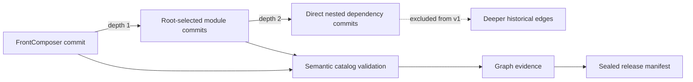
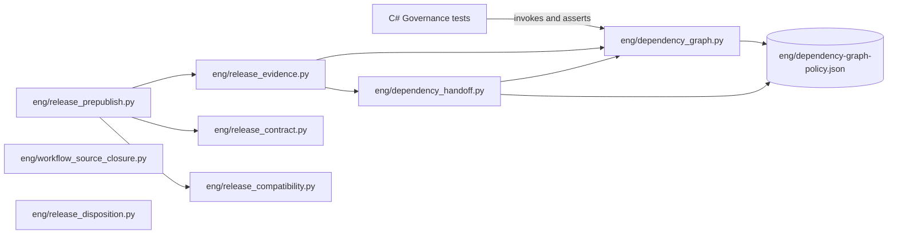
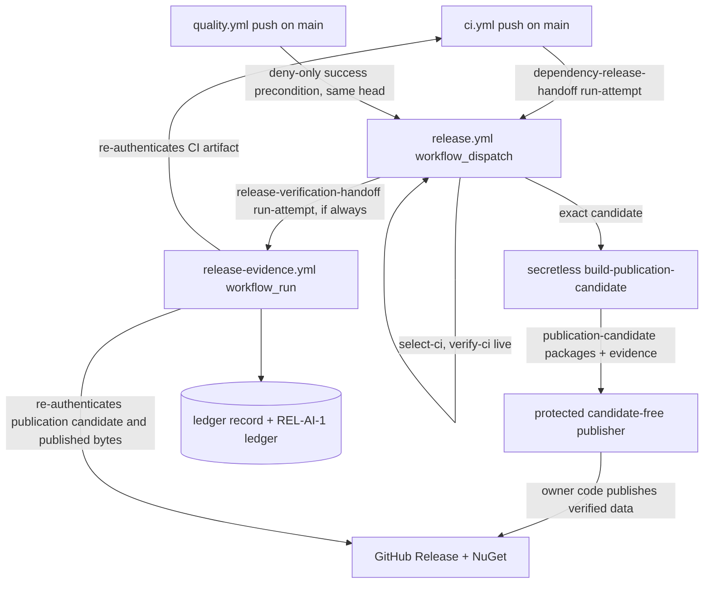

# Architecture Spine — GOV-1 Dependency Provenance

## Design Paradigm

**Bounded committed-object graph.** GOV-1 models dependency provenance from an explicit FrontComposer
commit as a closed-world, depth-bounded graph read from immutable Git objects. Semantic compatibility
is evaluated over selected catalog bytes; exact graph identity is sealed separately as provenance.
Release consumes exactly one authenticated CI-tested revision, and every trust input activates only
from an already-merged revision, never from the candidate under evaluation.


```mermaid
flowchart LR
    R[FrontComposer commit] -->|depth 1| M[Root-selected module commits]
    M -->|depth 2| N[Direct nested dependency commits]
    N -. excluded from v1 .-> H[Deeper historical edges]
    R --> G[Semantic catalog validation]
    M --> G
    G --> E[Graph evidence]
    E --> S[Sealed release manifest]
```

## Inherited Invariants

This spine is the authoritative mechanism record for GOV-1 and the release-integration seam. The
parent's FR-24 prose is a projection of it. The 2026-09-09 owner-ratified privilege split strengthens
the exact-artifact invariant and supersedes the parent's same-job mechanism; source reconciliation is
required before split-publication implementation (see Deferred).

| Inherited | From parent | Binds here |
| --- | --- | --- |
| Approved GOV-1 amendment: `hexalith.dependency-graph.v1` is bounded to depth 1 + depth 2 | `architecture.md` Key Invariants | AD-1 boundary; deeper edges need a new schema. |
| Shared-catalog compatibility is semantic, never a hard-coded SHA allowlist | `architecture.md` Key Invariants | AD-6 separation of compatibility and provenance. |
| FR-24 exact-artifact pipeline: validate the one prepared package set with inventory, tests, consumer checks, checksums, SBOM, and symbol evidence; seal, classify, and publish only those authorized bytes | `architecture.md` FR-24 Release Evidence Architecture | AD-9 ordering; AD-13/AD-17 propagation; AD-19 builder evidence and publisher boundary. |
| Only pre-publication authorization may authorize; post-publication verification never authorizes | `architecture.md` FR-24 Release Evidence Architecture | AD-9, AD-15 fail-closed evidence. |
| Ownership boundaries: Hexalith.Builds owns the reusable-workflow contract and catalog marker; FrontComposer owns evidence, verification, and publication of authorized bytes; the Release Owner owns production approval, credentials, exceptions, and incident response | `architecture.md` FR-24 Release Evidence Architecture | AD-15 ledger, AD-16 lineage, AD-18 approval, Deferred runbook items. |
| BUILD-REL-1 governed intent: the pinned reusable is opt-in/default-off for existing callers, preserves root-only non-recursive initialization, and publishes only the exact author-unsigned candidate packages after mandatory attestation or approved fallback; NuGet.org repository-signs them | G2 request (BUILD-REL-1), REL-5 (2026-08-04), and `architecture.md` FR-24 Release Evidence Architecture; author signing and the same-job mechanism are superseded | AD-13, AD-16, AD-18, AD-19. |
| GOV-1 alters no runtime, API, package inventory, or UX | `architecture.md` FR-24 Release Evidence Architecture | AD-11 scope. |

## Adoption and Release Eligibility

Administrator ratified the architecture direction in this update; that does not close PRD D-16/G-8
or imply Product Owner and Release Owner acceptance. Until those roles accept AD-19 and the reconciled
parent/source contract, an owner-accepted split Builds revision enters AD-16 lineage, the implementation
gate passes, and the approved incident runbook/response target exists, production releases halt. The
required emergency-stop value during that interval is literal
`HEXALITH_RELEASE_PUBLISH_ENABLED=false`; it can deny but never authorize. A read-only repository API
observation on 2026-09-09 instead returned literal `true` (last updated 2026-08-06), so the legacy path
is publication-capable and this is a Critical operational blocker. No release approval or dispatch is
eligible until a Release Owner or repository administrator sets literal `false` and a subsequent
authenticated API read records that value and its server timestamp. No bounded risk exception is
currently authorized. A future exception
requires a separate dated Product Owner + Release Owner + Architect decision naming scope, expiry,
compensating controls, and revocation trigger; it cannot be inferred from environment approval.

## Invariants & Rules

### AD-1 — `[ADOPTED]` v1 graph boundary

- **Binds:** GOV-1 graph collection, CI diffing, manifest preparation, live verification, and fixtures.
- **Prevents:** collectors independently choosing root-only, direct-nested, or historical-transitive scope.
- **Rule:** `hexalith.dependency-graph.v1` contains every gitlink at the explicit FrontComposer root
  commit as depth 1 and every gitlink in each exact root-selected repository commit as depth 2. Edges
  below depth 2 are outside v1. Census counts are evidence, never acceptance criteria. Complete
  historical traversal requires a new schema and approval.

### AD-2 — `[ADOPTED]` committed objects are authoritative

- **Binds:** graph collectors, catalog validators, CI, pre-publication and post-publication verification.
- **Prevents:** provenance changing with the ambient index, nested checkout HEADs, or mutable worktrees.
- **Rule:** accept an explicit repository identity and 40-hex root commit; read trees, committed
  `.gitmodules`, and catalogs from exact Git objects. Never clone candidate URLs, move submodule HEADs,
  or initialize nested submodules to construct evidence. The only working-tree read GOV-1 permits is
  the root-only catalog formatting gate of AD-6, which is a gate, not evidence.

### AD-3 — `[ADOPTED]` repository resolution is closed-world

- **Binds:** every graph node and edge.
- **Prevents:** candidate-controlled URLs expanding trust or resolving one repository under multiple names.
- **Rule:** resolve only the explicit FrontComposer root identity and identities declared by its root
  `.gitmodules`, validated against the active policy revision selected by AD-12. Identity is the trust
  key; the gitlink path is graph evidence, not policy data, and the policy `local_path` is acquisition
  data only. Normalization is ordered: accept `https://github.com/<owner>/<repo>`,
  `git@github.com:<owner>/<repo>`, or `ssh://git@github.com/<owner>/<repo>` with scheme and host
  matched case-sensitively; reject any port, userinfo, query, fragment, percent escape, control
  character, or extra/dot segment; strip exactly one trailing `/`, then exactly one terminal `.git`
  (case-sensitive); then lowercase owner and repository only; a normalized repository segment still
  ending in `.git` is rejected. Duplicate normalized identities or duplicate paths in one `.gitmodules`
  fail closed. Gitlink paths are byte-exact and never case-folded.

### AD-4 — `[ADOPTED]` v1 edge identity and deterministic order

- **Binds:** collectors, diffs, offline verification, live verification, and test fixtures.
- **Prevents:** duplicate suppression, unstable array order, and incompatible graph digests.
- **Rule:** record every depth-1/2 edge, including self/back-reference edges, before object-read or
  catalog-validation deduplication. Edge uniqueness is `(owner_repository, owner_commit, path)`; owner
  object reads deduplicate by `(repository, commit)` without suppressing edges. Each edge contains
  `owner_repository`, `owner_commit`, `path`, `repository`, `commit`, and `depth`; Builds edges
  additionally contain raw-byte `catalog_sha256` and nullable `catalog_contract_version`. Sort by
  `(depth, owner_repository, owner_commit, path, repository, commit)` using ordinal comparison.

### AD-5 — `[ADOPTED]` v1 canonical material and digest

- **Binds:** graph producers, manifest seals, fallback invalidation, and every verifier.
- **Prevents:** two conforming implementations hashing different bytes for the same logical graph.
- **Rule:** the envelope has exactly `{schema, root:{repository,commit}, edge_count, edges,
  graph_digest}`; `schema` is exactly `hexalith.dependency-graph.v1` and `edge_count == len(edges)`.
  An edge is a Builds edge iff `repository == github.com/hexalith/hexalith.builds` (a v1 constant that
  the collector also asserts equal to policy `builds_identity`; offline verification uses the constant
  and needs no policy). A non-Builds edge has exactly the six AD-4 members; a Builds edge has exactly
  those six plus `catalog_sha256` and `catalog_contract_version`. Reject missing or unknown members,
  duplicate JSON member names at any nesting level, JSON booleans where integers are required, and
  depths other than integer 1 or 2. Values are ASCII-only: strict lowercase 40-hex commits, strict
  lowercase 64-hex SHA-256, normalized relative POSIX paths, and a `catalog_contract_version` of JSON
  `null` or a token matching `[A-Za-z0-9][A-Za-z0-9._-]{0,63}` until BUILD-CAT-1 tightens it.
  **Canonical bytes** (used by every digest and seal in this spine) are byte-for-byte the UTF-8 result
  of Python 3.14 standard-library
  `json.dumps(value, ensure_ascii=True, allow_nan=False, sort_keys=True, separators=(",", ":"))`,
  with no BOM or trailing newline. Closed schemas admit only JSON null, booleans, integers in the
  inclusive interoperable range `0..9007199254740991` (identifiers and run coordinates start at 1),
  strings, arrays, and objects; a narrower AD-7/schema bound wins, negative and floating-point values
  are forbidden, and boundary/overflow golden vectors are mandatory. Any JSON-equivalent alternate
  spelling is noncanonical: quotes use `\"`, backslashes use `\\`, U+0008/U+0009/U+000A/U+000C/U+000D
  use `\b`/`\t`/`\n`/`\f`/`\r`, other C0 controls and non-ASCII BMP code points use lowercase
  `\uXXXX`, supplementary code points use lowercase UTF-16 surrogate pairs, and `/` plus printable
  ASCII other than quote/backslash are literal. Cross-language golden vectors cover every escape
  class, DEL, BMP, and supplementary code points. `graph_digest` is SHA-256 over the canonical bytes
  of `{schema, root, edge_count, edges}`. This is project canonicalization v1, not RFC 8785. V1
  requires Git SHA-1 object format; 40-hex identity validation enforces it and a future schema may add
  SHA-256 object IDs.

### AD-6 — `[ADOPTED]` compatibility and provenance are separate

- **Binds:** semantic validators, Governance tests, graph evidence, and release classification.
- **Prevents:** commit/catalog fingerprints becoming compatibility allowlists.
- **Rule:** hash raw catalog blob bytes and parse those same bytes for the applicable semantic
  package/import/marker contract. Semantic validity decides compatibility; commit and fingerprint
  changes appear in provenance and graph diff only. The marker is `null` until BUILD-CAT-1 supplies it
  and a separate migration approval makes it mandatory. Blob load/parse/hash caches by Builds
  `(repository, commit)`; semantic evaluation runs for every selector edge; evidence and diagnostics
  retain every selector and its catalog path. The Python graph engine is the single canonical
  semantic-policy implementation; C# Governance invokes its machine result and retains repository-wide
  MSBuild ownership assertions rather than reimplementing catalog policy. Every owner of a Builds
  selector resolves to exactly one named semantic profile in the active policy; a missing, duplicate,
  or implicit profile fails closed. Profile identifiers and rows are policy seed, not spine content.
  The BOM/CRLF formatting check applies to the root catalog only and reads the root working tree as a
  formatting gate.

### AD-7 — `[ADOPTED]` bounded traversal fails closed

- **Binds:** collectors, contract-tree materialization, workflow closure, and all verification modes.
- **Prevents:** partial graphs, unbounded resource use, and silent evidence loss.
- **Rule:** within depths 1-2, fail on missing/unavailable objects, missing or duplicate mappings,
  unknown identities, duplicate edges, malformed inputs, unavailable catalogs, or any resource ceiling.
  Measure before decoding/parsing and fail before consuming beyond a ceiling: use `cat-file -s` before
  bounded blob reads and stream `ls-tree -r -z --full-tree` under both byte and edge ceilings. Deeper
  edges are excluded by AD-1, not reported as unresolved. The inclusive v1 ceilings, stated once here
  and mirrored by policy `resource_limits` and boundary fixtures, are:

  | Surface | Ceiling |
  | --- | --- |
  | Graph edges (cumulative across the whole graph, checked per record) | 4,096 |
  | Raw `ls-tree` output per owner commit | 64 MiB |
  | Raw committed `.gitmodules` blob | 1 MiB |
  | Raw catalog blob | 4 MiB |
  | Contract-tree materialization: regular files / per blob / summed | 16,384 / 16 MiB / 256 MiB |
  | Workflow source closure: depth / unique blobs / per blob / total | 16 / 256 / 1 MiB / 16 MiB |
  | Publication-candidate archive: raw / members / per-member uncompressed / total uncompressed | 512 MiB / 256 / 128 MiB / 1 GiB |
  | Publication-candidate archive: per-member and aggregate compression ratio / path depth / UTF-8 path bytes | 100:1 / 8 / 240 |

  Contract-tree materialization rejects symlinks, gitlinks, special modes, and unsafe paths before
  extraction. The protected publisher retrieves the raw artifact ZIP through the authenticated
  Actions REST archive endpoint with a streaming 512 MiB hard stop; an action that auto-extracts the
  artifact is forbidden before this scan. It streams the ZIP central directory and enforces every
  archive cap before extraction. For each member, compression ratio is
  `uncompressed_size / max(compressed_size, 1)` and aggregate ratio is
  `sum(uncompressed_size) / max(sum(compressed_size), 1)` using central-directory integer sizes;
  zero-byte members have ratio zero and central-directory/header overhead is excluded. Streamed CRC,
  compressed-size, and uncompressed-size results must agree with the central directory and any local
  header/data descriptor. The scanner rejects overlap, encryption, inconsistent ZIP64 fields,
  undeclared/non-regular members, and any ratio or size over its limit, then materializes only declared
  regular members into a fresh bounded temporary directory; it never follows archive paths or links.
  Network acquisition has no v1 byte ceiling; it is bounded
  by the trusted remote set and the job timeout (see Deferred).

### AD-8 — `[ADOPTED]` CI uses one explicit revision model

- **Binds:** pull-request graph diff and affected-module gates.
- **Prevents:** comparing one candidate SHA while building another or executing candidate-controlled commands.
- **Rule:** for pull requests, `event_base = github.event.pull_request.base.sha`, the candidate is
  `github.sha` (the merge revision primary CI already built), and `merge_base = git merge-base
  event_base github.sha` must equal `event_base` or the run fails closed; the checkout used for the
  merge-base computation carries full history, and a depth-1 fetch is never the sole source. For
  pushes, compare the non-zero `github.event.before` with `github.sha`; a zero/unavailable base takes
  the fail-closed full-affected diagnostic path of AD-12. Record all revisions and collect/build the
  same candidate. Diff logical edges keyed by `(owner_repository, path, repository)`. **Unchanged
  relation:** two logical edges with the same key are unchanged iff every member except a depth-1
  `owner_commit` is equal (depth-2 edges compare all members); any other difference is `changed`; a key
  present on one side only is `added`/`removed`. A graph is unchanged iff every logical edge is
  unchanged and none is added or removed. Classify depth-1 changes first: added/changed edges build
  the candidate target, removed edges build FrontComposer root, and a changed/removed depth-1 edge
  subsumes every depth-2 change owned by its prior/candidate module. Remaining depth-2 changes build
  their candidate owner or collapse to FrontComposer root when that owner is absent. Deduplicate by
  canonical identity; an unchanged graph builds no module. Argv and evidence-only dispositions come
  from the active policy registry; every `build` row is a standalone Release-configuration build with
  NuGet-resolved dependencies (`Configuration=Release`, `UseNuGetDeps=true`), and candidates supply no
  executable policy. Each build materializes the exact candidate owner commit in isolation; an
  edge-bound Builds target additionally extracts the bounded contract tree from the exact candidate
  Builds commit into the listed gitlink path and re-verifies the catalog SHA-256 without initializing
  that nested repository.

### AD-9 — `[ADOPTED]` offline structure and live identity are distinct verification modes

- **Binds:** manifest preparation, sealing, fallback invalidation, pre-publication and post-publication verification.
- **Prevents:** a structurally valid manifest being accepted after repository/catalog drift, and a fallback approval surviving the drift it was recorded against.
- **Rule:** the complete pre-publication order is authenticate raw archive and descriptor → verify all
  declared bytes and AD-7 caps → mint and verify attestation or authenticate an approved fallback →
  prepare → seal → offline verify → live verify → classify → set the owner-controlled publication
  marker → publish. No later step may run when an earlier one failed. Offline verification parses JSON with
  duplicate-member rejection, enforces the closed AD-5/AD-17 schemas, and validates types, uniqueness,
  ordering, counts, and digests. Live verification additionally resolves the sealed root commit,
  reconstructs the v1 graph, and compares every edge and raw catalog hash. **Fallback approval
  digest:** `sha256(canonical({"definition": definition, "package_set": package_set_fingerprint,
  "dependency_graph": graph_digest, "dependency_policy": policy_sha256,
  "workflow_definition": workflow_provenance.definition_digest}))`, where `definition` is exactly the
  `FALLBACK_INVALIDATION_FILES` map `{relative POSIX path: 64-hex sha256}` plus one `helper_version`
  key and no other key. Each fingerprint is the SHA-256 of the exact blob at the candidate commit
  (for a path under a gitlink, at the selected gitlink commit); working-tree bytes are never hashed
  and a missing blob fails closed with no sentinel. `helper_version` is SHA-256 over the UTF-8 bytes of
  the release-evidence helper `__version__` string; helper content is outside the digest by design,
  covered by the exact AD-12/AD-18/AD-19 evaluator closure, so deliberate behavior changes bump
  `__version__`, and no file named `helper_version` may appear in the list. `workflow_definition` is the
  combined CI+Release digest of AD-17, which hashes the candidate's exact push-CI handoff.

  The `workflow_dispatch` input `attestation-fallback-request` is the unpadded RFC 4648 base64url of
  one AD-5 canonical `hexalith.attestation-fallback-request.v1` record exactly
  `{schema, candidate, ci_run, reason, requested_by, created_at, expires_at, fingerprints_sha256,
  authority}`. `ci_run` is `{repository, workflow_path, run_id, run_attempt}`, `reason` is literal
  `github-attestations-unavailable`, `requested_by` equals the authenticated dispatching actor,
  timestamps obey the Consistency Conventions, and expiry is later than creation by at most 24 hours.
  `authority` is `{policy_commit, policy_sha256}` for the active policy; `fingerprints_sha256` equals
  the digest above;
  `candidate`/`ci_run` equal the authenticated handoff; and the active base policy must explicitly say
  `attestation_capability: unsupported`; on this public GitHub.com repository it is `supported`, so no
  runtime action, network, permission, validation, or verification error may select fallback.

  The protected publisher computes `request_sha256`, then authenticates the same Release run's
  `production` deployment reviews using GitHub's `GET /actions/runs/RUN_ID/approvals` response. The
  exact approval comment is
  `hexalith-attestation-fallback-v1:<request_sha256>:<release_run.run_id>:<release_run.run_attempt>`.
  The final authorization's `release_run` must byte-match the safe-integer coordinates parsed from that
  comment and the authenticated current run/attempt. It projects every
  response row with lower-case state `approved`, that exact comment, and one environment object whose
  positive safe-integer ID, name `production`, and `can_admins_bypass: false` match the sampled
  environment. Byte-identical projected rows are collapsed; their `{login, user_id}` approvers are
  ordinally sorted and unique, and every login must occur in the active policy's
  `release_owner_logins`. Zero qualifying approvers, any unequal duplicate for one user, any other
  environment in a qualifying row, or unavailable API data fails closed. The API supplies no approval
  timestamp, so none is invented; `observed_at` is the publisher's canonical sampling time and must be
  no later than the request expiry.

  Pinned owner code then creates the AD-5 canonical
  `hexalith.attestation-fallback-authorization.v3` record exactly
  `{schema, request, request_sha256, release_run, approval}`. `request` is the byte-exact decoded v1
  object; `release_run` is `{repository, workflow_path, run_id, run_attempt}` for this run; and
  `approval` is exactly `{environment_id, environment_name, state, comment, approvers, observed_at}`
  with the authenticated values above. This binds authorization to one Release run/attempt without
  changing `main`; a retry needs a new request and deployment approval. The raw canonical v3 record is
  copied byte-for-byte to `attestation-fallback-authorization.json`; its SHA-256 and path are bound in
  AD-15/AD-17 and the raw file is a mandatory durable asset for an approved fallback. Every
  classification recomputes all bindings and fails closed on inequality, expiry, absence, or a
  non-unsupported policy; no workflow step may invent, default, rebind, or refresh the request or API
  approval. Fixtures prove graph/policy/workflow drift, expiry, current supported capability, and
  ordinary operational errors invalidate fallback; an attempt-1 qualifying row plus an attempt-2
  generic or attempt-1 comment must not authorize attempt 2.
  Collection, semantic diagnostics, preparation, sealing, verification, fallback invalidation,
  fixtures, and Governance pins change atomically. In `split-publication-v1`, builder checks are early
  denial only and never authorize: after authenticating the builder artifact, the candidate-free
  protected publisher uses pinned owner-controlled code to obtain and verify the required provenance
  attestation (or validate the authenticated run-bound approved-unsupported fallback), prepare and seal manifest v4,
  perform offline and live verification, classify, and require `publish_authorized=true`. Attestation
  minting over already-authenticated package digests is the only permitted external side effect before
  that result: it is evidence registration, not package/Release publication, cannot mutate the
  candidate bytes or create a tag, Release, asset, or NuGet version, and cannot itself authorize.
  Parent/source wording must adopt this narrow distinction before integration. Any failure yields
  blocked/invalid evidence and `publish_authorized=false` before publication; post-publication
  verification never authorizes after the fact. Every step receives the same explicit 40-hex root
  commit; `local` never yields a governed manifest.

### AD-10 — `[ADOPTED]` acquisition is isolated from collection

- **Binds:** CI graph collection and live release verification.
- **Prevents:** collectors silently depending on ambient object stores or mutating shared checkouts.
- **Rule:** the collector is offline and object-only. CI may acquire exact objects only from the
  explicit root repository and policy-declared identities (remote URLs reconstructed from canonical
  identity, never from candidate text) into isolated temporary bare stores, prepares identity-to-store
  maps for base and candidate including removed-base edges, and passes those maps to collection.
  Acquired objects are trusted by object ID (content address), never by transport; TLS to
  `github.com` is availability, not integrity. Acquisition forbids `http.sslVerify=false`, credential
  helpers, and protocol widening. It never initializes nested submodules or moves a shared checkout;
  missing objects after bounded acquisition fail closed.

### AD-11 — `[ADOPTED]` GOV-1 is governance-only

- **Binds:** all GOV-1 implementation tasks and completion evidence.
- **Prevents:** dependency provenance work absorbing runtime, API, packaging, or UX scope.
- **Rule:** GOV-1 changes no runtime/public API behavior, generated output, package inventory,
  dependency versions, or UX. Governed release eligibility is gated by GOV-1 independently of any
  story promotion.

### AD-12 — `[ADOPTED]` one versioned trust and semantic policy

- **Binds:** identity resolution, semantic profiles, affected-module commands, evaluator trust, limits, and release fingerprints.
- **Prevents:** candidate `.gitmodules`, C# tests, Python code, and workflows independently defining trust or compatibility.
- **Rule:** FrontComposer-owned `eng/dependency-graph-policy.json` (`hexalith.dependency-graph-policy.v1`)
  is the sole declarative policy for trusted identities, owner semantic profiles, the module build
  registry, `resource_limits`, `evaluator_authorizations`, `release_owner_logins`, and
  `attestation_capability`; candidate `.gitmodules`, workflows, and action metadata are untrusted data.
  Architecture defines schema, coverage invariants, activation, and trust boundary without mirroring
  policy rows.

  **Activation.** For a PR the active policy is read from `event_base`; for a push, from the non-zero
  `github.event.before`; at release, from the handoff `dependency_policy.commit`, which must equal
  `revisions.base`. Base and candidate graphs are evaluated with that one revision, and evidence
  records its repository, canonical path, 40-hex commit, raw SHA-256, and schema. A policy change
  cannot authorize itself: it becomes eligible only as the active base policy of a later change. A
  zero/unavailable `before` cannot select trust: the run may evaluate the candidate policy for
  full-affected diagnostics only, the gate fails, and the run is never release-eligible. Base-policy
  existence means a blob at the canonical path regardless of validity; a malformed active policy fails
  closed and recovery is a dated Architect + Release Owner decision, never a bootstrap. The PR gate
  rejects a candidate policy that fails the closed schema. The one-time v1 bootstrap was consumed when
  the first policy landed on 2026-07-19; no bootstrap mode is reachable.

  **Evaluator authorizations.** `evaluator_authorizations` is an object keyed by stage `ci`, `release`,
  `post_release`, and `incident_recovery`, each an array of rows
  `{stage, caller, reusable, actions, closure_digest}` sorted
  ordinally by `(caller.repository, caller.workflow_path, caller.blob_sha256, closure_digest)` with
  `caller.blob_sha256` unique within a stage. `caller` is `{repository, workflow_path, blob_sha256}` so
  a future local workflow blob can be approved before its commit exists; `reusable` is
  `{repository, workflow_path, commit, blob_sha256}` for `ci` and `release` and JSON `null` for
  `post_release` and `incident_recovery`, whose callers reach no reusable workflow; every action is
  `{repository, path, commit, blob_sha256}`, unique, and sorted ordinally by that tuple. A closure
  contains only sources reachable from the caller; adding an unreachable root is forbidden. External
  commits are literal lowercase 40-hex. `closure_digest` is SHA-256 over the AD-5 canonical bytes of
  the other four members. The PR gate recomputes every added or changed row's closure from the exact
  caller/reusable/action blobs it names and fails closed on any `actions` or `closure_digest`
  difference, so a row is never trusted on its own word; the caller blob is located by
  `caller.blob_sha256` either at `caller.workflow_path` in the candidate commit or in a committed
  fixture file under `tests/ci-governance/fixtures/`, and a row whose caller blob is found in neither
  fails closed. A policy revision may pre-authorize a next
  closure; switching to it happens only in a later change governed by that now-active policy (the
  two-phase pin pattern). A closure absent from the active registry fails the push gate, release, or
  verification; it is never a soft deferral. A `post_release` or `incident_recovery` evaluator executes
  only commands whose complete text is in its pre-authorized caller blob and pinned actions in its exact closure. It never
  checks out an ambient default branch or the released candidate and never imports or invokes a
  repository helper outside that closure; helper logic must be bundled into a literal-commit action.
  The protected publisher, `post_release`, and `incident_recovery` closures may issue data-only requests only to the
  contract-named GitHub API, the GitHub/Sigstore endpoints used by the pinned attestation action, and
  NuGet endpoints. The authenticated Actions artifact download may follow exactly one HTTP 302
  `Location` supplied by GitHub to an HTTPS URL with no userinfo or non-default port. The client strips
  GitHub authorization, cookies, and all caller-supplied headers before that one data-only GET, follows
  no further redirect, never logs the signed query, and enforces AD-7's streaming hard stop; redirect
  bytes remain untrusted archive data and are authenticated by run/artifact coordinate plus digest.
  No other redirect target is permitted. GitHub runner resolution of a closure-listed action whose `uses:` is a literal
  lowercase 40-hex commit is the sole permitted executable acquisition and is accepted as GitHub
  platform delivery of the already-authorized blob closure. Neither workflow steps nor that action may
  otherwise download or execute a script, action, installer, package, plugin, redirect target,
  configuration, or generated command at runtime;
  package managers and install/bootstrap commands are forbidden. Executable logic must already be in
  a literal-commit source in the computed closure and may use only the GitHub-hosted runner's declared
  platform runtimes. Governance fixtures include `curl|sh` equivalents, child-process downloads,
  package-manager install, dynamic imports, and redirected executable content.

  **Bindings.** The policy, `.github/workflows/ci.yml`, `.github/workflows/release.yml`,
  `eng/dependency_graph.py`, `eng/dependency_handoff.py`, `eng/workflow_source_closure.py`,
  `eng/release_contract.py`, and `eng/release_prepublish.py` are members of both
  `RELEASE_DEFINITION_FILES` and `FALLBACK_INVALIDATION_FILES`; both lists are owned by
  `eng/release_evidence.py` and pinned by a Governance fixture. Post-publication sources are
  deliberately outside both publication/fallback lists because they never authorize product publication
  (AD-9), but their caller and every executable byte are inside the separately authorized
  `post_release` or `incident_recovery` closure; ambient `release-evidence.yml`,
  `release-incident-preservation.yml`, or `eng/release_disposition.py` bytes are not
  executable trust. The fallback request is an authenticated Release `workflow_dispatch` input, never
  a repository variable or pull-request input, and gains authority only from the exact AD-9 deployment
  review for that run; deny-only Builds gates read from repository variables
  (`HEXALITH_RELEASE_PUBLISH_ENABLED`) cannot authorize, and their value at publication is recorded by
  the Release run in the AD-15 handoff and copied to the ledger record. Policy changes require
  Governance fixtures and review. Candidate-controlled evaluator/build code is confined to the
  secretless AD-19 builder; publication and ledger decisions execute only authorized owner code.

### AD-13 — `[ADOPTED]` release consumes the exact CI-tested revision

- **Binds:** `release.yml` dispatch and authentication, the reusable release workflow, the CI handoff, and release evidence.
- **Prevents:** a successful CI run for one commit authorizing checkout or publication from another revision, or a mutable workflow source entering the evaluator chain.
- **Rule:** publication is operator-initiated `workflow_dispatch` on `refs/heads/main` only. The
  dispatched `github.sha` must be lowercase 40-hex, must equal the live `main` ref re-read through the
  API, and must be the head of exactly one completed successful push run of
  `.github/workflows/ci.yml` on `main`, selected through read-only Actions APIs
  (`eng/release_contract.py select-ci`). Selection filters to completed successful runs before
  applying uniqueness: prior failed/cancelled attempts neither authorize nor create ambiguity, while
  two successful reruns fail closed. Missing, duplicate-success, paginated, truncated, or malformed
  responses fail before any protected job. `select-ci` applies the same predicate to
  `.github/workflows/quality.yml` and records its exact authenticated projection as `quality_run`;
  that run is a **deny-only precondition outside every trust structure** (no registry
  stage, neither fingerprint list, not in the AD-18 assertion surface), so it may reference mutable
  actions because it can only block. Every trust-bearing Governance assertion this spine names (AD-12
  list membership and closure recomputation, AD-17 shape, AD-18 static assertions) executes inside the
  `dependency-governance` job of `ci.yml`, which is in the authorized closure; a Governance lane
  outside that job is defense in depth and proves nothing for release eligibility. Release then downloads the CI run's `dependency-release-handoff-<run_id>-<run_attempt>`
  artifact (exactly one match, zip archive, recorded `run.run_id`/`run_attempt` equal to the
  authenticated coordinates), verifies it offline and live (`verify-ci --live`), and requires its
  recorded candidate to equal the dispatched SHA. That authenticated handoff candidate is the sole
  release-candidate authority: every checkout, preparation, seal, live verify, fallback, and
  publication step consumes it, and no tag, ambient checkout, default-branch value, or later run head
  may replace it. `main` is re-validated before protected credentials. The
  `hexalith.dependency-release-source.v1` proof CI also emits is a diagnostic only; it is never
  release-eligible and never a candidate authority for manifest preparation. Release invokes only the
  active-policy-authorized AD-19 `split-publication-v1` reusable: the authenticated candidate may be
  executed only by its secretless builder, then crosses into the protected publisher exclusively as
  the run-bound publication-candidate artifact.

  **Handoff.** The artifact contains exactly one duplicate-member-free `dependency-release-handoff.json`
  with `{schema, run, revisions, evaluator, dependency_policy, dependency_graph}`: `schema` is
  `hexalith.dependency-release-handoff.v1`; `run` is
  `{repository, workflow_path, run_id, run_attempt, event, branch, candidate}` with literal event
  `push`, branch `main`, and integer run coordinates >= 1; `revisions` is `{base, candidate, merge_base}`
  with `merge_base` null for push evidence; `dependency_policy.commit` equals `revisions.base` exactly,
  not merely a commit carrying an identical blob; `evaluator` is
  `{caller, reusable, actions, definition_digest}` in the AD-12 source shapes with `definition_digest`
  = SHA-256 over the canonical bytes of `{caller, reusable, actions}`; policy and graph use the closed
  AD-14/AD-5 shapes. Release recomputes `definition_digest` and the raw handoff SHA-256 and binds both
  into AD-17.

  **Evaluator trust.** The CI evaluator is the active-policy `ci` row whose `caller.blob_sha256` equals
  the exact `.github/workflows/ci.yml` blob at the candidate commit; the release evaluator is the
  `release` row matched the same way for `.github/workflows/release.yml`. Because the caller blob
  literally names the reusable commit and that commit fixes every transitive action, the matched row is
  the evaluator; a caller blob with no row fails closed. `ci.yml` and `release.yml` each reference
  `domain-ci.yml`/`domain-release.yml` by a literal 40-hex Hexalith.Builds commit equal to the row's
  `reusable.commit`; the release row's reusable must implement AD-19 `split-publication-v1`, and the
  two pins lie in the AD-16 lineage and need not be equal. For the Release phase, the
  **execution-SHA equality set** is `env.BUILDS_EXECUTION_SHA`, `HEXALITH_BUILDS_EXECUTION_SHA`, the
  `builds-execution-sha:` input, the `domain-release.yml@` pin, and every `actions/checkout` `ref:`
  whose `path:` is `.hexalith/builds-execution` in the exact Release caller/reusable closure;
  `release_contract.py builds` asserts the caller members before the protected publisher and
  Governance asserts the rest. Post-release and recovery use their respective active-policy-authorized
  `post_release` and `incident_recovery` action commits, which may advance after the historical Release; the ledger records
  that evaluator independently and never projects it as Release provenance or requires equality with
  the historical `builds_execution_sha`. Every transitive `uses:` in either closure is a literal
  40-hex commit; `@main` or any mutable reference anywhere in the closure is non-conforming.

  **Static closure.** `eng/workflow_source_closure.py` computes the closure from exact Git blobs,
  following every literal job/step `uses:` in the caller, reusable workflows, and composite
  `action.yml`/`action.yaml`; conditions never remove sources. Local references resolve inside the same
  exact repository commit, with one carve-out for `.hexalith/builds-execution/`: in a non-Builds caller
  blob, a local `uses:` under that prefix resolves into Hexalith.Builds at the literal 40-hex `ref:` of
  the one `actions/checkout` step in the same blob whose `repository:` is literally
  `Hexalith/Hexalith.Builds` and whose `path:` is that directory, matched over the raw blob text
  (comment lines included, `repository:`, `ref:`, and `path:` within six lines of each other); every
  other step whose explicit `path:`/`with.path` normalizes to that directory, a prefix of it, or a
  descendant of it (a second checkout, another repository, a mutable ref, an expression), and every
  `run:` step whose text contains that literal path, fails closed; a checkout without `path:` targets
  the workspace root, is the caller's own candidate checkout, and is exempt. That ref must equal the row's `reusable.commit` or, for `post_release` and
  `incident_recovery`, the `commit` of the local actions it reaches. In a Builds blob itself (`domain-ci.yml`,
  `domain-release.yml`), a local `uses:` under that prefix resolves to the same Builds commit as the
  enclosing blob, and that blob's checkout into the directory must be exactly `repository:
  Hexalith/Hexalith.Builds` with `ref: ${{ inputs.builds-execution-sha }}`, since the caller binds
  that input through `builds-execution-sha == reusable.commit`, an equality the closure computation
  itself asserts from the caller blob literal before admitting the carve-out; any other checkout form
  into the directory inside a Builds blob fails closed. External references require literal 40-hex commits and
  repositories already named by the matching row; acquisition fetches only those commits into bounded
  isolated bare stores. JavaScript actions terminate at their exact repository commit, which fixes the
  committed bundle. Docker actions, expressions in `uses:`, ambiguous/missing metadata, YAML
  anchors/aliases/merge keys affecting `uses:`, unsupported `uses:` forms, and composite cycles fail
  closed; AD-7 caps apply. Runtime `github.workflow_sha`/`job.workflow_sha` observation and
  production-time closure recomputation are deferred (see Deferred); `job.*` contexts are
  GitHub.com-only.

### AD-14 — `[ADOPTED]` manifest migration is one-way and fail-closed

- **Binds:** manifest producer, verifier, fixtures, fallback approvals, and historical evidence.
- **Prevents:** legacy evidence being silently upgraded, resealed, or treated as dependency-complete.
- **Rule:** the manifest lineage is `hexalith.release-evidence.v1` (legacy) → `v2` → `v3` → `v4`
  (AD-17).
  `prepare-manifest` emits only the current schema, and `classify-release`, `seal-manifest`,
  `fallback-digest`, `verify-prepared`, and `publish` accept only it; v2/v3 acceptance is confined to
  `verify-manifest` and audit commands, so a v2/v3 manifest is never produced, resealed, or
  fallback-eligible for a new publication. Legacy manifests without the current members are parsed
  only by an explicit audit mode, are always non-publishable, and cannot satisfy fallback. Nothing is
  upgraded in place; historical ledger bytes remain unchanged. The `dependency_policy` projection is
  exactly `{schema, repository, path, commit, sha256}` with `path` `eng/dependency-graph-policy.json`
  and `schema` `hexalith.dependency-graph-policy.v1`. `seal` is exactly
  `{algorithm: "sha256", hash: <64-hex>, sealed_at: <canonical UTC timestamp>}`; `hash` is SHA-256 over the AD-5
  canonical bytes of every top-level member except `seal`, so every new member is sealed, and
  `sealed_at` is unsealed metadata, never a trust input. Fixtures migrate in the same atomic change as
  the schema.

### AD-15 — `[ADOPTED]` release-to-verifier handoff preserves the original candidate

- **Binds:** release completion/failure, `release-evidence.yml`, downloaded-asset verification, and the ledger.
- **Prevents:** the second `workflow_run` hop substituting its default-branch SHA or green-no-oping a released candidate.
- **Rule:** the Release workflow uploads exactly one
  `release-verification-handoff-<run_id>-<run_attempt>` artifact under `if: always()` for every
  authenticated Release run. It contains exactly one of (a) `release-verification-handoff.json` plus
  the normative CI copy named `dependency-release-handoff.json`, or (b)
  `release-verification-handoff.deferred.json` only when no CI handoff was authenticated. An archive
  containing neither, both, duplicate normative names, or a CI copy whose raw SHA-256 differs from
  `ci_handoff.evidence_sha256` is `missing-artifact`, never a deferral; other files are non-normative.

  The duplicate-member-free handoff schema is `hexalith.release-verification-handoff.v3`, exactly
  `{schema, release_run, quality_run, ci_handoff, candidate, dependency_policy,
  publication_candidate, release, prepublication_denial, manifest, attestation, assets, evaluator}`.
  `release_run` is
  `{repository, workflow_path, run_id, run_attempt, job_results, conclusion}`; `job_results` is the
  closed object of every direct dependency named by the handoff-emitter job in the exact caller blob,
  with values in `{success,failure,cancelled,skipped}`. Reject missing/unknown job IDs or values; project
  `failure` if any value is `failure`, otherwise `cancelled` if any is `cancelled`, otherwise `success`
  when every value is `success` or `skipped`. This projection is evidence, not API authentication.
  `quality_run` is the AD-13 selected `{repository, workflow_path, run_id, run_attempt, event, branch,
  head_sha, conclusion}` with literal `push`, `main`, the handoff candidate, and `success`; it is carried
  here, authenticated post-release, and never re-selected. `ci_handoff` is
  `{repository, workflow_path, run_id, run_attempt, evidence_sha256}`; `candidate` is the AD-13
  candidate; and `dependency_policy` is the AD-14 projection copied from the CI handoff.

  `publication_candidate` is JSON `null` when the builder did not succeed or exactly
  `{artifact_name, artifact_id, run_id, run_attempt, archive_sha256, descriptor_sha256}` with positive
  integer coordinates, the current Release run/attempt, the exact run-bound artifact name, and strict
  64-hex digests. It is required after builder success, including the no-releasable case; if the
  publisher starts, the descriptor must additionally carry a non-null release plan. A null value after
  builder success, or a non-null value whose builder did not succeed, is `missing-artifact`. `release`
  is exactly
  `{mode, version, tag, github_release_id, publication_started, published, publish_gate_variable}`;
  `mode` is `split-publication-v1`, and `publish_gate_variable` is the literal Release-run value of
  `HEXALITH_RELEASE_PUBLISH_ENABLED`. `manifest` is JSON `null` before successful final classification
  or exactly `{schema, path, sha256, seal}` where `schema` is `hexalith.release-evidence.v4` and `seal`
  is the AD-14 `seal.hash` and `path` is `release-evidence.json`. `attestation` is JSON `null`
  before its protected-publisher step or exactly `{status, bundle, fallback}`. For
  `status: attested`, `bundle` is `{path, sha256}`, the bundle authenticates every package digest, and
  `fallback` is null; for `status: approved-unsupported`, `bundle` is null and `fallback` is
  `{path, sha256}` for the raw AD-9 v3 authorization record. No other combination is valid; the only
  non-null bundle path is `provenance-attestation.json` and the only non-null fallback path is
  `attestation-fallback-authorization.json`. `prepublication_denial` is JSON
  `null` except for `rejected-before-publication`, where it is
  exactly one of `{builder-failed, attestation-unavailable, fallback-not-authorized,
  manifest-invalid, live-verification-failed, classification-blocked}` and agrees with authenticated
  job results and owner-controlled publisher output.
  `assets` are GitHub Release assets `{name, sha256, size}`, unique by name and sorted by name. Each is
  either a byte-identical AD-19 descriptor file mapped by its `asset_name`, the exact raw
  publication-candidate archive/descriptor/CI handoff, or the exact publisher-produced final manifest,
  attestation bundle, or raw fallback authorization bound above; every AD-19 authorized release asset appears once and no other
  asset is
  allowed. Package and symbol asset hashes therefore remain the authenticated builder hashes, and
  each asset SHA-256 must equal the GitHub asset digest when present. `evaluator` is exactly the AD-13
  Release evaluator shape. Unavailable fields are JSON `null`; unpublished attempts have an empty
  asset array.

  **Attempt classifier.** A governed attempt is an authenticated AD-13 operator Release run that
  obtained the CI handoff and whose caller blob matches the active `release` evaluator for the exact
  AD-19 split reusable, independent of any legacy job name or outcome. The split contract exposes
  exactly one API job named `release / build-publication-candidate` and one named
  `release / publish-publication-candidate`; zero, duplicates, other publication-capable jobs, or a
  topology/handoff disagreement fail closed as `missing-artifact`. The builder job never starts
  publication. With a literal `true` publish gate and non-null release plan, pinned publisher code sets
  `publication_started=true` immediately before the first NuGet push or GitHub Release/tag/asset
  mutation; merely starting the protected job or minting its prerequisite attestation does not set it.
  `published` is true iff that marker exists and the authenticated publisher job concluded `success`.
  A skipped publisher requires both booleans false; a successful publisher with a release plan requires
  both true; a failed/cancelled publisher may report `publication_started` false only when external API
  inspection confirms that no package/Release mutation occurred. With any non-`true` gate value the
  publisher must be skipped, both booleans are false, and the disposition is `gate-frozen`. Any NuGet
  or GitHub Release publication observed while `publication_started=false`, or any mismatch between
  authenticated job state, the owner-controlled marker, and these fields, is
  `partial-publish-incident`.

  The post-release workflow authenticates the Release and quality run projections through read-only
  Actions APIs, downloads the named Release artifact, and independently authenticates/downloads the CI
  artifact at `ci_handoff.run_id/run_attempt`. The independent CI member is authoritative: its raw
  SHA-256 equals both `ci_handoff.evidence_sha256` and the normative copy's hash. It reloads the exact
  base/before policy, requires candidate/policy agreement even when preparation failed, authenticates
  its own AD-12 `post_release` closure before any ledger decision, and executes no ambient helper.
  It authenticates the publication-candidate artifact by Release run/attempt, name, ID, raw archive
  digest, descriptor digest, final manifest seal, attestation/fallback projection, and every descriptor
  file hash before inspecting any file as data. Its current evaluator pin may differ from a historical
  Release pin and is recorded only as
  post-release evidence. For every `publication_started` attempt, whether or not `published`, it
  inspects GitHub Release and NuGet for the planned version. Any missing, extra, or unequal published
  byte, tag, release ID, non-final draft, non-immutable successful Release, provenance
  attestation/fallback, repository signature, or
  candidate/policy/evaluator projection is an incident; post-release verification never authorizes.

  **Ledger.** `frontcomposer.release-ledger-record.v2` is duplicate-member-free and exactly
  `{schema, release_run, reported_conclusion, quality_run, verification_run, candidate, disposition,
  prepublication_denial, published, tag, manifest_verified, attestation_verified, published_bytes_verified,
  repository_signatures_verified, incident, evaluator, actors, environment_protection,
  publish_gate_variable}`. Run projections are
  `{repository, workflow_path, run_id, run_attempt, conclusion}` with positive integer coordinates;
  `conclusion` is one of `{success, failure, cancelled, action_required, neutral, skipped, stale,
  startup_failure, timed_out}`, and an unavailable or future value fails closed; booleans are JSON
  booleans; unavailable strings/objects are JSON `null`; `prepublication_denial` is copied byte-exact
  from the handoff for `rejected-before-publication` and is null for every other disposition;
  `reported_conclusion` is the handoff
  three-state projection; `evaluator` is the matched `post_release` shape; and the actor/environment
  objects are closed by AD-18. The closed `disposition` vocabulary and total mapping are:

  | Disposition | Required condition |
  | --- | --- |
  | `deferred-no-ci-handoff` | The sole normative member is a valid deferred sentinel; no CI handoff was authenticated; terminal incident state per FC-DEP-1. |
  | `gate-frozen` | Publish-gate value is not literal `true`; publisher skipped; no external bytes exist, regardless of whether the builder ran. |
  | `no-releasable-commits` | Gate is literal `true`; builder succeeded; its authenticated descriptor has `release_plan: null`; publisher skipped; no external bytes exist. |
  | `rejected-before-publication` | Gate is literal `true`; the authenticated handoff has one valid `prepublication_denial`; publisher did not publish; no external bytes exist. |
  | `compliant-candidate` | Gate is literal `true`; the descriptor has a non-null release plan; publisher succeeded; manifest, mandatory attestation/fallback, published bytes, and repository signatures all verify. |
  | `missing-artifact` | A required artifact/member/topology is absent, duplicate, malformed, or unauthenticated. |
  | `partial-publish-incident` | Publication started or external bytes exist, but publication or verification is incomplete/unequal. |
  | `non-compliant` | Any other authenticated contract, authorization, or verification failure. |

  Required artifacts are phase-dependent: the Release handoff is always required; the publication
  candidate is required after builder success; and a final manifest plus attestation projection are
  required after the protected authorization step succeeds and before publication starts. Evaluate
  the mapping in fail-closed precedence: external NuGet/GitHub Release publication evidence makes any
  incomplete or unequal attempt `partial-publish-incident`; a valid deferred sentinel is
  `deferred-no-ci-handoff`; otherwise
  a required artifact/topology failure is `missing-artifact`; otherwise a valid closed
  `prepublication_denial` is `rejected-before-publication`; otherwise any authorization, contract, or
  verification failure is `non-compliant`; only then may exactly one other non-incident outcome match.
  The three non-incident pre-publication states are disjoint by gate value, builder result, and release
  plan. Zero or multiple matches are `non-compliant`.

  `incident` is JSON `null` only for `no-releasable-commits`, `gate-frozen`,
  `rejected-before-publication`, and `compliant-candidate`; it is exactly `{kind, phase}` for
  `deferred-no-ci-handoff`, `missing-artifact`, `partial-publish-incident`, and `non-compliant`, with
  `kind == disposition` and `phase` in `{ci-authentication, quality-authentication,
  builder, publisher, handoff, github-release, nuget, post-release, ledger}`. A machine observation is
  keyed by immutable Release-attempt `(release_run.repository, workflow_path, run_id, run_attempt)` and
  verification-run coordinates; a duplicate observation key must be byte-identical. The durable
  repository-tracked REL-AI-1 ledger is append-only: any incident observation permanently makes that
  Release attempt incident-bearing, and no later green observation can replace, weaken, or hide it.
  Release Owner sign-off never mutates that machine observation. It is a separate append-only
  `frontcomposer.release-ledger-signoff.v1` record exactly
  `{schema, observation_key, ledger_record_sha256, decision, signer, authority, approving_review}`:
  `observation_key` is
  `{release:{repository,workflow_path,run_id,run_attempt},
  verification:{repository,workflow_path,run_id,run_attempt}}`; `ledger_record_sha256` is the SHA-256
  of the machine record's AD-5 canonical bytes; `decision` is literal `confirmed`; and `signer` is the
  nonempty GitHub login of an authorized Release Owner. `authority` is
  `{policy_commit, policy_sha256}` and binds the machine observation's active policy, whose closed
  `release_owner_logins` array contains `signer`. `approving_review` is
  `{repository, pull_number, head_sha, review_id, state, submitted_at}` with safe-integer IDs, literal
  `APPROVED`, and canonical GitHub server time. The review body is exactly the AD-5 canonical JSON of
  `{schema:"frontcomposer.release-ledger-approval.v1", observation_key, ledger_record_sha256,
  decision:"confirmed", signer, authority}` with no surrounding text; its API user equals `signer`,
  it covers `head_sha`, and that unchanged head is merged to protected `main`.

  Sign-off uses two non-squashed, append-only pull requests after the machine observation is durable.
  The approval PR adds exactly one approval payload at
  `governance/release-ledger/approvals/<release_run.run_id>-<release_run.run_attempt>-<verification_run.run_id>-<verification_run.run_attempt>-<signer>.json`;
  its Release Owner review body is the byte-identical approval JSON above. After that head merges,
  pinned ledger tooling authenticates the server review and opens a distinct projection PR that adds
  the resulting signoff record at
  `governance/release-ledger/signoffs/<release_run.run_id>-<release_run.run_attempt>-<verification_run.run_id>-<verification_run.run_attempt>-<signer>-<review_id>.json`
  without changing the observation or approval payload. A normalized GitHub login matches
  `[A-Za-z0-9](?:[A-Za-z0-9-]{0,37}[A-Za-z0-9])?`; its original API spelling appears in the body while
  its ASCII-lowercase spelling appears in the path. Exactly one approval and one signoff per
  `(observation_key, lowercase signer)` is valid; duplicate or replacement paths fail closed. The projection
  PR must itself merge unchanged through protected `main` with an authorized Release Owner approval;
  verification discovers the unique associated merged PR for the commit that first added the signoff,
  authenticates its head and approval through the API, and rejects squash/rebase, replacement, or a
  direct push. The signoff projection must byte-match the first PR's authenticated API response and is
  valid only after the projection PR merges. It is valid only for a `compliant-candidate` observation. Zero valid sign-offs leaves the
  publication visibly pending; later distinct-owner sign-offs sort by lowercase signer and may append
  but cannot alter the observation or make an
  incident green. This mechanism is implementation-ineligible until the no-bypass ruleset in Deferred
  exists.

  Immutable GitHub Release assets are durable evidence; run artifacts are short-retention replay
  material. When a product Release is incomplete or absent after `publication_started`, the
  candidate-free `.github/workflows/release-incident-preservation.yml` workflow runs as the AD-12
  `incident_recovery` stage under the protected `production` environment. Each recovery run creates a
  separate immutable prerelease whose tag and name are exactly
  `release-evidence/incident/<release_run.run_id>-<release_run.run_attempt>/<recovery_run.run_id>-<recovery_run.run_attempt>`,
  pointing to the authenticated candidate. The entire `release-evidence/incident/` namespace is
  reserved and excluded from version discovery and product-release selection.

  Its mandatory `incident-evidence.json` is closed schema
  `frontcomposer.release-incident-evidence.v1`, exactly
  `{schema, release_run, recovery_run, candidate, disposition, observed_at, slots}`. `release_run` and
  `recovery_run` use `{repository, workflow_path, run_id, run_attempt}`; `slots` has exactly
  `{publication_candidate, descriptor, ci_handoff, release_handoff, manifest, authorization,
  ledger_observation, github_inventory, nuget_inventory, prior_recovery_inventory}`. Each slot is
  exactly `{status, name, sha256, size, reason}`. `status` is `present`, `quarantined`, or `absent`:
  present has a unique asset name, strict digest, non-negative safe-integer size, and null reason;
  quarantined has the same byte identity plus reason `authentication-failed`; absent has null
  name/digest/size and reason in `{not-produced, not-recorded, expired, api-unavailable}`. Every fetched
  byte is present or quarantined; absence/error claims are backed by the captured authenticated API
  response or transport-error record in the corresponding inventory asset. Asset names are ordinally
  unique, and every non-absent slot's bytes must match its asset. Missing slots, invalid combinations,
  digest drift, or a mutable/draft evidence Release fails preservation.

  A recovery crash never adopts, replaces, or deletes its partial tag, draft, or assets. A later run
  uses its own run-bound namespace and records all earlier recovery states in
  `prior_recovery_inventory`; product retry remains forbidden until one evidence Release is verified
  non-draft and immutable and accounts for every prior recovery attempt. If GitHub Releases cannot
  accept this evidence, retry remains forbidden until the service is available and the evidence
  Release is verified immutable. The read-only verifier never receives write scope; only this
  separately approved, exact `incident_recovery` closure may create evidence in the reserved namespace.

  Before any retry or later dispatch after an incident, the Release Owner follows
  `docs/release-incident-response.md`: acknowledge and record containment, set the publish gate false,
  preserve and verify that immutable evidence Release, rotate possibly exposed credentials, inventory every external side effect,
  unlist rather than replace affected packages, and issue any correction under a new version. The gate
  may be re-enabled only after cause/remediation are documented, independent verification is complete,
  and the Release Owner approves. Race, pre-manifest failure, split-topology, duplicate-name,
  state-mapping, attestation/fallback, and incident-monotonicity fixtures pin this contract.

### AD-16 — `[ADOPTED]` Hexalith.Builds workflow revision is an owner-accepted external input

- **Binds:** primary CI, reusable release, GOV-1 completion, and every governed release.
- **Prevents:** FrontComposer editing shared Builds source, silently weakening provenance, or claiming completion against a mutable reference.
- **Rule:** CI and release each pin one immutable 40-hex Builds execution commit; both must lie in the
  accepted lineage and need not be equal, and `builds_execution_sha` names the release pin only. A
  Builds commit is **in the accepted lineage** iff, walking the first-parent history of `main` for
  `eng/dependency-graph-policy.json`, some policy revision that was the active base of a later `main`
  commit contains a row of any stage with that `reusable.commit`, and every policy revision on that
  walk back to the one recording the owner-accepted revision
  `a8a50859fa2f27f511a9470dfe1e3ae54d0ebc1a` (Hexalith.Builds issue 17, accepted 2026-08-08) satisfies
  the same rule for its own pins. The predicate is per Builds commit, not per stage; Governance
  verifies it from the policy blob history; Git ancestry of the Builds commits is not required. The
  lineage admits; only rows present in the active policy authorize, so retiring a pin is a policy
  change that removes its rows under AD-12 delayed activation, after which a workflow revert to that
  pin fails closed. Each pinned commit and its exact workflow/action blob closure live in the
  active policy before integration. No reusable-workflow integration, GOV-1 completion claim, or
  release eligibility exists against a commit outside the lineage. The Builds catalog gitlink (AD-8
  graph identity) and the execution commits are independent identities. Builds owns the reusable
  contract's reusable workflow/action code, inputs, and minimum permissions. FrontComposer owns the
  publication-candidate/manifest/evidence schemas, exact output bytes, classification, invocation of
  the selected reusable, and publication/verification operation; the Release Owner owns production
  approval, credentials, exceptions, and incident containment. FrontComposer may select only a lineage
  commit. A FrontComposer-owned contingency outside the lineage requires a dated Release Owner +
  Architect decision with scope, expiry, migration trigger, and equivalent proofs.

### AD-17 — `[ADOPTED]` manifest v4 binds selected runs, attestation, and workflow provenance

- **Binds:** manifest producer, offline/live verifiers, fallback digest, Governance pins, and fixtures.
- **Prevents:** two producers projecting CI/Release provenance into different member sets or digest material.
- **Rule:** the current manifest schema is `hexalith.release-evidence.v4`; v3 remains byte-preserved
  audit evidence and is never eligible for new publication. V4 carries the required top-level members
  `dependency_graph` (complete AD-5 envelope), `dependency_policy` (AD-14 projection), `quality_run`
  (the exact AD-13 selected projection), `attestation` (the exact AD-15
  `{status, bundle, fallback}` projection), and `workflow_provenance` exactly
  `{ci, release, definition_digest}`. `quality_run` is sealed denial evidence but is not an evaluator
  trust source and does not enter `definition_digest`. The manifest and Release handoff attestation
  projections must be byte-identical; AD-14 seals it, and producer, verifier, fixtures, and fallback
  digest material migrate atomically. `ci` is exactly
  `{run, evidence_sha256}` where `run` is
  `{repository, workflow_path, run_id, run_attempt, event, branch, head_sha}` projected from the
  authenticated CI handoff (`head_sha` = handoff `run.candidate`, event `push`, branch `main`) and
  `evidence_sha256` is the raw CI handoff JSON SHA-256, which transitively binds the CI evaluator
  closure. `release` is exactly `{caller, reusable, builds_execution_sha}` where `caller` and
  `reusable` are `{repository, workflow_path, commit, blob_sha256}`, `reusable` names
  `github.com/hexalith/hexalith.builds` `.github/workflows/domain-release.yml`, and
  `reusable.commit == builds_execution_sha`; that exact reusable blob implements both AD-19 split
  roles, so one provenance coordinate binds builder and publisher code while their privileges remain
  separate. `definition_digest` is SHA-256 over the AD-5 canonical
  bytes of `{ci, release}` and is the `workflow_definition` input of AD-9. Offline verification
  recomputes the digest and rejects any unequal projection. Run coordinates are JSON integers >= 1;
  identities, paths, commits, and hashes follow the Consistency Conventions. Actors and approvals never
  enter the sealed manifest; their home is the AD-15 ledger record. The manifest cannot contain the
  digest of the archive that contains it; AD-19 binds its internal files and AD-15 independently binds
  the uploaded archive coordinate/digest, avoiding self-reference and a manifest-schema bump.

### AD-18 — publication actor and least-privilege stage tokens

- **Binds:** `ci.yml`, `release.yml`, `release-evidence.yml`, `release-incident-preservation.yml`, the pinned reusable at `reusable.commit`, and Governance static assertions.
- **Prevents:** any write collaborator publishing, a job with write scope consuming candidate code, or artifact deletion breaking handoff immutability.
- **Rule:** workflow-level permissions are `contents: read` plus `actions: read` only where an Actions
  API consumer needs it; unspecified permissions are `none`. CI, graph/semantic gates, affected builds,
  and the AD-19 builder have no environment, no secret, no OIDC/attestation permission, and no write
  scope. Their candidate checkout and all candidate-controlled restore/build/pack/release-planning code
  therefore execute only with a read-only token. `pull_request_target`, `actions: write`, and any job
  that combines candidate code with a secret or write scope are forbidden.

  Only the AD-19 candidate-free publisher/attester may hold product publication authority. It runs under the
  `production` environment, whose protection requires Release Owner review, allows deployments from
  `main` only, and grants no admin bypass; the reusable declares
  `environment: ${{ inputs.environment-name }}` and the caller passes `production`. The caller may
  delegate only `{contents, id-token, attestations, issues, pull-requests}` write scopes, and each
  protected job receives only its required subset. `artifact-metadata: write` is forbidden because
  AD-19 disables registry push and storage-record creation. `NUGET_API_KEY` or a successor credential is
  environment-scoped and exposed only to the publisher; `secrets: inherit` and repository/organization
  publication-secret forwarding are forbidden. GitHub makes the protected job's token permissions and
  environment secrets available for the whole job; step-level elevation is not assumed. Safety comes
  from executing only pinned candidate-free owner code in that job. That code invokes no publication
  credential, OIDC token request, or write API until after the bounded archive and every digest are
  authenticated; candidate bytes are never executed at any point. Reusable-workflow permissions may
  be maintained or reduced, never elevated, so the exact caller and reusable blobs are both part of
  the static assertion surface. Governance fails if either phase violates these rules.

  The only other Release-writing actor is AD-12 stage `incident_recovery`: the candidate-free
  `.github/workflows/release-incident-preservation.yml` job runs on GitHub-hosted `ubuntu-24.04` under
  the same protected `production` environment with only `contents: write` plus the read permissions
  needed to fetch authenticated evidence. It has no NuGet or other secret, OIDC, `attestations: write`,
  package permission, arbitrary tag input, or product-Release authority. Literal owner code constructs
  the AD-15 reserved tag from authenticated run integers and may create assets only below
  `release-evidence/incident/`; static hostile-namespace, product-tag, NuGet-endpoint, candidate-code,
  and permission-escalation fixtures reject any broader behavior. The AD-19 builder, publisher,
  `post_release` verifier, and incident recovery jobs all run on GitHub-hosted `ubuntu-24.04`; the
  runner label and literal workflow/action closures are Governance assertions, and self-hosted or
  Windows/macOS variants are ineligible.

  Environment protection is platform state sampled after the Release run completes. The ledger
  `environment_protection` object is exactly `{name, observed_at, required_reviewers,
  prevent_self_review, can_admins_bypass, deployment_branch_policy}`: `name` is `production`,
  `observed_at` obeys the Consistency Conventions, and `required_reviewers` is an ordinally sorted
  array of `{type, id, login, slug}` where `type` is `User` or `Team`, `id` is a positive safe integer,
  and exactly one of `login`/`slug` is a nonempty string matching the type while the other is null. The
  next two members are booleans, and `deployment_branch_policy` is exactly
  `{protected_branches, custom_branch_policies, branches}` with booleans and an ordinally sorted unique
  string array containing `main`. `actors` is exactly
  `{dispatching_actor, triggering_actor, environment:{name, approvers, approval_observed_at}}`, with
  nonempty actor login strings. `approvers` is the ordinally sorted unique nonempty login set from all
  GitHub review-history `approved` records naming `production`; it must contain at least one authorized
  Release Owner. `approval_observed_at` equals `environment_protection.observed_at`, the verifier's
  sampling time—not an approval-event timestamp GitHub does not expose. These records are evidence;
  platform enforcement is the trust gate. A governed publication with missing/unavailable actor or environment state is
  `non-compliant`. When a second Release Owner exists, `prevent_self_review` must be true.

  Every handoff/publication-candidate artifact name embeds run coordinates; one producing step uploads
  it once, upload/name conflict fails, and consumers treat zero or multiple matches as forgery. The
  pinned v4+ artifact action returns a SHA-256 digest, but consumers also authenticate the run/artifact
  API coordinate and recompute the downloaded archive hash; a warning-only digest mismatch is failure.
  Artifacts are short-retention transfer, never durable authorization, and expiry requires a new CI or
  Release run rather than reconstruction.

### AD-19 — `[ADOPTED]` build and publication are privilege-separated

- **Binds:** BUILD-REL-1 successor reusable, Release caller, publication-candidate artifact, package publisher, attester, and split-phase fixtures.
- **Prevents:** candidate-controlled MSBuild, package hooks, shell, release configuration, or plugins executing with GitHub/NuGet publication authority.
- **Rule:** the active AD-13 Release evaluator selects exactly one Hexalith.Builds reusable implementing
  `split-publication-v1` with two fixed roles: `build-publication-candidate` and
  `publish-publication-candidate`. It is a default-off opt-in mode of the exact
  `.github/workflows/domain-release.yml` pinned by AD-17, so existing callers remain behaviorally
  unchanged until they explicitly select it. Both fixed jobs must be defined directly in that selected
  reusable: it may invoke closure-listed literal-commit composite/JavaScript actions, but a nested or
  sibling reusable workflow may not define, wrap, or receive either split job. This keeps the protected
  attester's GitHub OIDC `job_workflow_ref` equal to the AD-17 selected reusable identity. The builder checks out only the exact AD-13 candidate with
  `submodules: false`, initializes only dependencies declared by FrontComposer's root `.gitmodules`,
  never performs recursive or nested-submodule initialization, and may execute its
  restore/build/pack/release-planning surface. It must run the package inventory, exact-package tests,
  package-consumer validation, checksums, SBOM generation, and symbol evidence required by FR-24
  against that one prepared set before uploading exactly one
  `publication-candidate-<run_id>-<run_attempt>` artifact. Every required evidence file appears in the
  descriptor inventory. Builder-side manifest/check/classification output is diagnostic early denial,
  never a seal or authorization consumed by publication. The builder obeys AD-18's
  secretless/read-only boundary and performs no external publication.

  The archive contains exactly one `publication-candidate.json` plus its declared files. The
  duplicate-member-free descriptor is `hexalith.publication-candidate.v1`, exactly
  `{schema, release_run, candidate, ci_handoff_sha256, dependency_policy, evaluator, release_plan,
  files}`:
  `release_run` is `{repository, workflow_path, run_id, run_attempt}`; `candidate` is the AD-13 commit;
  `ci_handoff_sha256` is the authenticated raw handoff hash; `dependency_policy` is the AD-14 projection;
  `evaluator` is the AD-13 Release evaluator; `release_plan` is JSON `null` for no releasable commit or
  exactly `{version, tag, release_name, release_notes_path}` with nonempty strings and a declared
  `release-metadata` path. `version` is a strict canonical NuGet/SemVer subset of at most 128 ASCII
  bytes: exactly three dot-separated decimal components in `0..2147483647`, with no leading zero
  except the single digit `0`, optionally followed by `-` and one or more dot-separated lowercase
  `[0-9a-z-]+` identifiers; a numeric prerelease identifier has no leading zero. Empty identifiers,
  uppercase, whitespace, a fourth numeric component, and `+` build metadata are rejected. For a
  release, NuGet's normalized package identity must byte-equal this `version`, every package version
  and the sealed manifest version equal it, `tag == "v" + version`, and release notes are valid UTF-8 of at most 1 MiB passed
  as an API body/file rather than shell text. `files` contains every other archive member exactly once as
  `{path, asset_name, sha256, size, role}`, unique and ordinally sorted by path, with `role` in
  `{package, symbol, evidence, release-metadata}`. Paths obey the Consistency Conventions, sizes are
  non-negative integers, package/symbol rows exactly match the sealed inventory, and undeclared
  members, links, special files, duplicates, or digest/size drift fail closed. `asset_name` is JSON
  `null` for release metadata consumed only as API input; otherwise it matches
  `[A-Za-z0-9](?:[A-Za-z0-9._-]{0,126}[A-Za-z0-9])?` (1–128 ASCII characters). Non-null names are
  ordinally unique across all rows, become the exact GitHub Release destination names, and are checked
  for collision before any publication side effect.

  The protected publisher downloads that one raw artifact archive through the authenticated Actions
  REST endpoint by Release run/attempt, name, ID, and digest and applies AD-7 before extraction; it does
  not use `actions/download-artifact` or any auto-extract path before that scan. It validates the descriptor, policy/evaluator projections, file inventory,
  candidate, and release plan; and treats every extracted byte as non-executable data.
  It never checks out FrontComposer, imports a module from the archive, runs restore/build/pack/install,
  executes a package lifecycle hook, or loads candidate `.releaserc`/Semantic Release configuration or
  plugins. Any release engine, configuration, plugin, action, signer, and publisher it executes is
  pinned owner-controlled code in the exact reusable closure. It publishes only descriptor/manifest-
  authorized bytes with literal argv/API fields; release notes and metadata remain bounded data. Only
  after artifact authentication, it must either mint and verify GitHub provenance attestations over
  every verified package digest or validate the AD-9 sealed `approved-unsupported` fallback. The
  attester is exactly `actions/attest@f7c74d28b9d84cb8768d0b8ca14a4bac6ef463e6` (v4.2.0), already in
  the active evaluator closure. Pinned publisher code creates an ordinally sorted checksum file from
  the authenticated package `asset_name`/SHA-256 pairs and passes only `subject-checksums`, with
  `push-to-registry: false`, `create-storage-record: false`, `show-summary: false`, and the current
  protected-job token. Verification executes a closure-listed literal-commit owner action whose
  bundled verifier is pinned with the action bytes; ambient `gh`, `cosign`, or a runtime-installed
  verifier is forbidden. Its policy is the semantic equivalent of `gh attestation verify` with exact
  repository `Hexalith/Hexalith.FrontComposer`, signer workflow
  `Hexalith/Hexalith.Builds/.github/workflows/domain-release.yml`, signer digest
  `reusable.commit`, source ref `refs/heads/main`, source digest equal to the candidate, predicate type
  `https://slsa.dev/provenance/v1`, and self-hosted runners denied. After signature/certificate policy
  succeeds, it requires the certificate result's issuer
  `https://token.actions.githubusercontent.com`, source-repository URI
  `https://github.com/Hexalith/Hexalith.FrontComposer`, source digest equal to the candidate, source ref
  `refs/heads/main`, build-signer digest `reusable.commit`, and runner environment `github-hosted`.
  It then decodes `dsseEnvelope.payload` as an in-toto Statement v1 and requires
  `statement._type == "https://in-toto.io/Statement/v1"`, the exact sorted
  `statement.subject[*].{name,digest.sha256}` package set, and
  `statement.predicateType == "https://slsa.dev/provenance/v1"`. The signed predicate is exactly the
  GitHub workflow build type: `buildDefinition.buildType` is
  `https://actions.github.io/buildtypes/workflow/v1`;
  `buildDefinition.externalParameters.workflow.{repository,ref,path}` equals
  `https://github.com/Hexalith/Hexalith.FrontComposer`, `refs/heads/main`, and
  `.github/workflows/release.yml`; `buildDefinition.internalParameters.github` equals
  `{event_name:"workflow_dispatch", repository_id:<API repository id>,
  repository_owner_id:<API owner id>, runner_environment:"github-hosted"}`; and
  `buildDefinition.resolvedDependencies` contains exactly
  `{uri:"git+https://github.com/Hexalith/Hexalith.FrontComposer@refs/heads/main",
  digest:{gitCommit:<candidate>}}`. `runDetails.builder.id` is exactly
  `https://github.com/Hexalith/Hexalith.Builds/.github/workflows/domain-release.yml@<reusable.commit>`
  and `runDetails.metadata.invocationId` is exactly
  `https://github.com/Hexalith/Hexalith.FrontComposer/actions/runs/<run_id>/attempts/<run_attempt>`.
  GitHub repository/OIDC spelling is byte-exact here and is distinct from the lower-case internal
  repository identity of AD-3. The `production` environment approval is authenticated separately by
  AD-18/AD-9; it is not invented as a predicate field. Missing, duplicate, differently located, or
  extra signed identity/subject data fails closed. Golden bundles from the exact action/verifier
  commits pin those paths and reject unsigned lookalike fields.

  Pinned owner-controlled code then prepares and seals the final manifest from the authenticated descriptor
  and evidence, performs the complete AD-9 offline/live/classification gate, and requires
  `publish_authorized=true`; builder-produced readiness claims are ignored. The final manifest binds
  the attestation bundle or fallback digest, and the publisher returns their exact AD-15 projections.
  The publisher job uses `concurrency: governed-release-nuget-<version>` with the already validated
  canonical version bytes and cancellation disabled and,
  immediately before its first side effect, rechecks that no matching tag, Release, asset, or NuGet
  version exists. It then creates a draft GitHub Release, uploads and verifies the complete
  collision-checked asset set, pushes and verifies packages only through
  `https://api.nuget.org/v3/index.json`, and publishes the draft exactly once. The successful Release
  is non-draft and immutable, and its tag resolves exactly to the AD-13 candidate; an abandoned draft
  or any incomplete tag/asset/package state is `partial-publish-incident`. Candidate-derived GitHub
  assets are byte-identical to descriptor files. Mandatory durable assets additionally include the raw
  `publication-candidate-<run_id>-<run_attempt>.zip` archive, `publication-candidate.json`, the raw
  `dependency-release-handoff.json`, final `release-evidence.json`, and exactly one of
  `provenance-attestation.json` when attested or `attestation-fallback-authorization.json` when fallback
  is approved; their names share the same combined uniqueness check.
  NuGet.org packages may
  differ only because repository
  signing adds the root
  `.signature.p7s`: verification requires a valid repository signature and byte-equivalent normalized
  ZIP members for every other entry; any other addition/removal/content drift is an incident.
  Builder/publisher job topology and a hostile candidate that attempts credential access are mandatory
  contract fixtures. A new owner-accepted Builds
  revision implementing this split must enter AD-16 lineage before FrontComposer selects it.


```mermaid
flowchart LR
    G[C# Governance tests] -->|invokes and asserts| E[eng/dependency_graph.py]
    H[eng/dependency_handoff.py] --> E
    P[eng/release_prepublish.py] --> M[eng/release_evidence.py]
    P --> C[eng/release_contract.py]
    P --> RC[eng/release_compatibility.py]
    M --> E
    M --> H
    E --> POL[(eng/dependency-graph-policy.json)]
    H --> POL
    W[eng/workflow_source_closure.py]
    D[eng/release_disposition.py]
```

## Consistency Conventions

| Concern | Convention |
| --- | --- |
| Repository identity | Lowercase `github.com/owner/repository`; root-declared closed-world map; Builds identity is `github.com/hexalith/hexalith.builds`. |
| Builds identities | Catalog identity = the unique depth-1 edge whose `repository` equals the Builds identity, resolved from the graph (path-literal lookups are non-conforming); Release execution identity = the active-policy `release` row's `reusable.commit`, equal to `builds_execution_sha`; the CI pin is independently sealed in the CI handoff; catalog/CI/Release identities need not be equal. |
| Git identity | Full lowercase 40-hex commit IDs; no abbreviations or symbolic revisions; the all-zero OID is never a valid commit in any evidence member. |
| Paths | ASCII relative POSIX paths, byte-exact; no absolute, backslash, empty, dot, `..`, or control segments. |
| Catalog identity | SHA-256 of raw committed blob bytes; optional marker represented as JSON `null`. |
| Canonical bytes and digests | Every digest and seal uses the AD-5 canonical bytes; arrays are ordered by an explicit tuple, never by serializer behavior. |
| Timestamps | Exactly `YYYY-MM-DDTHH:MM:SSZ` in UTC with second precision; offsets, fractional seconds, leap seconds, and alternate spellings are rejected. |
| Evidence envelopes | Every GOV-1 evidence object, including `hexalith.publication-candidate.v1`, `hexalith.release-evidence.v4`, `hexalith.release-verification-handoff.v3`, and `frontcomposer.release-ledger-record.v2`, is closed and duplicate-rejecting; raw member SHA-256 is the identity consumers record, while an internal `evidence_digest` is a producer self-check only. |
| Artifacts | `<base>-<run_id>-<run_attempt>` zip archives; exactly one run/artifact-ID/name/digest match per authenticated run. |
| Errors | Fail closed with owner repository/commit/path, selected repository/commit, catalog path when applicable, and the precise mismatch. |
| Commands | Governance uses FrontComposer-owned static argv from active policy. Candidate commands execute only in the secretless AD-19 builder; the publisher uses literal owner-controlled argv/API fields and never interprets candidate text as code. |
| Evidence hygiene | Evidence holds public repository metadata and hashes only; tokens, environment dumps, and `secrets.*` never enter evidence or step summaries. |

## Executable Policy Authority and Closed Registry Shape

`eng/dependency-graph-policy.json` is the sole executable authority for semantic profile identifiers,
owner-to-profile assignments, required catalog properties/packages/versions, target dispositions and
argv, evaluator authorizations, Release Owner login authorizations, attestation capability, and
resource limits. `release_owner_logins` is an ordinally sorted unique array of nonempty GitHub logins;
`attestation_capability` is `supported` or `unsupported`. This spine does not mirror those values; a
planning-document edit cannot authorize a catalog, command, repository, workflow, or evaluator.

The semantic registry is closed: every Builds selector owner in the defined graph resolves to exactly
one named profile; every referenced profile exists with a closed, schema-valid contract; baseline
catalog structure, central-package ownership, import/marker rules, and owner-specific requirements are
explicit rather than implementation defaults; required package rows are unique, unconditional,
authoritative, nonempty, and protected from `Update`, `Exclude`, `Remove`, conditional shadowing, or
inline consumer override; exact commits and fingerprints are evidence only.

The module build registry is closed: every governed target identity has exactly one explicit `build`
(literal argv, working solution, Builds contract source of `edge-tree` or `self`) or `evidence-only`
disposition. Missing, duplicate, or unknown identities/dispositions fail closed. Changing any registry
row follows AD-12 delayed activation and requires policy/Governance fixtures.

## Stack

Observed design-environment versions on 2026-09-08, not trust inputs. Behavior is pinned by golden
fixtures; .NET comes from the repository `global.json`; CI invokes `python3`, not `uv`.

| Name | Observed version |
| --- | --- |
| Git | 2.53.0 local (upstream 2.55.0; plumbing unchanged) |
| Python | 3.14.4 local (upstream 3.14.7; standard-library `json`, `hashlib`, `subprocess`) |
| .NET SDK | 10.0.400 local/pinned feature-band floor (`global.json`, `rollForward: latestPatch`; upstream 10.0.401) |
| GitHub Actions | GitHub.com only on GitHub-hosted `ubuntu-24.04`: `actions/upload-artifact` v7.0.1 (v4+ immutable artifacts, unique names per run, `archive: true`; v4+ unsupported on GHES); `actions/attest` v4.2.0 at `f7c74d28b9d84cb8768d0b8ca14a4bac6ef463e6`; `job.workflow_*` contexts (not on GHES) |
| Git object format | SHA-1 (required by v1; fail closed otherwise) |

## Structural Seed

This is the target structure after the GOV-1 split implementation gate passes. It is not a claim that
the brownfield HEAD already implements v4, handoff v3, the closed ledger, or incident recovery; the
current-to-target deltas remain mandatory nonconformance-register rows under Deferred.

```text
eng/
  dependency_graph.py            # collect, normalize, validate, diff, acquire, materialize, digest v1 graphs
  dependency-graph-policy.json   # identities, profiles, builds, limits, evaluators, owners, attestation capability
  dependency_handoff.py          # AD-13/AD-15 handoff producers, verifiers, draft-evaluator, source proof
  workflow_source_closure.py     # static exact-blob workflow/composite-action closure
  release_contract.py            # select-ci and exact-SHA dispatch authentication, Builds/manifest contracts
  release_prepublish.py          # prepare/seal orchestration, env-to-argv plumbing
  release_evidence.py            # manifest v4 producer/sealer/verifier; legacy v2/v3 audit; classification/fallback
  release_disposition.py         # current post-release classifier; superseded by the AD-15 closed ledger producer
  release_compatibility.py       # package compatibility checks consumed by release evidence
.github/workflows/
  ci.yml                         # dependency-governance job: diff, affected builds, AD-13 handoff
  quality.yml                    # Gate 2b Governance + tests/eng suites; deny-only precondition for select-ci (AD-13)
  release.yml                    # workflow_dispatch exact-main-SHA release; AD-15 handoff emission
  release-evidence.yml           # workflow_run post-release verification and ledger record
  release-incident-preservation.yml # candidate-free reserved-namespace incident evidence writer
tests/eng/
  test_dependency_graph.py       # synthetic committed-object graphs and hostile inputs
  test_dependency_handoff.py     # handoff shapes, authentication, deferred sentinel
  test_workflow_source_closure.py # conditional/composite/cycle/limit/checkout-injection closure fixtures
  test_release_evidence_v2.py    # manifest v2/v3 audit + v4 preparation, seal, fallback digest, drift
  test_release_prepublish.py     # prepare/seal orchestration
  test_release_contract.py       # select-ci and Builds identity contracts
  test_release_disposition.py    # disposition and ledger record
tests/ci-governance/fixtures/    # current manifest fixtures; policy/split-phase fixtures land with implementation
```

| Named identifier | Meaning |
| --- | --- |
| `BUILDS_EXECUTION_SHA` / `HEXALITH_BUILDS_EXECUTION_SHA` / `builds-execution-sha` / checkout `ref:` | The AD-13 execution-SHA equality set; all the same literal. |
| `.hexalith/builds-execution/` | Exact-SHA Builds checkout hosting local actions such as `Github/initialize-build`. |
| `DEPENDENCY_RELEASE_HANDOFF`, `RELEASE_EVALUATOR` | Paths of the authenticated CI handoff and matched release evaluator consumed by preparation. |
| `attestation-fallback-request` | Run-bound workflow-dispatch request; authority comes only from the exact production deployment review comment. |
| `HEXALITH_RELEASE_PUBLISH_ENABLED` | Deny-only Builds publish gate variable; recorded, never authorizing. |
| `.github/release-evidence-recovery.json` | Push-triggered recovery input for post-release verification. |


```mermaid
flowchart TD
    CI[ci.yml push on main] -->|dependency-release-handoff run-attempt| REL[release.yml workflow_dispatch]
    Q[quality.yml push on main] -->|deny-only success precondition, same head| REL
    REL -->|select-ci, verify-ci live| REL
    REL -->|exact candidate| B[secretless build-publication-candidate]
    B -->|publication-candidate packages + evidence| PUB[protected candidate-free publisher]
    PUB -->|owner code publishes verified data| EXT[GitHub Release + NuGet]
    REL -->|release-verification-handoff run-attempt, if always| POST[release-evidence.yml workflow_run]
    POST -->|re-authenticates CI artifact| CI
    POST -->|re-authenticates publication candidate and published bytes| EXT
    POST --> LED[(ledger record + REL-AI-1 ledger)]
```

## Capability → Architecture Map

| Capability / Area | Lives in | Governed by |
| --- | --- | --- |
| Exact graph collection | `eng/dependency_graph.py` | AD-1–AD-5, AD-7 |
| Semantic catalog compatibility | Python graph engine; C# Governance consumes its result | AD-2, AD-3, AD-6, AD-12 |
| Pointer-change review/build proof | `.github/workflows/ci.yml` + `quality.yml` | AD-1, AD-8, AD-10, AD-12 |
| CI-to-release handoff | `eng/dependency_handoff.py` + `eng/release_contract.py` + `release.yml` | AD-8, AD-12, AD-13, AD-18 |
| Evaluator trust/closure | active policy + `eng/workflow_source_closure.py` | AD-12, AD-13, AD-16 |
| Release-to-verifier handoff | `eng/dependency_handoff.py` + `eng/release_disposition.py` + `release-evidence.yml` | AD-12, AD-15, AD-18 |
| Sealed dependency/workflow provenance | `eng/release_evidence.py` + `eng/release_prepublish.py` | AD-4, AD-5, AD-9, AD-14, AD-17 |
| Manifest migration and legacy audit | `eng/release_evidence.py` + fixtures | AD-9, AD-14, AD-17 |
| Exact-object acquisition | CI temporary bare stores | AD-3, AD-7, AD-10 |
| External catalog marker | BUILD-CAT-1 in Hexalith.Builds | AD-6 |
| External reusable workflow contract | Hexalith.Builds issue 17 accepted lineage | AD-13, AD-15, AD-16 |
| Split build/publication privilege boundary | owner-accepted Hexalith.Builds reusable + publication-candidate artifact | AD-13, AD-15, AD-18, AD-19 |

## Deferred

- **Historical transitive graph:** a schema after v1 may traverse below depth 2 only after legacy
  identity/object resolution, traversal budgets, unresolved-edge policy, and migration fixtures are
  approved. Reopen trigger for Git SHA-256 object support: Git 3.0 GA or GitHub hosting sha256
  repositories; SHA-1 collision risk is accepted for v1 (catalog bytes are additionally SHA-256-bound).
- **Mandatory catalog marker:** BUILD-CAT-1 owns the marker and canonical catalog contract; absence
  remains valid until supported selectors migrate and a separate approval changes AD-6.
- **Runtime workflow identity and production closure recomputation:** recording `github.workflow_sha` /
  `job.workflow_sha` and recomputing the static closure at CI/release time are deferred; v1 trust is
  the exact caller blob hash, the literal reusable commit, and the PR-gate recomputation of AD-12.
  Revisit when the Builds `governed-provenance` output is consumed by FrontComposer evidence.
- **Repository-control hardening:** candidate/evaluator code may execute only in the secretless builder;
  protected publication and post-release classification execute exact owner-controlled closure bytes.
  As of 2026-09-08 `main` still has no branch protection/ruleset or `CODEOWNERS`, and a non-admin write
  collaborator exists. The intended defense in depth is a no-bypass `main` ruleset requiring pull
  requests, CI/Governance checks, and code-owner review of policy, evaluator, and workflow paths, with
  observed protection recorded in the ledger. Revisit when that ruleset lands, a second Release Owner
  is appointed, or another write collaborator is added.
- **Incident runbook and automation:** `docs/release-incident-response.md` and the candidate-free,
  protected `release-incident-preservation.yml` workflow are Release Owner-owned and must land before
  `split-publication-v1` integration. The runbook records acknowledgement and the AD-15 containment and
  immutable evidence-Release actions before any retry/later dispatch; re-enable requires documented
  cause/remediation, credential rotation when exposure is possible, complete external-side-effect
  inventory, independent verification, and Release Owner approval. Automatic incident-issue creation
  remains deferred and must not grant the read-only verifier write scope. Product Owner and Release
  Owner acceptance and the measurable response target remain open D-16/G-8 inputs; until recorded, the
  halt/no-exception rule under Adoption and Release Eligibility applies.
- **Companion/source reconciliation:** before split-publication implementation, the owner of
  `architecture.md`, FC-DEP-1, the GOV-1 story, and the G2 request must replace their same-job
  Semantic-Release/handoff-v2 wording with AD-15/AD-19, distinguish pre-authorization attestation
  evidence registration from package/Release publication, migrate the PRD's target manifest from v3
  to v4, and preserve REL-5's dated removal of author signing while retaining mandatory
  attestation/fallback evidence. The nonconformance register must
  add discrete closure rows for: accepted split reusable plus delayed activation; caller switch and
  exact two-job topology; removal of `production` from candidate/build jobs; publication-candidate
  production/authentication and hostile-candidate fixtures; handoff-v3/ledger migration;
  candidate-free final classification/publication; pinned post-release helper execution; and duplicate
  destination asset-name rejection. This spine-only run does not mutate those sources.

  The named **GOV-1 split implementation gate** passes only when
  `_bmad-output/implementation-artifacts/gov-1-split-publication-conformance.json` exists as duplicate-
  rejecting AD-5 canonical schema `frontcomposer.gov1-split-conformance.v1`, exactly
  `{schema, spine_sha256, frontcomposer_commit, builds_commit, policy_commit, policy_sha256,
  caller_blob_sha256, register_sha256, validator, checks, reviewer_reports, evidence_runs}`. Commits and hashes
  are strict lowercase 40-/64-hex and bind the final spine bytes, the selected owner-accepted split
  Builds commit, the active policy, the tested/reconciled FrontComposer implementation and caller
  blobs, and the updated nonconformance register. `frontcomposer_commit` is the tested implementation
  commit before the later evidence-only packet PR; it is not self-referential. `validator` is exactly
  `{path:"eng/validate_gov1_conformance.py", blob_sha256, command, required_check}` with command
  `python3 eng/validate_gov1_conformance.py verify --packet _bmad-output/implementation-artifacts/gov-1-split-publication-conformance.json --live`
  and required check `GOV-1 split conformance`.

  A run projection used below is exactly
  `{repository, workflow_path, run_id, run_attempt, job_name, head_sha, event, conclusion}` with safe-
  integer coordinates, exact workflow/job names, 40-hex head, a closed GitHub event string expected by
  the validator, and a known AD-15 conclusion. An artifact projection is exactly
  `{artifact_id, artifact_name, archive_sha256, member_path, member_sha256}` with a positive safe-
  integer ID, run-bound name, safe relative path, and strict hashes. `checks` is ordinally name-sorted
  unique `{name, command, producer, source_artifact, output_path, output_sha256, conclusion}`;
  `producer` and `source_artifact` are the authenticated projections above, `output_path` is below
  `_bmad-output/implementation-artifacts/gov-1-split-publication-conformance/`, and its committed raw
  bytes equal both hashes. Commands must be literal entries in the validator's closed allowlist and
  include the Governance/static suite, schema fixtures, hostile-candidate credential test, and full
  package/repository verification, all with `conclusion: success`.

  `reviewer_reports` is ordinally lens-sorted unique
  `{lens, path, sha256, sidecar_path, sidecar_sha256, producer, report_source, sidecar_source}` for
  rubric, current-technology, adversarial, security, and code-drift lenses. `producer` is an
  authenticated run projection and each source is an artifact projection; their archive coordinates
  match and their distinct member bytes equal the committed `path`/`sidecar_path`. The duplicate-
  rejecting sidecar schema `frontcomposer.gov1-review.v1` is exactly `{schema, header, report_sha256}`;
  `header` is exactly
  `{schema:"frontcomposer.gov1-review-header.v1", lens, spine_sha256, frontcomposer_commit,
  builds_commit, policy_sha256, verdict, critical, high, reviewer_run}`. The Markdown report's first
  line is exactly `<!-- bmad-review:<base64url-AD-5-canonical-header> -->`; the sidecar header and parsed
  line must byte-match, `report_sha256` equals the report bytes, the sidecar identity members equal the
  packet, `reviewer_run` equals `producer`, and every sidecar requires `verdict:"PASS"`, zero critical,
  and zero high. `evidence_runs` is exactly
  `{ci, hostile_candidate, gate_frozen_release, verification}`. `ci` is
  `{run, handoff_artifact}`. `hostile_candidate` is exactly
  `{run, base_commit, fixture_sha256, fixture_tree_sha256, candidate_probe, publication_started,
  external_effects}` with successful run,
  `candidate_probe:"credential-unavailable"`, false marker, and empty array. `gate_frozen_release` is
  exactly `{run, handoff_artifact, publish_gate_variable, publisher_conclusion,
  publication_started, published, external_effects}` with successful run, literal `false`, `skipped`,
  false, false, and empty array. `verification` is exactly
  `{run, release_run, disposition, incident}` with successful run, the identical gate-frozen Release
  coordinates, `gate-frozen`, and null. The pinned validator authenticates each run/job and artifact
  through live GitHub APIs, recomputes every tracked output hash, and queries GitHub Release and NuGet
  to validate the empty external-effect arrays; a successful hostile test means denial was observed,
  never that candidate code reached authority.

  The equality map is mandatory: `ci.run.head_sha`, every non-review/non-hostile check producer head,
  `gate_frozen_release.run.head_sha`, `verification.run.head_sha`, and every reviewer producer head equal
  `frontcomposer_commit`; every corresponding handoff candidate equals it. Every handoff and checked
  output names `policy_commit`/`policy_sha256`; its selected Release evaluator names
  `builds_commit` and `caller_blob_sha256`; the gate-frozen handoff is produced by its named Release
  run; and verification's `release_run` equals that Release run. Each source artifact belongs to its
  row's producer. The hostile run head is a commit whose sole parent is
  `base_commit == frontcomposer_commit`, and `git diff-tree` proves the only changed paths are below
  `tests/ci-governance/fixtures/hostile-candidate/` with the exact `fixture_tree_sha256`; its fixture
  file equals `fixture_sha256`. Mixed-FrontComposer, Builds, policy, caller, producer, artifact, and
  hostile-base negative packets are mandatory fixtures.

  The register hash must name an updated register in which every row required above is closed with
  evidence. An unchanged protected-main packet PR adds the packet, raw outputs, review reports, and
  sidecars; changes no implementation/policy/workflow blob relative to `frontcomposer_commit`; and
  passes the exact required live validator check. Its Release Owner review body is exactly the AD-5
  canonical JSON of
  `{schema:"frontcomposer.gov1-conformance-approval.v1", packet_sha256, spine_sha256,
  frontcomposer_commit, builds_commit, decision:"accepted", signer}` with no surrounding text. The API
  review user equals `signer` in the packet policy's `release_owner_logins`, state is `APPROVED`, and it
  covers the unchanged non-squashed head merged through protected `main`.

  After that merge, pinned validator tooling opens a distinct protected-main projection PR adding
  `_bmad-output/implementation-artifacts/gov-1-split-publication-conformance-approval.json` as exact
  `frontcomposer.gov1-conformance-approval-record.v1`
  `{schema, packet_sha256, approving_review}`; `approving_review` is
  `{repository, pull_number, head_sha, review_id, state, submitted_at}` from the authenticated first-PR
  API response. The projection PR changes no prior evidence or implementation byte, passes required
  check `GOV-1 conformance approval projection`, and merges unchanged without squash/rebase through the
  no-bypass ruleset. Only then does the implementation gate pass. Direct push, stale or forged review
  data, a stale spine hash, unavailable/expired source evidence, missing run or raw check output, or any
  open row fails the gate. Release remains ineligible until this exact gate and the other Adoption
  conditions pass.
- **Network ceilings and diagnostic retention:** acquisition is bounded only by the trusted remote set
  and the job `timeout-minutes`; run artifacts expire on platform retention and only the ledger and
  GitHub Release assets are durable. Per-remote byte/time ceilings and long-term diagnostic archival are
  not decided.
- **Deployment/provider topology:** GOV-1 adds no runtime service or infrastructure. It runs inside
  the existing CI and governed release environments; environment/provider design remains owned by FR-24.
