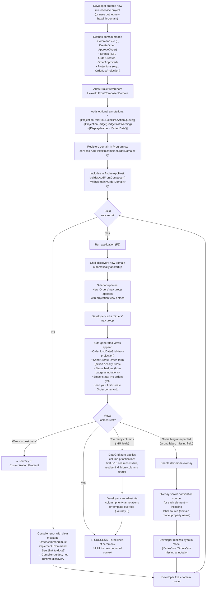
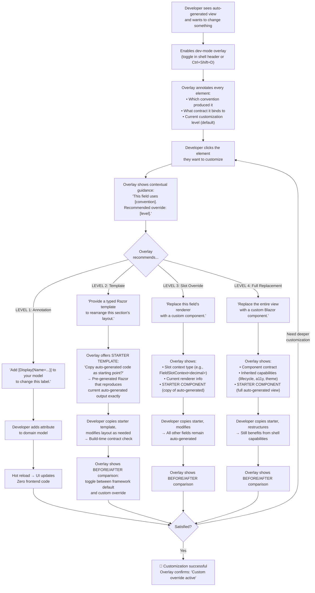
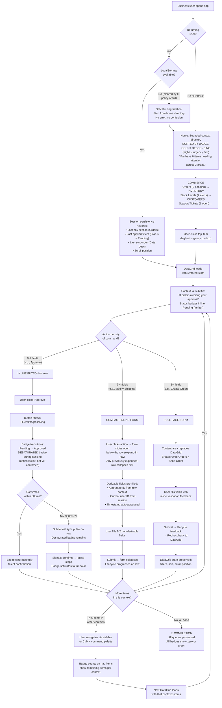
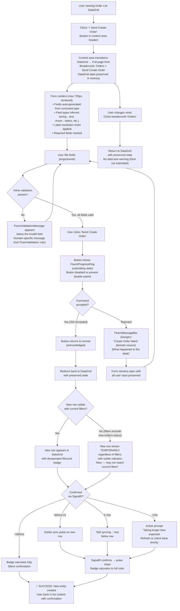

# UX Design Specification: Hexalith FrontComposer

**Author:** Jerome
**Date:** 2026-04-06

---

## Executive Summary

### Project Vision

Hexalith FrontComposer is the missing frontend layer for event-sourced microservices. It provides a unified, convention-driven Blazor frontend that automatically composes polished UIs for all Hexalith.EventStore microservices -- enabling .NET developers to expose rich interfaces with minimal code while delivering business users a seamless experience across the entire application landscape.

The framework operates through a two-layer composition architecture. The first layer treats the domain model as a UI contract: each microservice's commands, events, and projections are introspected to auto-generate intent-driven forms, observation panels, and detail views. The second layer is a composition shell that discovers and composes these UI fragments from all microservices into one coherent application -- handling navigation, layout, consistency, and Fluent UI theming.

The architecture is optimized for predictable, consistent patterns that accelerate both human developers and LLM code generation. The tech stack is C# / .NET 10 / Blazor (Server + WebAssembly) / Fluent UI Blazor v5 / DAPR, communicating with Hexalith.EventStore through REST API (commands/queries) and SignalR (real-time projection change notifications).

### Target Users

**Primary: .NET Developers**
Backend-focused developers with strong DDD/CQRS/event sourcing expertise but limited frontend comfort. They want to expose microservice functionality through polished UIs with minimal effort and no frontend specialization required. Their primary frustration is boilerplate UI code, keeping UIs in sync with evolving domain models, and the architectural complexity of composing multiple microservice UIs. FrontComposer serves them by making the domain model the single source of truth for both backend and frontend. Critically, developers need a smooth **customization gradient** -- not a binary switch between auto-generated and fully custom -- so that escaping conventions is trivial at any granularity (whole view, section, or single field).

**Secondary: Business Users**
End users of applications built with FrontComposer who interact with the composed UI daily. They think in **workflows** that span bounded contexts ("approve this order, check inventory, notify supplier"), not in data views. They expect a seamless, coherent application experience where domain groupings feel natural and meaningful -- the shell is translucent, not invisible. Their frustration is inconsistent UI across modules, slow feature delivery due to frontend bottlenecks, and confusing navigation when multiple microservices are stitched together.

### Key Design Challenges

1. **Eventual consistency UX** -- Commands are processed asynchronously (202 Accepted). The UI must handle five lifecycle states as **progressive system health indicators** -- invisible on the happy path, increasingly visible under degraded conditions. Timing thresholds: show nothing if confirmed <300ms, show sync pulse if 300ms-2s, show explicit "Still syncing..." text if 2-10s, show action prompt with refresh option if >10s, fall back to polling with ETag if SignalR connection lost. Double-submission prevention and clear visual feedback are non-negotiable.

2. **The customization gradient** -- Auto-generated UIs must transition smoothly to custom implementations through **contract-based customization**: each override level (annotation, template, slot, full replacement) binds to a typed contract, not to the framework's internal DOM structure. Slot overrides receive a typed context object (field value, validation state, metadata). Templates receive a typed model. Build-time compatibility checks warn when an override's expected contract doesn't match the current framework version. Developers must be able to replace a single field's rendering without rewriting the entire view.

3. **Seamless multi-service composition** -- Business users must perceive meaningful domain groupings (Orders, Inventory, Customers) without knowing they're bounded contexts. The shell should include composition intelligence: priority-based navigation, dashboard widgets from projection metadata, and attention-routing for state changes requiring action. **Navigation at scale** (10+ bounded contexts) requires: collapsible nav groups, maximum 2-level depth, command palette (Ctrl+K) for direct access, and recently visited shortcuts.

4. **Command + context pattern** -- Command forms should never appear without the relevant projection context. **Aggregate relationship metadata** (which commands affect which projections) enables auto-linking: when a user submits a command, the affected projection is visible and live-updating via SignalR, closing the loop between intent and observation. The framework introspects domain model relationships to determine these links automatically.

5. **Developer-business user continuum** -- Developer conventions and business user experience are not separate design problems. Every convention must be validated against the business user experience it produces. If a convention generates an awkward UI by default, the convention is wrong.

6. **Shell-first architecture** -- The composition shell (navigation, layout, theming, lifecycle management) is the primary deliverable. Auto-generation is the accelerator built on top. A developer who overrides every view should still benefit enormously from FrontComposer's shell capabilities alone.

### Design Opportunities

1. **Intent-driven UI language** -- Since the underlying model is commands (intents) and projections (observations), the UI vocabulary should reflect this: action buttons named after domain intents ("Send Order," "Approve Request," never "Submit" or "Save"), projection views presented as observation panels, not generic data tables. Domain language in every interaction.

2. **Intelligent defaults from domain metadata** -- FrontComposer's knowledge of the domain model enables auto-generated UIs that are smarter than scaffolding: contextual labels, appropriate input types, validation messages from FluentValidation rules, intelligent field grouping, meaningful empty states ("No orders found. Create one?"), and proper loading states ("Loading projections..."). A **label resolution chain** ensures field labels are always human-readable: (1) explicit display name annotation, (2) resource file lookup, (3) humanized CamelCase ("OrderDate" → "Order Date"), (4) raw field name as last resort.

3. **Action density rules** -- The framework auto-determines command rendering based on field count and context derivability: commands with 0-1 non-derivable fields render as **inline buttons** on list rows, commands with 2-4 fields render as **compact inline forms**, and commands with 5+ fields render as **full-page forms**. This eliminates the one-size-fits-all form pattern and makes common actions feel instant.

4. **Projection role hints** -- A small, permanently capped set (5-7) of rendering hints that upgrade auto-generated views from generic tables to role-appropriate patterns: `ActionQueue` (items needing user action), `StatusOverview` (aggregate status dashboard), `DetailRecord` (single-entity detail), `Timeline` (chronological events), `Dashboard` (metric widgets). Unknown roles default to data table. One annotation, massive UX improvement -- the first rung of the customization gradient.

5. **List-detail inline pattern** -- Default DataGrid rows that expand to show projection detail views inline, reducing navigation depth and preserving context. Business users can scan a list and drill into details without losing their place.

6. **Lifecycle as composition wrapper** -- Command lifecycle state management (idle → submitting → acknowledged → syncing → confirmed) is implemented as a cross-cutting composition wrapper, not per-component logic. Custom components inherit lifecycle behavior automatically. The wrapper is preserved even when developers override the inner component through the customization gradient.

7. **Real-time activity awareness** -- The SignalR projection change pattern naturally supports a notification/activity feed showing recent changes across subscribed projections. This enables multi-user awareness and reduces the need for manual refresh.

8. **Developer-mode overlay** -- A dev-mode visualization layer showing which components are auto-generated, what conventions produced them, and how to override them. Discoverability through the framework itself, not just external documentation.

### V1 UX Scope Boundary

The v1 UX scope is deliberately constrained to deliver a tight, polished experience:

- **In scope:** Composition shell (navigation, layout, theming, lifecycle wrapper), flat command forms, list DataGrid views, single-entity detail views, five-state command lifecycle with timeout escalation, empty/loading states, contract-based granular component replaceability, command+context auto-linking via aggregate metadata, domain-language action labels, action density rules, label resolution chain, navigation at scale (collapsible groups, command palette), projection role hints (5-7 capped)
- **V2 candidates:** Cross-context workflow views, dashboard composition, notification/activity feed, guided wizard mode for complex commands, visual configuration tooling, nested object forms, dev-mode overlay
- **Core principles:** (1) Granular replaceability at any level (view, section, field) via typed contracts is an architectural requirement. (2) The shell is valuable without auto-generation -- it's the foundation, not a wrapper. (3) Projection role hints are permanently capped at 5-7; beyond that, use template overrides.

## Core User Experience

### Defining Experience

**The Core Loop: Domain Model → Beautiful Application**

FrontComposer's defining experience is the moment a developer writes a few lines of business rules -- commands, events, projections -- and gets both a running server and a beautiful, fully functional UI. This is not a "scaffold and customize" workflow. The auto-generated application should be production-worthy at first render, not a starting point that needs polish.

**Developer core action:** Register a microservice's domain model with FrontComposer and see its UI appear in the composed application -- navigation entry, command forms, projection views, lifecycle management -- all working, all styled, all connected to the event store. This registration requires **three lines of ceremony**: (1) add the NuGet package, (2) call the registration method in `Program.cs`, (3) include the microservice in the Aspire AppHost. After that, the framework takes over. Be honest about those three lines; under-promise and over-deliver.

**Business user core action:** There is no single dominant action. Business users perform the full spectrum -- browsing lists, acting on items, submitting new commands, checking statuses, drilling into details. This means the entire auto-generated UI surface must be **uniformly competent, selectively excellent**. Every generated view is usable, styled, and production-ready. Views that carry projection role hints (`ActionQueue`, `StatusOverview`) receive additional polish and intent-driven layout. Views without hints default to clean, functional data presentations. Perfection across all surfaces is not the goal for v1; consistent competence with targeted excellence is.

### Platform Strategy

**Production deployment:** Blazor Auto (SSR → WebAssembly transition) for fast initial page loads with full client-side capability after WASM download. SignalR connections transition from server-side to browser-side automatically. This is the mode business users experience.

**Development inner loop:** Blazor Server mode by default for developers. Fast startup, instant hot reload, simple debugging, consistent SignalR behavior. Auto mode adds complexity during development (hot reload differs between SSR/WASM phases, debugging requires mode awareness). Developers work in Server mode; production deploys in Auto mode.

- **Primary interaction:** Desktop-first, mouse and keyboard. The primary users (developers configuring, business users operating) work at desks.
- **Responsive target:** Functional on tablets; usable but not optimized for mobile. Business applications built on FrontComposer are operational tools, not consumer apps.
- **Offline:** Not required. Event-sourced systems with DAPR infrastructure assume always-connected.
- **Accessibility:** WCAG 2.1 AA from day one, inherited from Fluent UI Blazor v5's built-in accessibility (ARIA, keyboard navigation, screen reader support, high contrast mode).

### Effortless Interactions

**What must feel effortless:**

1. **Microservice registration → UI appearance.** Three lines of ceremony (NuGet reference, registration call, Aspire inclusion), then the framework discovers and composes automatically. No manual route configuration, no navigation setup, no layout wiring. If a developer misses a step, they get a helpful compiler error or startup diagnostic -- not a silent failure or runtime `ServiceNotFoundException`.

2. **Command submission → visual confirmation.** A business user clicks an intent button ("Approve Order") and knows instantly that it worked. The five-state lifecycle with timeout escalation handles this silently -- the user never thinks about eventual consistency, async processing, or SignalR. They click, they see confirmation, they move on.

3. **Browsing across bounded contexts.** A business user navigates from Orders to Inventory to Customers without perceiving any boundary. The sidebar groups feel like sections of one application. Theming, interaction patterns, and data density are consistent across all microservices.

4. **Customization without friction.** When a developer needs to override an auto-generated view, the path is obvious: add one annotation for a hint, swap one template for layout changes, replace one slot for field-level customization, or replace the whole component. No documentation diving required -- the dev-mode overlay shows what to override and how.

**What should happen automatically without developer intervention:**

- Navigation entries and hierarchy from microservice registration
- Form field types inferred from C# property types (string → text, bool → toggle, DateTime → date picker, enum → select)
- Validation messages from FluentValidation rules applied to form fields
- Label resolution (display name → resource file → humanized CamelCase)
- Empty states with domain-language messages and creation actions
- Loading states per component (not full-page spinners)
- Command lifecycle management (disable on submit, re-enable on confirm)
- SignalR subscription and projection refresh on change
- ETag caching for query optimization
- Dark/light theme support following Fluent UI tokens

### Critical Success Moments

**Time to First Render: <5 minutes**

The critical success moment is not the first F5 -- it's the *decision to press F5*, which only happens if setup was painless. The onboarding experience defines adoption:

| Minute | Developer Experience |
|--------|---------------------|
| 0:00 | `dotnet new hexalith-frontcomposer` -- project template scaffolds everything |
| 1:00 | Project opens in IDE; Aspire dashboard configuration visible |
| 2:00 | Sample microservice running with domain events flowing |
| 3:00 | Browser opens; composed application with sample views visible |
| 5:00 | Developer modifies a command, sees the UI update automatically |

This "Zero to Render" timeline is the real "I'm never going back" moment -- not that the UI is beautiful (though it is), but that the entire cycle is *fast*. A project template or CLI command must scaffold the complete stack: Aspire config, sample microservice, FrontComposer registration, and sample data.

**The "this just works" moment (Business User):**

A business user opens the application for the first time and finds a clean, familiar-feeling interface (Fluent UI matches their Microsoft 365 experience). They browse a list, expand a row to see details, click "Approve," see instant feedback, and move to the next item. They never wonder "did that work?" and never see a loading spinner for more than a blink. It feels like a product built by a large frontend team, not an auto-generated application.

**The make-or-break interaction:**

The first command submission. If a business user clicks an action button and nothing visible happens for more than a second -- no animation, no state change, no feedback -- trust is broken. The five-state lifecycle with progressive visibility thresholds (nothing <300ms, pulse 300ms-2s, text 2-10s, prompt >10s) exists specifically to protect this moment.

### Experience Principles

1. **Business rules in, beautiful app out.** The framework's value is measured by how little non-domain code a developer writes. Every line of boilerplate the developer must add is a failure of convention.

2. **Uniformly competent, selectively excellent.** Every auto-generated view is usable, styled, and production-ready. Views with projection role hints receive additional polish and intent-driven layout. Consistent quality across all surfaces; targeted excellence where role hints direct it.

3. **Invisible infrastructure.** Eventual consistency, SignalR, ETag caching, microservice composition, navigation routing -- all of it must be invisible to both developers and business users. The framework handles infrastructure; humans handle domain logic and business tasks.

4. **Compiler-guided for developers.** Wrong configuration produces a helpful compiler error or startup diagnostic, not a runtime crash or silent failure. IntelliSense, type safety, and build-time checks guide the developer through setup and customization. The framework is hard to misuse.

5. **Affordance-guided for business users.** Every actionable element looks clickable. Every status is visually distinct. Empty states explain what to do next. The interface communicates its own functionality without requiring training or documentation.

6. **Fast by default, honest when slow.** The happy path feels instant. When it can't be instant (network issues, high load, complex processing), the framework communicates honestly and progressively -- never silent, never stuck.

7. **Five-minute onboarding.** From `dotnet new` to a running composed application with sample data in under 5 minutes. The getting-started experience IS the product experience for a framework.

## Desired Emotional Response

### Framework Metaphor

**"Write the recipe, the kitchen builds itself."**

FrontComposer's emotional promise in one sentence. Developers write business rules (the recipe); the framework composes the entire application (the kitchen). This metaphor anchors all communication -- README, docs, conference talks, onboarding. It captures empowerment (you write the creative part), invisible infrastructure (the kitchen handles the rest), and the relationship transformation (the baker and the customer both benefit from the speed).

### Primary Emotional Goals

**Two primary principles govern all emotional design decisions:**

1. **Confusion is failure** -- the filter for every design choice
2. **Design for the relationship** -- the north star for emotional success

All other emotional goals (empowerment, familiarity, consistency, feedback, capability arrival) are supporting principles that serve these two. If confusion is eliminated and the developer-business user relationship is transformed, all other emotional goals follow.

**Developer: Empowerment**
The primary emotional payoff is not relief ("thank god I don't have to build UI") but empowerment ("now I can do more with less"). FrontComposer should make developers feel like their domain expertise has been amplified -- they're not avoiding frontend work, they're transcending it. Their business rules *become* the UI. This distinction matters: relief is passive and fades; empowerment is active and compounds.

**Business User: Invisible competence**
The application should feel so natural that business users never think about the tool itself. The emotional goal is not delight or surprise -- it's the quiet confidence of a tool that just works. They feel efficient, oriented, and in control.

**Aspirational outcome: Feeling valued.** When FrontComposer enables frequent feature updates, business users may feel valued -- "someone is building this for me, fast." This connects primarily to the *quality evolution of existing views* (views getting smarter over time through projection role hints and customization), not just the arrival of new features. Note: this emotion depends on team velocity, not just framework capability. FrontComposer *enables* it but cannot guarantee it. It is an aspirational outcome, not a design target.

**Relational: Dissolving the developer-business user tension**
FrontComposer's deepest emotional impact transforms the relationship between developers and business users from adversarial to collaborative. Today: business user asks for features, developer says "it'll take six weeks," both feel frustrated. With FrontComposer: developer writes business rules in the morning, the UI is already live. The shared moment of "wait, that's already done?" is the emotional climax -- the developer feels empowered, the business user feels valued, both feel they're finally on the same team. Proxy metric: time from "developer writes domain code" to "business user sees it in production." Target: <1 day.

**The primary emotional differentiator:** No competing Blazor framework addresses eventual consistency UX *at all*. DIY approaches and Oqtane/ABP assume synchronous CRUD. FrontComposer is the only option that designs the emotional experience of asynchronous command processing end-to-end -- the five-state lifecycle, timeout escalation, rollback messages, and reconnection handling. This is not just a design challenge; it is the core emotional value proposition against all alternatives.

**Infrastructure visibility distinction:** "Invisible infrastructure" (Experience Principle #3) applies to *runtime behavior* -- business users never see SignalR, ETag caching, or DAPR. Developers, however, should see infrastructure *when configuring* through dev-mode overlay, diagnostics, and typed contracts. Invisible to users ≠ invisible to developers. Empowerment requires understanding; understanding requires visibility at the right moments.

### Emotional Journey Mapping

**Developer Journey:**

| Stage | Emotion | Trigger | Regression Trigger |
|-------|---------|---------|-------------------|
| Discovery | Curious skepticism | "Auto-generated UI for event sourcing? That never works well." | -- |
| First run | Surprise → Empowerment | Three lines of code produce a running app with beautiful UI in <5 minutes | -- |
| Customization | Confidence | Adding one annotation upgrades a view; replacing one slot changes one field. The gradient works. | Hitting a customization cliff where the override takes hours, not minutes → drops to Skepticism |
| Production use | Trust | Auto-generated views handle edge cases. Lifecycle states protect users. ETag caching just works. | A silent failure in production (skipped field, wrong optimistic state) → drops to Skepticism |
| Advocacy | Pride | "I built this entire multi-microservice app and wrote almost no frontend code." | Framework update breaks an override contract → drops to Frustration |

**Recovery design:** Each regression trigger must have a designed recovery path. Customization cliff → dev-mode overlay explains the override path. Silent failure → auto-generation boundary protocol surfaces the issue with actionable guidance. Contract break → build-time compatibility warning before deployment.

**Business User Journey:**

| Stage | Emotion | Trigger | Regression Trigger |
|-------|---------|---------|-------------------|
| First use | Familiarity | Fluent UI looks like Microsoft 365 -- immediately comfortable | -- |
| Core tasks | Confidence | Click "Approve," see instant feedback. No ambiguity about what happened. | Command rejection after optimistic update with generic "Action failed" message → drops to Distrust |
| Daily use | Efficiency | Navigate across bounded contexts seamlessly. Find items fast via command palette. | -- |
| Week 2: Friction discovery | Patience or frustration | The micro-interactions they repeat 50 times a day must survive scrutiny. Sort, filter, search, inline action -- if any top-10 action requires >2 clicks to *begin*, frustration surfaces here. | Having to re-apply filters and navigation every session → drops to Frustration |
| Sustained use | Valued | New capabilities appear naturally in the sidebar. Silent arrival signals continuous investment. | Features stop arriving; framework's enabling effect invisible → drops to Indifference |
| Habitual use | Invisibility | The tool disappears from consciousness. It's just how work gets done. | Inconsistent new views that break established patterns → drops to Confusion |
| Error/slow | Calm trust | Sync indicator appears, explains the state, offers action. Never confused, never stuck. | -- |

**Error Emotional Sequence:** When something goes wrong (command rejection, stale data, disconnection), the target emotional progression is: **Surprise → Understanding → Trust**. Not: Surprise → Panic → Distrust. This requires: (1) immediate visible acknowledgment that something happened, (2) domain-specific explanation of what went wrong ("Approval failed: insufficient inventory"), (3) clear next action ("The order has been returned to Pending"). Generic error messages ("Action failed") break this sequence at step 2.

**Idempotent Outcome UX:** When a command is rejected but the end state matches the user's intent (e.g., User B approves an order already approved by User A), the rollback message should acknowledge the intent was fulfilled: "This order was already approved (by another user). No action needed." Emotionally: vindication, not rejection. The user wanted it approved; it's approved.

**Reconnection Reconciliation UX:** When SignalR reconnects after a gap, batch-update all stale items with a single subtle animation sweep (not individual per-row flashes). Show a brief "Reconnected -- data refreshed" toast that auto-dismisses in 3 seconds. The emotional goal during reconnection is calm resolution, not celebration.

**Schema Evolution Resilience:** When a registered projection type disappears or changes after a deployment, the framework should: (1) detect the mismatch at startup and log a clear diagnostic, (2) show an explicit "This section is being updated" message to business users instead of empty/stale data, (3) invalidate all cached ETags for the affected projection type. The emotional goal: graceful degradation during deployment transitions, not silent breakage.

### Micro-Emotions

**Critical micro-emotions to cultivate:**

| Micro-Emotion | Where It Matters | How to Create It |
|---------------|------------------|------------------|
| **Confidence** (vs. Confusion) | Every command submission, every navigation action | Five-state lifecycle feedback; clear affordances; domain-language labels |
| **Competence** (vs. Helplessness) | Developer configuring overrides; business user completing tasks | Compiler-guided setup; IntelliSense; clear empty states with next actions |
| **Orientation** (vs. Lost) | Navigating 10+ bounded contexts; returning to app after absence | Collapsible nav groups; command palette; recently visited; breadcrumbs; **user context persistence** (restore last nav, filters, sort on return) |
| **Trust** (vs. Skepticism) | First auto-generated form; first async command; first command rejection | Validation feedback inline; lifecycle states honest about timing; no silent failures; **domain-specific rollback messages** |
| **Flow** (vs. Interruption) | Business user processing a queue of items | Inline actions on list rows; expand-in-place details; no unnecessary page navigations; **session persistence preserves working context** |
| **Valued** (vs. Ignored) | Business user noticing new features arriving continuously | Silent capability arrival with data-gating and subtle "New" badge; new bounded contexts appear like new data |

**The cardinal sin: Confusion.**

Confusion is the worst emotion either user can experience. For the developer, confusion means "I don't know how to configure this" -- they'll abandon the framework for a library they understand. For the business user, confusion means "I don't know if my action worked" -- they'll double-click, navigate away, or call support. Every design decision must be filtered through: **"Does this risk confusing either audience?"**

**Objective confusion definition:** A user is confused when they (1) take an unintended action, or (2) fail to take an intended action within 5 seconds. "Had to think for a moment" is not confusion; "clicked the wrong thing" or "didn't know what to click" is.

Confusion manifests as:
- Silent failures (command submitted but no visible feedback)
- Silent omission (auto-generation skips a field without explanation)
- Ambiguous state (is this data current or stale?)
- Unclear path (how do I override this one field?)
- Magic behavior (something changed but I don't know why)
- Inconsistent patterns (this list works differently from that list)
- Surprising visual change (a view suddenly looks different because a role hint was added -- transitions between default and role-hinted views must feel evolutionary, not jarring, eased by animations)

### Auto-Generation Boundary Protocol

When the framework encounters a type it cannot auto-generate a field for (e.g., `Dictionary<string, List<Address>>`, complex nested objects, custom value types):

1. **Never silently omit.** The field must be visually present in the form.
2. **Render a visible placeholder** with the field name and type annotation.
3. **Display a clear message:** "This field requires a custom renderer. See: [link to customization gradient docs]."
4. **Emit a build-time warning** so the developer sees the gap during compilation, not at runtime.
5. **In dev-mode overlay,** highlight unsupported fields with a distinct visual indicator.

Silent omission violates Principles 1 (confidence through progressive feedback), 3 (confusion is failure), and 4 (progressive honesty) simultaneously. It is the single most likely source of developer confusion in the auto-generation system.

### Design Implications

| Emotional Goal | UX Design Approach |
|----------------|-------------------|
| **Empowerment** (developer) | Three-line ceremony, then the framework takes over. Customization gradient with typed contracts. Build-time errors that teach, not punish. Dev-mode overlay for infrastructure visibility. |
| **Invisible competence** (business user) | Fluent UI familiarity. Consistent patterns across all bounded contexts. Zero training required for basic tasks. User context persistence restores last working state on return. |
| **Valued** (business user) | New bounded contexts and capabilities arrive silently -- gated on projection data availability (don't show empty nav entries). Subtle "New" badge on first appearance, disappears after first click. No banners, no modals. Developer velocity becomes visible through the experience itself. |
| **Relational harmony** (both) | The framework's speed transforms the developer-business user dynamic. Target: <1 day from domain code to production UI. Fast iteration replaces long request-to-delivery cycles. |
| **Confidence** (both) | Every action produces visible feedback within 300ms. No silent failures. Domain language on every button and label. Domain-specific rollback messages on command rejection -- never generic "Action failed." |
| **Orientation** (both) | Command palette for instant navigation. Breadcrumbs in content area. Collapsible nav with visual indicators for active section. Session persistence: remember last nav section, filters, sort order. |
| **Flow** (business user) | Action density rules minimize page transitions. Inline expand keeps context. Lists remember scroll position and filters. Minimize **context switches** (mental model changes from leaving one view for another) -- context switches cause more friction than raw click count. |
| **Trust** (both) | Honest timing indicators. ETag freshness visible in dev mode. Compiler errors for misconfiguration. Predictable, consistent conventions. Error emotional sequence: Surprise → Understanding → Trust. |
| **Anti-confusion** (both) | Every auto-generated component behaves identically regardless of which microservice produced it. Visual transitions between view modes are animated and evolutionary, never jarring. Auto-generation boundary protocol surfaces unsupported fields visibly. No exceptions, no special cases. |

**Consistency boundaries:** Consistency is enforced for *behavior* (layout structure, spacing, interaction patterns, lifecycle states, navigation model). Consistency is *customizable* for visual identity (accent colors per bounded context, custom column renderers, projection role hints, field-level slot overrides). Consistency applies to how things work, not to every visual detail.

**Floor-before-ceiling ordering:** Uniform competence is the floor; selective excellence is the ceiling. All default views must pass the quality bar before any role-hinted views receive extra polish. In practice: fix a rendering issue in the default table before polishing the `ActionQueue` layout.

### Emotional Design Principles

**Primary Principles** (the two that subsume all others):

1. **Confusion is failure.** Any moment of confusion -- developer or business user -- is a design failure to be fixed, not a documentation gap to be covered. If a user is confused, the framework is wrong. Confusion is objectively defined: user takes an unintended action OR fails to take an intended action within 5 seconds. This is the filter for every design decision.

2. **Design for the relationship.** FrontComposer's emotional success is measured not just by how each individual feels, but by how it transforms the dynamic between developers and business users. Target metric: <1 day from domain code to production UI. The framework succeeds when both audiences feel they're on the same team. This is the north star for emotional direction.

**Supporting Principles** (serve the two primary principles):

3. **Empowerment over relief.** The framework amplifies developer capability, not compensates for developer weakness. The emotional message is "you can do more" not "you don't have to do this."

4. **Confidence through progressive feedback.** Every user action produces a visible response within 300ms. The system is never silent. When things are slow or broken, escalate communication progressively: invisible → subtle → explicit → actionable. Never jump from "everything's fine" to "something's wrong." Even "I'm working on it" is better than nothing.

5. **Familiarity as foundation.** Fluent UI is chosen not just for aesthetics but for emotional comfort -- business users already know this visual language from Microsoft 365. Don't fight it; lean into it completely.

6. **Consistency is trust.** Every auto-generated view from every microservice follows the same behavioral patterns, the same spacing, the same interaction model. Trust accumulates through predictability and breaks through inconsistency. Consistency applies to behavior and layout; visual identity details are customizable.

7. **Silent capability arrival.** New features and bounded contexts appear in the application as naturally as new data -- gated on projection data availability, marked with a subtle "New" badge on first appearance. Care expressed as absence of ceremony. Developer velocity becomes visible to business users through the experience itself, not through release notes.

### Measurable Emotional Design Requirements

1. **Minimize context switches for top-10 business user actions** (sort, filter, search, inline action, navigate, expand, submit, confirm, dismiss, return). The primary friction metric is **context switches** (mental model changes from leaving one view for another), not raw click count. A user who clicks three times within the same visual context (expand row → edit field → submit inline) experiences less friction than a user who clicks twice but navigates to a different page. Design for ≤2 clicks to *begin* any top-10 action AND zero unnecessary context switches.
2. **User context persistence** across sessions: last active navigation section, last applied filters per DataGrid, last sort order, last expanded row. On return, the user lands where they left off. This is a v1 requirement. **Architectural note:** Session persistence touches every component and requires a first-class persistence model designed into the framework architecture, not bolted on later.
3. **Domain-specific rollback messages** for every command rejection scenario. No generic "Action failed" messages. Format: "[What failed]: [Why]. [What happened to the data]." Example: "Approval failed: insufficient inventory. The order has been returned to Pending." For idempotent outcomes (rejected but intent fulfilled): acknowledge success, not failure.
4. **Auto-generation boundary visibility** for every unsupported field type. Zero silent omissions.
5. **New capability arrival gating** -- navigation entries for new bounded contexts appear only when at least one projection contains data. Subtle "New" badge on first appearance, removed after first visit.
6. **Reconnection reconciliation** -- batch-update stale items with single animation sweep on SignalR reconnect; brief auto-dismissing "Reconnected" toast. No per-row flashes.
7. **Schema evolution resilience** -- detect projection type mismatches at startup; show "This section is being updated" instead of empty/stale data; invalidate affected ETag caches.

## UX Pattern Analysis & Inspiration

### Inspiring Products Analysis

**1. Azure Portal**

*Why it's relevant:* Azure Portal is the closest analog to FrontComposer's composition problem -- it composes dozens of independent services into one coherent management experience. Business users (ops teams) and developers both use it daily.

| UX Strength | How It Achieves It | FrontComposer Relevance |
|---|---|---|
| **Resource blade navigation** | Click a resource → blade slides in from the right, preserving parent context. No full-page navigation for drill-down. | Directly relevant to the list-detail inline pattern. FrontComposer's expand-in-row is the same principle -- keep parent context visible during drill-down. |
| **Command bar** | Top-of-page action bar with contextual commands that change based on the selected resource type. | Maps to action density rules -- commands contextual to the current projection, not a fixed global toolbar. |
| **Resource groups as composition** | Independent Azure services grouped into logical "resource groups." Users see their mental model, not Azure's service architecture. | Identical to FrontComposer's bounded context grouping -- business users see "Orders" not "Hexalith.Orders.Microservice." |
| **Activity log** | Every action logged with timestamp, user, status. Always accessible. | Supports the "real-time activity awareness" design opportunity. Could inform v2 activity feed design. |
| **Notifications panel** | Top-right bell icon showing async operation progress. Deployment in progress, succeeded, failed -- all visible. | **Directly relevant** to eventual consistency UX. Azure Portal's notification model for long-running operations is the closest existing pattern to FrontComposer's five-state lifecycle. |

*Key UX weakness to learn from:* Azure Portal's blade navigation becomes unwieldy at depth >3. Blades stack horizontally and the user loses orientation. FrontComposer should enforce 2-level max depth (as already spec'd) and never let drill-down create a horizontal scroll of contexts.

**2. GitHub**

*Why it's relevant:* GitHub is the gold standard for developer-first UX that also serves non-developer stakeholders (PMs, designers using issues/PRs). Its command palette and keyboard-first design are directly applicable.

| UX Strength | How It Achieves It | FrontComposer Relevance |
|---|---|---|
| **Command palette (Ctrl+K)** | Universal search and navigation. Type anything -- repo, file, command, user -- and get instant results. | Already spec'd for FrontComposer. GitHub proves this pattern works at scale (millions of repos). Implementation should follow GitHub's approach: fuzzy matching, recent items first, categorized results. |
| **Contextual actions on list items** | Issue/PR lists show inline status badges, assignee avatars, and quick-action buttons without expanding the row. | Validates FrontComposer's action density rules. GitHub proves that inline actions on list rows reduce context switches dramatically. |
| **Progressive disclosure in detail views** | Issue detail shows title + description by default; timeline, linked PRs, labels are visible but not overwhelming. Tabs for code changes, checks, etc. | Pattern for projection detail views -- lead with the essential fields, group secondary fields into collapsible sections or tabs. Avoid the "wall of fields" anti-pattern. |
| **Keyboard shortcuts everywhere** | `g i` → go to issues, `g p` → go to PRs, `/` → focus search. Power users navigate without mouse. | FrontComposer should support keyboard shortcuts for top navigation targets. The composition shell should provide a consistent shortcut system across all bounded contexts. |
| **Empty states with CTAs** | Empty repo → "Quick setup" guide. Empty issues → "Create your first issue." Always actionable, never blank. | Already spec'd. GitHub's empty states are the benchmark -- domain-specific, actionable, not generic. |

*Key UX weakness to learn from:* GitHub's notification system is overwhelming for active users. Hundreds of unread notifications with no intelligent prioritization. FrontComposer's v2 activity feed should learn from this: prioritize by user relevance (projections the user subscribes to), not by chronological order.

**3. Notion**

*Why it's relevant:* Notion proves that a composition-based architecture (blocks composing into pages) can feel simple and delightful. Its progressive disclosure and "everything is a block" metaphor parallel FrontComposer's "everything is a projection/command" model.

| UX Strength | How It Achieves It | FrontComposer Relevance |
|---|---|---|
| **Sidebar navigation with nested pages** | Collapsible tree in the left sidebar. Drag to reorder. Infinite nesting but practically used at 2-3 levels. | Validates FrontComposer's collapsible sidebar with bounded context groups. Notion proves this scales well when depth is naturally limited. |
| **Inline editing everywhere** | Click any text to edit. No "edit mode" vs "view mode." The content IS the editor. | Philosophical inspiration: FrontComposer's command forms should feel native to the projection view, not like a separate "edit mode." The command+context pattern supports this -- command form appears within the projection context, not on a separate page. |
| **Slash commands for actions** | Type `/` to see all available actions in context. Discoverable, fast, keyboard-friendly. | Analogous to the command palette. Notion's slash menu is contextual (different options in different block types); FrontComposer's command palette should be contextual too (different commands available depending on current bounded context). |
| **Calm, minimal aesthetic** | Generous whitespace, muted colors, content-first design. The tool recedes; the content dominates. | Aligned with FrontComposer's visual direction: "functional, systematic, professional, clean, native." Fluent UI's design language supports this when used without overrides. |
| **Real-time collaboration indicators** | Colored cursors showing who else is editing. Subtle, non-intrusive, always-visible. | Inspiration for v2 real-time activity awareness. When another user modifies a projection the current user is viewing, a subtle indicator could show "Updated by [user] just now." |

*Key UX weakness to learn from:* Notion's performance degrades with large databases. A Notion database with 10,000 rows becomes sluggish. FrontComposer's DataGrid views will face the same challenge -- projection lists could be very large. Virtual scrolling (Fluent UI's `<Virtualize>`) and server-side pagination via ETag-cached queries are essential from v1.

### Transferable UX Patterns

**Navigation Patterns:**

| Pattern | Source | FrontComposer Application |
|---------|--------|--------------------------|
| **Command palette (Ctrl+K)** | GitHub | Universal navigation across all bounded contexts. Fuzzy match, recent items first, categorized by context. v1 requirement. |
| **Collapsible sidebar with groups** | Azure Portal, Notion | Bounded contexts as collapsible nav groups. 2-level max depth. Persistent across sessions. |
| **Breadcrumbs for orientation** | Azure Portal | Content area breadcrumbs: Home → Orders → Order #1234. Always visible, always clickable. |
| **Keyboard shortcuts for power users** | GitHub | `g o` → go to Orders, `g i` → go to Inventory. Consistent system across all bounded contexts. |

**Interaction Patterns:**

| Pattern | Source | FrontComposer Application |
|---------|--------|--------------------------|
| **Inline actions on list items** | GitHub | Action density rules: 0-1 field commands as inline buttons on DataGrid rows. No context switch for simple actions. |
| **Expand-in-place for details** | Azure Portal blades | List-detail inline pattern: click row to expand detail view within the list. Parent list stays visible. |
| **Async operation notifications** | Azure Portal bell icon | Five-state lifecycle mapped to a notification model: submitted → processing → complete. Notification panel accessible globally. |
| **Contextual command availability** | Notion slash menu | Commands available in the command palette change based on current bounded context. Orders context shows Order commands; Inventory context shows Inventory commands. |
| **Progressive disclosure in detail views** | GitHub issues | Projection detail views: essential fields visible by default, secondary fields in collapsible sections. Never show all 30 fields flat. |

**Visual Patterns:**

| Pattern | Source | FrontComposer Application |
|---------|--------|--------------------------|
| **Content-first, tool-recedes** | Notion | Fluent UI's minimal aesthetic. Data and actions dominate; framework chrome is minimal. |
| **Status badges inline** | GitHub | Projection status indicators as colored badges directly on list rows: "Pending" (amber), "Approved" (green), "Rejected" (red). Domain-language labels, not generic statuses. |
| **Empty states with domain CTAs** | GitHub | "No orders found. Send your first order command." Every empty state is actionable and domain-specific. |

### Anti-Patterns to Avoid

| Anti-Pattern | Source | Why to Avoid | FrontComposer Mitigation |
|---|---|---|---|
| **Blade stacking at depth >3** | Azure Portal | Users lose spatial orientation. Horizontal scrolling through stacked contexts is disorienting. | Enforce 2-level max navigation depth. Expand-in-place for details, never stack. |
| **Notification flood** | GitHub | Chronological notifications without prioritization become noise. Users stop checking. | v2 activity feed must prioritize by user relevance (subscribed projections, own commands) not by chronological order. |
| **Performance cliff with large datasets** | Notion | Large lists become sluggish, breaking the "fast by default" principle. | Virtual scrolling from v1. Server-side pagination via ETag-cached queries. Never load unbounded projection lists into memory. |
| **Modal dialogs for actions** | Many enterprise apps | Modals break context. User loses sight of the data they're acting on. | Inline forms and expand-in-place. Commands render within projection context, not in modals. Exception: destructive commands (delete) may use a confirmation dialog for safety. |
| **Generic empty states** | Enterprise CRUD apps | "No records found" tells the user nothing. Creates a dead end. | Every empty state names the domain entity and provides a creation action. "No orders found. Send your first order command." |
| **Separate edit/view modes** | Legacy admin panels | "Click Edit to modify" → form appears → "Click Save" → back to view mode. Adds ceremony to every change. | Inline editing where action density allows. Command forms appear within the projection context, not as a separate mode. |
| **Loading spinners blocking entire pages** | Many web apps | Full-page spinner breaks flow and creates anxiety. User wonders "did something break?" | Per-component loading skeletons. Each projection view loads independently. The shell and navigation are always responsive even if one projection is still loading. |

### Design Inspiration Strategy

**Adopt directly:**

- **Command palette (Ctrl+K)** from GitHub -- proven at scale, essential for 10+ bounded contexts
- **Collapsible sidebar with groups** from Azure Portal/Notion -- natural mapping to bounded contexts
- **Inline actions on list rows** from GitHub -- validates action density rules
- **Async operation notifications** from Azure Portal -- closest existing pattern to five-state lifecycle
- **Empty states with domain CTAs** from GitHub -- benchmark quality for auto-generated empty states
- **Per-component loading** from modern web apps -- never block the entire shell

**Adapt for FrontComposer:**

- **Azure Portal blade navigation** → FrontComposer's expand-in-place (same principle, but vertical expansion within a list instead of horizontal blade stacking, respecting 2-level depth limit)
- **Notion's inline editing** → FrontComposer's command+context pattern (commands render within projection context, not as separate "edit mode," but still as distinct command forms, not free-form text editing)
- **GitHub's keyboard shortcuts** → FrontComposer's bounded-context-aware shortcuts (same concept but dynamically scoped to current context)
- **Notion's slash commands** → FrontComposer's contextual command palette (commands available change based on active bounded context)

**Avoid explicitly:**

- Blade stacking / deep navigation hierarchies
- Chronological notification floods without relevance filtering
- Full-page loading spinners
- Modal dialogs for standard commands (reserve for destructive actions only)
- Generic empty states
- Separate edit/view modes
- Unbounded data loading without virtualization

## Design System Foundation

### Design System Choice

**Fluent UI Blazor v5** -- Microsoft's open-source component library for Blazor, built on Fluent UI Web Components v3 (the same rendering layer powering Microsoft 365, Teams, and Windows 11).

This is not a choice among alternatives; it is a fixed architectural constraint. The tech stack (Blazor), the design alignment (Microsoft ecosystem), the accessibility requirement (WCAG 2.1 AA), the LLM compatibility priority (MCP Server), and the solo-developer maintenance reality all converge on Fluent UI Blazor v5 as the only viable option.

### Rationale for Selection

1. **Architectural alignment** -- Fluent UI Blazor v5 is the only component library that provides native Blazor components (not JavaScript wrappers), design token theming via CSS custom properties, and first-class MCP Server integration for AI-assisted development.

2. **Emotional design support** -- Fluent UI's visual language is already familiar to business users from Microsoft 365. This directly serves the "Familiarity as foundation" emotional design principle. No custom styling or brand adaptation needed for the base experience.

3. **Maintenance reality** -- Solo project. A custom design system is unmaintainable. Fluent UI provides 65+ production-ready components with accessibility built in, maintained by Microsoft contributors. The framework inherits accessibility compliance rather than building it.

4. **Convention enforcement** -- Using Fluent UI exclusively (no custom styling, no overrides of the design system) enforces the consistency-is-trust principle. Every auto-generated view from every microservice looks identical because they all use the same unmodified components.

5. **LLM compatibility** -- The Fluent UI Blazor MCP Server provides component intelligence directly in the IDE. AI coding assistants generate correct, idiomatic v5 code. This supports the "architecture optimized for LLM code generation" success criterion.

### Implementation Approach

**Zero-override strategy:** FrontComposer uses Fluent UI Blazor v5 exactly as designed. No custom CSS overrides, no shadow DOM penetration, no design token hacking. The only customization is the accent color (Teal #0097A7) applied through Fluent UI's supported theming mechanism.

**Component mapping:**

| FrontComposer Concept | Fluent UI Component | Notes |
|---|---|---|
| Application shell | `FluentLayout` + `FluentLayoutItem` | Declarative area-based layout (Header, Navigation, Content, Footer) |
| Sidebar navigation | `FluentNav` (v5 renamed from FluentNavMenu) | Collapsible groups per bounded context |
| Navigation toggle | `FluentLayoutHamburger` | Built-in responsive hamburger with smooth animation |
| Command forms | `FluentTextField`, `FluentSelect`, `FluentCheckbox`, `FluentDatePicker`, etc. | Auto-generated from command field types |
| Form validation | `FluentValidationMessage` + EditContext | Blazor-native validation with FluentValidation library |
| Projection lists | `FluentDataGrid` (HTML `<table>` in v5) | Native HTML rendering, improved accessibility and testability |
| Detail views | `FluentCard`, `FluentAccordion` | Cards for grouped fields, accordion for progressive disclosure |
| Action buttons | `FluentButton` | Appearance variants: Primary (main action), Secondary (alternative), Outline (subtle) |
| Status indicators | `FluentBadge` | Colored badges for projection status on list rows |
| Loading states | `FluentSkeleton`, `FluentProgressRing` | Per-component skeletons, not full-page spinners |
| Empty states | Custom Blazor component with `FluentIcon` | Domain-specific message + creation CTA |
| Lifecycle feedback | `FluentProgressRing` (submitting), `FluentBadge` (syncing), `FluentMessageBar` (confirmed) | Note: `IToastService` removed in v5; use `FluentMessageBar` or custom notification component |
| Theme toggle | CSS custom properties via `<fluent-design-theme>` | Dark/Light/System with LocalStorage persistence |
| Command palette | Custom Blazor component with `FluentSearch` | No built-in Fluent UI command palette; must be custom-built following GitHub's pattern |
| Icons | `FluentIcon` from `Microsoft.FluentUI.AspNetCore.Components.Icons` | 2,200+ icons, strongly-typed, Filled and Outlined variants |
| Providers | `<FluentProviders />` | Single provider component replaces v4's individual providers |

**Service registration:**

```csharp
builder.Services.AddFluentUIComponents(config =>
{
    config.DefaultValues.For<FluentButton>()
          .Set(p => p.Appearance, ButtonAppearance.Primary);
});
```

**Key v5 migration considerations for implementation:**
- `FluentNavMenu` → `FluentNav` (renamed)
- `IToastService` → removed (use `FluentMessageBar` or custom)
- `SelectedOptions` → `SelectedItems` (binding change)
- `FluentDesignTheme` → CSS custom properties (theming change)
- `<FluentDesignSystemProvider>` → `<FluentProviders />` (simplified)

### Customization Strategy

**What FrontComposer customizes (supported by Fluent UI):**

- **Accent color:** Teal #0097A7 applied through CSS custom properties. This is the sole brand differentiation from default Fluent UI.
- **Default component values:** Using the v5 DefaultValues system to set application-wide defaults (e.g., all buttons default to Primary appearance).
- **Localization:** IFluentLocalizer for English + French resource files on all framework-generated UI strings.
- **DataGrid adapters:** EF Core or OData adapter for server-side query resolution.

**What FrontComposer does NOT customize:**

- No custom CSS overrides on Fluent UI components
- No custom design tokens beyond accent color
- No custom typography (Segoe UI / system font stack)
- No custom icons (Fluent UI icon library only)
- No custom spacing or elevation values
- No shadow DOM penetration

**Rationale for zero-override:** Every custom override is a maintenance burden, a potential accessibility regression, and a consistency risk. By using Fluent UI as-is, FrontComposer inherits all future Fluent UI improvements (bug fixes, accessibility enhancements, new components) without migration friction. The only custom components are those Fluent UI doesn't provide: command palette, eventual consistency lifecycle wrapper, and auto-generation boundary placeholders.

**Custom components needed (not in Fluent UI):**

| Component | Purpose | Built With |
|---|---|---|
| `FrontComposerCommandPalette` | Universal navigation and command search (Ctrl+K) | `FluentSearch` + custom overlay |
| `FrontComposerLifecycleWrapper` | Five-state command lifecycle composition wrapper | Custom Blazor component wrapping any inner component |
| `FrontComposerFieldPlaceholder` | Auto-generation boundary protocol -- unsupported field indicator | `FluentCard` + `FluentIcon` + `FluentAnchor` |
| `FrontComposerEmptyState` | Domain-specific empty state with creation CTA | `FluentIcon` + `FluentButton` + custom layout |
| `FrontComposerSyncIndicator` | Reconnection reconciliation and sync pulse | Custom Blazor component with CSS animation |

## Defining Experience

### The Core Interaction

**"Define your domain. See your application."**

This is FrontComposer's defining interaction -- the moment that, if nailed, makes everything else follow. A developer writes business rules (commands, events, projections), registers the domain with three lines of ceremony, and a complete, beautiful, functional application appears. No frontend code. No layout configuration. No route setup.

The business user's parallel defining experience is the inverse: they open the app and complete their first task without any awareness of the underlying architecture. Browse a list, act on an item, see confirmation. The tool is invisible; the work gets done.

Both sides of this interaction must be excellent. They are not independent -- the developer experience produces the business user experience. The quality of auto-generation directly determines the quality of the business user's first impression.

### User Mental Model

**Developer mental model:** "I build domain models. Someone else builds the UI." FrontComposer replaces "someone else" with the framework itself. The developer's mental model doesn't need to change -- they continue thinking in commands, events, and projections. The framework translates their existing mental model into UI without requiring them to learn a new one.

**Key mental model alignment:** Developers already think in CQRS terms. FrontComposer's UX concepts map directly:
- Command → form (intent submission)
- Projection → list/detail view (observation)
- Aggregate → bounded context group (navigation section)
- Event → activity feed entry (v2)

This 1:1 mapping means developers never learn "FrontComposer concepts" -- they already know them by different names.

**Business user mental model:** "This is an application I use for my job." They have no awareness of microservices, bounded contexts, or event sourcing. Their mental model is task-oriented: "I need to approve orders," "I need to check inventory," "I need to find a customer." The navigation groups, command forms, and projection views must map to these tasks, not to architectural concepts.

**Current solutions and their friction:**
- **DIY Blazor:** Developer builds everything from scratch. Full control but weeks of boilerplate per microservice. UI drifts from domain model as both evolve independently.
- **Oqtane/ABP:** Scaffolding helps but imposes CRUD paradigms. Developer fights the framework when the domain doesn't fit CRUD. Business user gets inconsistent UX across modules built by different teams.
- **No frontend (CLI/API only):** Zero frontend effort but zero business user accessibility. Limits adoption to technical audiences.

### Success Criteria

| Criterion | Measurement | Target |
|-----------|-------------|--------|
| **Time to first render** | From `dotnet new` to browser showing composed app | <5 minutes |
| **Lines of non-domain code** | Code written by developer that isn't business rules | <10 lines per microservice (registration, Aspire config) |
| **Business user first-task completion** | Time from app open to completing first action (e.g., approving an order) | <30 seconds, zero training |
| **Auto-generation coverage** | Percentage of views that work without custom code for flat commands/projections | 100% for v1-scoped types (flat primitives, enums, DateTime, bool) |
| **Customization time** | Time to override one field's rendering in an otherwise auto-generated form | <5 minutes |
| **Command lifecycle confidence** | Business user successfully completes first async command without confusion | 100% (no double-clicks, no "did it work?" hesitation) |

### Novel vs. Established Patterns

**FrontComposer combines established patterns in a novel way:**

| Pattern | Established/Novel | Source |
|---------|------------------|--------|
| Sidebar navigation with groups | Established | Azure Portal, Notion, every admin panel |
| DataGrid with inline expand | Established | GitHub, Azure Portal, enterprise UX |
| Command forms from data models | Established | Scaffolding in Rails, Django, ABP |
| Command palette (Ctrl+K) | Established | GitHub, VS Code, Notion |
| Dark/light theme toggle | Established | Fluent UI, every modern app |
| **Auto-generation from CQRS domain models** | **Novel** | No existing framework does this for event-sourced systems |
| **Five-state eventual consistency lifecycle** | **Novel** | Azure Portal notifications are the closest, but not designed for CQRS |
| **Projection role hints upgrading view patterns** | **Novel** | No equivalent -- one annotation changing the entire view archetype |
| **Command+context auto-linking via aggregate metadata** | **Novel** | No framework auto-links command forms to affected projections |
| **Composition shell for microservice UI fragments** | **Novel for event sourcing** | Micro-frontends exist but none designed for CQRS/ES |

**Teaching strategy for novel patterns:** The novel patterns require zero user education because they are invisible by design. The developer doesn't learn "five-state lifecycle" -- they register a domain and the lifecycle works automatically. The business user doesn't learn "projection role hints" -- they see a well-designed view. The novel patterns are framework capabilities, not user-facing concepts. The only novel concept the developer must learn is the registration API itself -- and that's three lines of code.

### Experience Mechanics

**Developer Flow: Registration → First Render**

```
1. INITIATION
   Developer runs: dotnet new hexalith-frontcomposer
   → Template scaffolds: Aspire AppHost, sample Counter microservice,
     FrontComposer shell, all NuGet references

2. MODIFICATION (optional)
   Developer opens the sample Counter domain:
   - IncrementCounter command (1 field: Amount)
   - CounterProjection (fields: Id, Count, LastUpdated)
   Developer modifies or adds their own commands/projections

3. REGISTRATION
   In the microservice's Program.cs:
   services.AddHexalithDomain<CounterDomain>();
   In the Aspire AppHost:
   builder.AddFrontComposer().WithDomain<CounterDomain>();

4. LAUNCH
   Developer presses F5 (or dotnet run)
   → Aspire orchestrates: EventStore + DAPR sidecar + FrontComposer shell
   → Browser opens to composed application

5. FIRST RENDER
   Developer sees:
   - FluentLayout shell with header (theme toggle, app title) and sidebar
   - "Counter" nav group in sidebar (auto-discovered from domain registration)
   - "Send Increment Counter" form (auto-generated from IncrementCounter command)
     - Amount field (FluentNumberField, inferred from int type)
     - "Send Increment Counter" button (domain-language label)
   - "Counter Status" DataGrid (auto-generated from CounterProjection)
     - Columns: Id, Count, Last Updated
     - Empty state: "No counter data yet. Send your first Increment Counter command."

6. FIRST INTERACTION
   Developer enters Amount: 1, clicks "Send Increment Counter"
   → Button shows FluentProgressRing (submitting state)
   → 200ms later: button returns to normal (acknowledged)
   → Subtle sync pulse on DataGrid (syncing state)
   → 400ms later: DataGrid refreshes with new row (confirmed via SignalR)
   → Developer sees the complete loop: command → event → projection → UI update
```

**Business User Flow: Open App → Complete First Task**

```
1. INITIATION
   Business user opens browser to app URL
   → FluentLayout loads: familiar Fluent UI chrome, sidebar with domain groups
   → Session persistence restores last nav section (or home on first visit)

2. ORIENTATION
   Sidebar shows collapsible groups: Orders, Inventory, Customers...
   User clicks "Orders" → group expands to show:
   - Order List (DataGrid view)
   - Send Order (command form, if action density = full page)

3. BROWSING
   User clicks "Order List"
   → DataGrid loads with projection data
   → Status badges inline: "Pending" (amber), "Approved" (green)
   → Session-persisted filters restore: "Status = Pending" (if previously set)
   → User scans the list, sees 3 pending approvals

4. ACTING
   User sees "Approve" button inline on a Pending order row
   (action density: 0 non-derivable fields)
   → Clicks "Approve"
   → Button shows micro-animation (submitting, <200ms)
   → Row status badge transitions: "Pending" → "Approved" (optimistic update)
   → Subtle sync pulse on row (syncing)
   → 400ms later: sync pulse disappears (confirmed via SignalR)
   → User moves to next row

5. INVESTIGATING (optional)
   For a complex order, user clicks the row to expand detail view inline
   → FluentAccordion expands below the row
   → Detail fields: order lines, customer info, shipping details
   → "Modify Shipping" button appears (action density: compact inline form)
   → User modifies and submits within the expanded context
   → Row collapses back after confirmation

6. COMPLETION
   User has processed all pending approvals
   → DataGrid now shows all "Approved" status badges
   → User navigates to next task via sidebar or command palette (Ctrl+K)
```

## Visual Design Foundation

FrontComposer does not define a parallel visual system; it consumes Fluent UI Blazor v5's tokens exactly as designed. This section documents how Fluent UI's foundations map to FrontComposer's specific needs -- command lifecycle signaling, projection badges, auto-generated form density, and the framework's default brand differentiator (Teal accent). The zero-override strategy from the Design System Foundation section is the enforcement rule: every decision below either references a Fluent UI token or is implemented as an explicit, documented exception with architectural justification.

**Architectural boundary:** Microservices cannot inject CSS into the composed shell. All theming, token resolution, and visual decisions are shell-resolved. A microservice contributes commands, projections, and (via the customization gradient) typed component overrides -- it never contributes stylesheets, CSS variables, or design tokens. This boundary is what makes zero-override possible at composition scale: the shell is the single source of visual truth, and microservices are visual guests.

### At a Glance: Customization Reality

For evaluators deciding whether FrontComposer fits their constraints, here are the answers to the most common questions, with links to detailed sections below.

| Question | Answer | Details |
|---|---|---|
| **Can I change the accent color?** | Yes -- the default teal (`#0097A7`) is overridable at deployment time via Fluent UI's supported accent theming API. "Zero-override" refers to the framework, not the deployed app. | Color System → Brand accent override policy |
| **Can I customize individual components?** | Yes -- via the customization gradient (annotation → template → slot → full replacement). Custom components inherit lifecycle and accessibility wrappers. | Customization Strategy section |
| **Will this pass a WCAG 2.1 AA audit?** | Yes, provided adopters do not silence the build-time accessibility warnings and their custom components preserve the accessibility contract. | Accessibility Considerations → WCAG criterion mapping |
| **Does it support right-to-left languages?** | v1: inherited from Fluent UI, not explicitly verified by FrontComposer. v2: explicit RTL verification via specimen view. | RTL support below |
| **Does it sync user preferences across devices?** | No. v1 uses LocalStorage (per-device) for all user preferences (theme, density, settings). Cross-device sync is not in v1 scope. | Theme Support → Preference storage rationale |
| **Can my enterprise set deployment-wide defaults?** | Yes -- see the deployment default tier in the density precedence rule. | Density Strategy → Precedence rule |

### Key Decisions with Rejected Alternatives

Each major visual foundation decision was a selection from multiple options. For future contributors, the rejected alternatives are as informative as the chosen ones.

| Decision | Chosen | Principal rejected alternatives | Why rejected |
|---|---|---|---|
| **Design system strategy** | Fluent UI + zero-override + single default accent | (a) Fluent UI + theme-layer wrapper (conventional); (b) custom design system; (c) alternative library (MudBlazor, Radzen) | Theme layer blurs the single source of visual truth; custom is unmaintainable solo; alternative libraries lose Microsoft ecosystem alignment |
| **Badge palette cardinality** | Fixed 6 slots + customization gradient escape | (a) free-form color per developer; (b) 3 slots only; (c) 12-slot extended palette; (d) auto-infer from state name keywords | Free-form destroys consistency; 3 slots insufficient for neutral states; 12 invites slot creep; keyword inference violates "explicit beats implicit" |
| **Density preference model** | Three-level global preference + deployment default tier | (a) fixed hybrid (no user override); (b) two-level (compact/comfortable); (c) per-surface preference | Fixed hybrid fails accessibility users; two-level excludes screen-magnifier users; per-surface multiplies cognitive load |
| **Type specimen verification** | CI-enforced screenshot diffing, self-hosted baselines | (a) no verification; (b) manual checklist; (c) external visual regression service (Chromatic, Percy) | Manual checklists get skipped under deadline pressure; external services add dependency and cost unjustified for solo OSS |
| **Fluent UI dependency protocol** | Strict zero-override + report upstream + narrow critical-bug shim | (a) private patches; (b) vendored fork; (c) escape-hatch theme layer for "quick fixes" | Every alternative erodes the zero-override commitment that makes solo maintenance possible |

### Right-to-Left Language Support

**v1 position:** FrontComposer inherits Fluent UI Blazor v5's RTL behavior without additional verification. Fluent UI supports RTL through its `dir="rtl"` attribute propagation and ships RTL-aware components. In v1, FrontComposer's auto-generation does not explicitly verify that composed layouts, bounded-context-grouped navigation, DataGrid column order, or form field alignment mirror correctly for RTL languages. Adopters building for Hebrew, Arabic, Farsi, or Urdu audiences should validate with real RTL content before production deployment.

**v2 commitment:** Explicit RTL verification via the type specimen view -- render the specimen in both `dir="ltr"` and `dir="rtl"` modes, compare against separate baselines, and include RTL-specific regression tests. Until v2, RTL is best-effort inherited, not guaranteed.

This is an honest scoping: building RTL verification infrastructure in v1 would delay everything else by weeks, and the adoption funnel for v1 is primarily English and French speakers (per the content language strategy). The v2 commitment is firm, not aspirational.

### Color System

This section structures color in three layers: **semantic tokens** (what colors exist), **lifecycle language** (how colors signal system state), and **badge palette** (how colors communicate domain state). Each layer serves a different audience -- theming engineers read the semantic tokens, UX designers read the lifecycle language, and domain developers read the badge palette.

**Brand accent (default, overridable at deployment):** Teal `#0097A7` is the default accent, applied through Fluent UI's supported theming API (CSS custom property `--accent-base-color`). The hex was selected to be distinct from Microsoft's default Fluent blue while remaining within Fluent UI's semantic-token contrast envelope for both Light and Dark themes; it is not derived from a formal brand guideline but from a small comparative palette exercise against the Fluent neutral ramps.

**Override policy:** "Zero-override" is the framework's commitment, not an adopter constraint. Adopters can replace the default accent at deployment time by setting a different accent through the same supported Fluent UI API. The override is documented as a single configuration knob, not a theming system. An adopter who wants purple, orange, or their own corporate color simply sets it; the rest of the zero-override strategy (no custom CSS, no token hacking, no shadow DOM penetration) still applies. What FrontComposer does not support is multiple accents across bounded contexts within the same deployment -- see "Bounded-context sub-branding" below.

**Semantic token mapping:**

| Semantic Slot | Fluent Token | Usage in FrontComposer |
|---|---|---|
| **Accent / Brand** | `--accent-base-color: #0097A7` (default, overridable) | Primary buttons, active nav indicators, sync pulse animation |
| **Neutral** | `--neutral-*` ramp | Shell chrome, borders, dividers, disabled states, text on neutral backgrounds, focus rings (Fluent's default `--colorStrokeFocus2`) |
| **Success** | `--palette-green-*` | Confirmed command state, "Approved"-style badges, success message bars |
| **Warning** | `--palette-yellow-*` / amber | Stale data, reconnecting state, "Pending"-style badges, timeout escalation text |
| **Danger** | `--palette-red-*` | Rejected commands, "Rejected"-style badges, rollback message bars, destructive action confirmations |
| **Info** | `--palette-blue-*` | Informational toasts, "New" badges on newly arrived capabilities, help tooltips |

**Command lifecycle color language:**

| State | Color Slot | Visual Treatment |
|---|---|---|
| **Idle** | Neutral | No color signal -- default button/form appearance |
| **Submitting** | Accent | `FluentProgressRing` on button, button disabled during processing |
| **Acknowledged** | Neutral | Button returns to normal -- lifecycle transitions silently to syncing |
| **Syncing** | Accent | Subtle pulse animation on affected projection row/card -- only when the gap between `Acknowledged` and `Confirmed` exceeds 300ms |
| **Confirmed** | Success | Brief 400ms highlight, then fades to neutral -- never lingers |
| **Rejected** | Danger | Row highlight + `FluentMessageBar` with domain-specific rollback message |
| **Timeout escalation** | Warning | Progressive: 2-10s shows "Still syncing..." text; >10s shows action prompt |

**Brand-signal fusion frequency rule:** The accent serves both brand identity and lifecycle signaling. The sync pulse timer is measured from the `Acknowledged` state transition to `Confirmed`. If that gap is under 300ms, the pulse never fires. On the happy path the user sees no pulse, keeping accent presence meaningful rather than ambient. The pulse is reserved for moments where the system actually needs to explain itself, which makes each appearance load-bearing.

**SignalR-down interaction:** The 300ms-to-2s syncing window relies on SignalR to deliver the `Confirmed` state transition. If SignalR is disconnected when a command enters the syncing window, the pulse does not run indefinitely waiting for a confirmation that will never arrive. The lifecycle wrapper detects SignalR connection state via the `HubConnectionState` API; when disconnected, the lifecycle escalates immediately to the timeout message ("Connection lost -- unable to confirm sync status") rather than displaying the sync pulse. Reconnection reconciliation (documented in the Emotional Response section) then runs a single batched refresh when SignalR resumes.

**Sync pulse and focus ring coexistence:** When a focused element also enters the syncing state, both visual signals must remain distinguishable. The focus ring is a static outline (Fluent's `--colorStrokeFocus2`, neutral); the sync pulse is an animated background glow (accent). They coexist on the same element without conflict: the focus ring remains sharp and static while the pulse animates underneath. The focus ring is never dimmed, desaturated, or reweighted during syncing -- focus visibility is a keyboard accessibility commitment that outranks lifecycle feedback.

**Projection status badge mapping:**

Projection status badges use a **fixed palette of six semantic slots** that domain developers map their states to via annotation. Six is under Miller's cognitive limit and covers the semantic states observed across analyzed domains; additional states route to the customization gradient rather than expanding the palette.

| Semantic Slot | Default Color | Typical Domain States |
|---|---|---|
| `Neutral` | Fluent neutral-foreground | Draft, Created, Unknown |
| `Info` | Fluent info-foreground | Submitted, InReview, Queued |
| `Success` | Fluent success-foreground | Approved, Confirmed, Completed, Shipped |
| `Warning` | Fluent warning-foreground | Pending, Delayed, Partial, NeedsAttention |
| `Danger` | Fluent danger-foreground | Rejected, Cancelled, Failed, Expired |
| `Accent` | Accent (default teal) | Active, Running, Highlighted (rare) |

Developers annotate domain enum values with `[ProjectionBadge(BadgeSlot.Warning)]`. Unknown slots fall back to Neutral with a build-time warning.

**Known limitation:** The framework cannot detect semantically wrong slot annotations (e.g., mapping `Cancelled` to `Success`). Code review is the only mitigation.

**When six slots are not enough:** The escape path is not expanding the palette; it is providing a custom badge component through the customization gradient. Custom badge components must honor the custom-component accessibility contract (see Accessibility Considerations).

**Bounded-context sub-branding (scoped out of v1):** FrontComposer v1 enforces a single accent across all bounded contexts in a composed application. An adopter with six bounded contexts cannot assign six sub-brand accents through framework-supported configuration. This is a deliberate v1 scoping: bounded-context sub-branding interacts with the zero-override strategy, the customization gradient, and the consistency-is-trust principle in ways that need empirical validation before being committed to. Adopters requiring sub-branding in v1 must use the customization gradient to override component rendering per bounded context; this is possible but not supported as a first-class pattern. v2 may introduce a first-class sub-branding configuration if empirical demand justifies it.

**Theme support:**

- **Light theme:** Default Fluent UI light neutral ramp + accent
- **Dark theme:** Default Fluent UI dark neutral ramp + accent (per-theme contrast verification is required via the Type Specimen Verification commitment)
- **System:** Follows OS preference via `prefers-color-scheme` media query
- **Persistence:** User's choice stored in LocalStorage, restored on return
- **Switching:** Instant, no flash -- handled by Fluent UI's `<fluent-design-theme>` at the shell layer

**Preference storage rationale (per-device, not cross-device):** All user preferences in v1 -- theme selection, density level, settings panel state, last-visited navigation section, DataGrid filters -- are stored in LocalStorage on the user's current device. Cross-device preference sync is not in v1 scope. A user who works on both a laptop and a desktop will have independent preference sets on each. This is a deliberate simplicity trade-off: cross-device sync requires server-side preference storage with per-user authentication scope, which is a significant architectural addition for a v1 that is already scope-constrained. Adopters building multi-device user experiences should communicate this limitation to their users or implement cross-device sync at the application layer (outside the framework). v2 may introduce optional server-side preference storage if adoption patterns justify it.

No custom dark-mode tweaking. If a Fluent component looks wrong in dark mode, the fix is upstream in Fluent UI, not in FrontComposer.

### Typography System

**Zero-override strategy:** FrontComposer uses Fluent UI Blazor v5's type ramp exactly as defined. No custom font families, no custom sizes, no custom weights.

**Font families:**

| Usage | Font Stack | Source |
|---|---|---|
| **Body, headings, UI labels** | `"Segoe UI Variable", "Segoe UI", system-ui, sans-serif` | Fluent UI default |
| **Code, identifiers, domain IDs** | `"Cascadia Code", "Cascadia Mono", Consolas, "Courier New", monospace` | Fluent UI monospace stack |

Segoe UI Variable is the emotional anchor -- business users recognize it from Microsoft 365 and Windows 11, which directly serves the "Familiarity as foundation" emotional design principle.

**Text content vs type rendering boundary:** FrontComposer distinguishes sharply between text content customization (allowed, standard) and typography customization (forbidden). Text content flows through the label resolution chain (annotation → resource file → humanized CamelCase → raw field name) and produces strings. Typography selects which Fluent UI type ramp slot renders those strings. Resource files, EN/FR localization, and label annotations change text content, not typography; they do not select different fonts, sizes, or weights. The two systems are independent by design: the label resolution chain is about *what* to display, the typography system is about *how* to display it.

**Type ramp mapping for auto-generated UI (living table, version-pinned):**

This table is a **living specification**: mappings are expected to evolve when the type specimen view reveals hierarchy issues. To preserve the framework's determinism constraint (identical inputs → identical output), living tables follow strict versioning discipline:

- **Patch version (1.2.3 → 1.2.4):** Mapping changes are forbidden in patch releases.
- **Minor version (1.2.x → 1.3.0):** Mapping changes are permitted and must be documented in release notes under "Visual specification changes" with before/after specimen screenshots committed to the repository.
- **Major version (1.x.x → 2.0.0):** Structural restructuring of the mapping is permitted; migration notes required.
- **Code generators and LLMs:** Generated code that references specific ramp slots should pin to a specific FrontComposer minor version.

| UI Element | Fluent Typography Slot | C# API Constant | Purpose |
|---|---|---|---|
| App title (header) | `Title1` | `Typography.AppTitle` | Shell header, brand area |
| Bounded context heading | `Subtitle1` | `Typography.BoundedContextHeading` | Nav group headers, section titles |
| View title | `Title3` | `Typography.ViewTitle` | "Order List", "Send Increment Counter" |
| Section heading | `Subtitle2` | `Typography.SectionHeading` | Card titles, detail view groupings |
| Field label | `Body1Strong` | `Typography.FieldLabel` | Form labels, DataGrid column headers |
| Body text | `Body1` | `Typography.Body` | Descriptions, help text, empty state messages |
| Secondary text | `Body2` | `Typography.Secondary` | Timestamps, metadata, subtle hints |
| Caption | `Caption1` | `Typography.Caption` | Validation messages, "Last updated" indicators |
| Code / IDs | `Body1` + monospace | `Typography.Code` | Aggregate IDs, command names in dev-mode overlay |

**Typography API surface:** The C# constants above are exposed through the `Hexalith.FrontComposer.Typography` static class. Custom components that need to match the framework's type hierarchy reference the constant (e.g., `<FluentLabel Typo="@Typography.ViewTitle">`) rather than hard-coding the Fluent slot. When a living-table remapping occurs in a minor version, all components referencing the constant update automatically; components hard-coding the Fluent slot do not. The API surface is the stable contract; the mapping behind it is the living table.

**Hierarchy via weight and size, not font variety:** The entire product uses two font families. Hierarchy is achieved through Fluent UI's predefined weight combinations (Regular 400, Semibold 600, Bold 700) and the ramp's size steps.

**Label resolution chain** (defined in the Discovery section) applies to all typographic elements.

**Line height and spacing:** Inherited from Fluent UI's type ramp definitions.

**Type Specimen Verification commitment (CI-enforced):**

A type specimen view is rendered inside the FrontComposer shell as part of the CI pipeline on every pull request and every release branch. The specimen exercises every ramp slot, every semantic color token, both Light and Dark themes, and all three density levels in context: one DataGrid with column headers and six badge states, one flat command form with the five-state lifecycle wrapper, one expanded detail view, one multi-level nav group, and (from v2) one RTL rendering. The specimen is rendered to deterministic screenshots per theme × per density × per direction, compared against committed baselines, and a diff beyond tolerance fails CI and blocks merge.

**Change-control discipline for baseline updates:** When a specimen regeneration is intentional (a living-table remapping, a Fluent UI version bump, a baseline recalibration), the PR updating the baseline must include:

1. A rationale paragraph explaining why the baseline changed
2. Before/after screenshot pairs for the affected specimen slots
3. A reference to the specification change that justifies the baseline update
4. Reviewer sign-off specifically on the baseline change, separate from the code change

This prevents silent baseline updates that mask regressions.

Per-theme contrast verification and density parity testing are both performed against the specimen; the specimen pipeline runs all combinations (theme × density × language direction) and fails CI if any combination regresses. Zero-override does not mean zero-verification; it means verification happens at the specimen boundary.

### Spacing & Layout Foundation

**Base unit:** 4px grid, consumed through Fluent UI's spacing tokens. No custom spacing values.

**Spacing scale (Fluent UI tokens):**

| Token | Pixel Value | Usage |
|---|---|---|
| `spacing*XS` | 2px | Badge internal padding, inline icon gap |
| `spacing*S` | 4px | Tight groupings, button internal spacing |
| `spacing*M` | 8px | Default gap between related elements |
| `spacing*L` | 12px | Between form fields, DataGrid row padding |
| `spacing*XL` | 16px | Between form sections, card internal padding |
| `spacing*XXL` | 20px | Between major page sections |
| `spacing*XXXL` | 24px | Content margins, bounded context separation |

**Density strategy (three-level global preference with deployment default tier):**

Density is a three-level user preference applied uniformly across the shell. The levels are:

| Level | Purpose | Default Application |
|---|---|---|
| **Compact** | Maximize visible rows for queue-processing power users | Factory default for DataGrids and dev-mode overlay |
| **Comfortable** | Balanced accessibility and efficiency | Factory default for detail views, forms, and navigation sidebar |
| **Roomy** | Larger margins for screen magnifier users | Never a factory default; user-activated only |

The Roomy level is a first-class, permanent feature in v1. If adoption patterns reveal that Roomy is under-used, that observation can inform v2 planning through direct adopter feedback.

**Four-tier precedence rule:** When multiple sources specify density, the resolution order is:

1. **Explicit shell-level user preference** (set via settings UI, stored in LocalStorage)
2. **Deployment-wide default** (set by the adopter via configuration at application startup; enables enterprise policies like "all call-center users default to compact")
3. **Factory hybrid defaults** (compact for DataGrids, comfortable elsewhere)
4. **Per-component default** (lowest priority; a custom component cannot override shell, deployment, or factory layers)

A microservice cannot unilaterally override the user's density preference. Custom components requiring a different density must document the exception in code review. Silent per-component density overrides are a code review failure.

**Factory hybrid defaults (before any user or deployment preference):**

| Surface | Default Density | Rationale |
|---|---|---|
| DataGrids (projection lists) | Compact | Queue processing; top-10 actions |
| Detail views (expanded rows, cards) | Comfortable | Reading-oriented |
| Command forms (flat commands) | Comfortable | Input focus + validation feedback |
| Navigation sidebar | Comfortable | Click accuracy at 10+ bounded contexts |
| Dev-mode overlay | Compact | Dense tooling convention |

**User override mechanism:**

- **Storage key:** `frontcomposer:density` with values `{compact, comfortable, roomy}`
- **Implementation:** Written to `<body>` as CSS custom property `--fc-density`; one source of truth, zero per-component density logic
- **Per-device storage:** LocalStorage (cross-device sync is out of scope for v1 -- see Preference Storage Rationale above)

**Settings UI location:** Density, theme, and other user preferences are accessed via a settings icon in the top-right corner of the shell header (adjacent to the theme toggle and command palette trigger). The icon uses the Fluent `Settings` icon for immediate recognizability. Opening it reveals a `FluentDialog` panel with three density radio options, a theme selector, and a live preview of one DataGrid row, one form field, and one nav item at the selected density. The settings panel is keyboard-accessible via the command palette (Ctrl+K → "Settings") and via a direct keyboard shortcut (Ctrl+,).

**Density parity testing commitment:** All three density levels must pass the same visual verification bar during the Type Specimen Verification CI check. The specimen view is rendered three times -- once per density level -- and each rendering is compared against its own baseline. "Roomy" receives the same testing as the factory defaults precisely because its users are the most vulnerable to rendering regressions.

**Application shell layout:**

The shell uses Fluent UI Blazor v5's declarative `FluentLayout` with area-based composition:

```
+-------------------------------------------------------+
|  HEADER                                               |
|  App title | Breadcrumbs | Ctrl+K | Theme | Settings  |
+-----------+-------------------------------------------+
|           |                                           |
|  NAV      |  CONTENT                                  |
|           |                                           |
|  Bounded  |  Projection view / Command form /         |
|  contexts |  Detail view                              |
|  as       |                                           |
|  collap-  |                                           |
|  sible    |                                           |
|  groups   |                                           |
|           |                                           |
+-----------+-------------------------------------------+
```

- **Header height:** Fluent default (48px)
- **Sidebar width:** Fluent default collapsible (~240px expanded, ~48px collapsed)
- **Content max-width:** None for DataGrids; forms constrain to 720px for readability
- **No hero section** -- this is an application, not a landing page
- **Responsive breakpoints:** Fluent UI defaults (tablet collapses nav to drawer; mobile usable but not optimized)

**Grid system within content:**

- Forms: single column, max 720px wide, field groupings via `FluentCard` or `FluentAccordion`
- DataGrids: full-width, virtualized, horizontal scroll when column count exceeds viewport
- Dashboards (v2): 12-column responsive grid using Fluent UI spacing tokens

**Layout principles:**

1. **Shell chrome is minimal, content dominates.** The Fluent shell is the frame; the projection/command views are the content.
2. **Context preservation over navigation.** Expand-in-place is preferred over new pages.
3. **Consistent rhythm across bounded contexts.** The same tokens, ramp, and density rules apply to every auto-generated view from every microservice. Trust accumulates through predictability.

### Accessibility Considerations

**Baseline: WCAG 2.1 AA is the framework's committed conformance target -- not AAA, not WCAG 3.0 APCA.** All commitments below implement specific WCAG 2.1 criteria and are verified against them in CI.

**Inherited baseline:** Fluent UI Blazor v5 provides ARIA attributes, keyboard navigation, screen reader labels, high contrast mode, and focus management out of the box. FrontComposer does not reimplement any of these; it inherits them and commits to not breaking them through customization.

**FrontComposer's additional commitments (mapped to WCAG 2.1 criteria):**

| # | Commitment | WCAG 2.1 Criterion | Enforcement |
|---|---|---|---|
| 1 | Color is never the sole signal -- every badge, lifecycle state, and error combines color with text or icon | 1.4.1 Use of Color | CI check: specimen view asserts every badge has a text label; build warning for any badge rendered color-only |
| 2 | Focus visibility in custom components preserves Fluent's `--colorStrokeFocus2` (not the accent) | 2.4.7 Focus Visible | Code review checklist; custom component accessibility contract |
| 3 | Keyboard navigation parity -- command palette, nav groups, DataGrid rows, inline actions all keyboard-reachable in DOM order | 2.1.1 Keyboard, 2.4.3 Focus Order | Documented tab order per shell area; specimen view includes tab-order test |
| 4 | Screen reader announcement of lifecycle state changes: two-category policy for v1 (polite for confirmed/syncing/info; assertive for rejected/timeout). A third "non-interrupting critical" category is explicitly deferred to v2 | 4.1.3 Status Messages | Lifecycle wrapper enforces the two categories; v1 has no ambiguity |
| 5 | Reduced motion preference respected via `prefers-reduced-motion: reduce`; motion replaced with instantaneous state changes | 2.3.3 Animation from Interactions | CSS media query; specimen view tested in both motion modes |
| 6 | Domain-language labels humanized for screen readers via CamelCase expansion | 1.3.1 Info and Relationships, 4.1.2 Name, Role, Value | Label resolution chain; build-time warning for unhumanized field names |
| 7 | Form field associations: explicit `<label for="">`, `aria-describedby` for validation messages | 1.3.1 Info and Relationships, 3.3.2 Labels or Instructions | Generated by `EditContext`-wired form generator; CI asserts every auto-generated form field has an accessible name |
| 8 | Contrast guarantees: teal accent meets WCAG AA (4.5:1 for normal text, 3:1 for large text and UI components) against both Light and Dark neutral backgrounds; body text uses Fluent neutral-foreground which is AA-compliant by design | 1.4.3 Contrast (Minimum), 1.4.11 Non-text Contrast | Per-theme contrast verification via specimen view; CI asserts contrast ratios |
| 9 | Build-time accessibility warnings for missing accessible names, labels, landmark roles. Warnings are severity-configurable but FrontComposer's shipped build templates default to `TreatWarningsAsErrors=true` for accessibility warnings | 4.1.2 Name, Role, Value | Roslyn analyzers + build-time template |
| 10 | Dev-mode overlay itself is keyboard-accessible and screen-reader-friendly | 2.1.1 Keyboard | Dev-mode overlay tested in specimen view |
| 11 | Density preference respects accessibility needs via the Roomy level and parity testing -- see Density Strategy section | 1.4.4 Resize Text (partial) | Specimen view renders all three density levels |
| 12 | Zoom/reflow support: content reflows correctly at up to 400% browser zoom without loss of content or functionality | 1.4.10 Reflow | Specimen view renders at 100%, 200%, and 400% zoom levels |
| 13 | Non-text contrast: UI components (button borders, focus rings, dividers, form field borders) meet 3:1 contrast against adjacent colors in both themes | 1.4.11 Non-text Contrast | Specimen view asserts non-text contrast ratios |
| 14 | Windows High Contrast mode (forced-colors): all custom components use `forced-colors` CSS media query and system color keywords to remain legible | 1.4.6 Contrast (Enhanced) for HC mode | Specimen view rendered in forced-colors mode |

**Custom component accessibility contract:**

When an adopter provides a custom component through the customization gradient (slot, template, or full replacement), the component is required to preserve the accessibility baseline. The contract is:

1. **Expose an accessible name** -- either via the `aria-label` attribute or via visible text content. Build-time warning if neither is present.
2. **Preserve keyboard reachability** -- the component must be in DOM order and focusable where appropriate.
3. **Preserve focus visibility** -- do not override `--colorStrokeFocus2` or suppress focus outlines.
4. **Announce state changes** -- if the custom component has lifecycle states, announcements must use the same `aria-live` politeness categories as the framework.
5. **Respect reduced motion** -- any animation must honor `prefers-reduced-motion`.
6. **Support forced-colors mode** -- use system color keywords in CSS for Windows High Contrast.

The contract is enforced through Roslyn analyzers where possible and code review checklists where not. Custom components that do not satisfy the contract are flagged by the dev-mode overlay.

**Automated accessibility testing:** FrontComposer's CI pipeline integrates `axe-core` (via Playwright's `@axe-core/playwright`) and runs it against the type specimen view on every pull request. Any axe violation at the "serious" or "critical" severity level fails CI. "Moderate" and "minor" violations are reported but do not block merge.

**Real-screen-reader verification:** Automated accessibility testing catches structural and attribute issues but cannot verify that announcements sound correct to a human user. FrontComposer commits to manual verification of the five custom components and the type specimen view against **NVDA** (Windows), **JAWS** (Windows, for enterprise audit parity), and **VoiceOver** (macOS) before each release branch is cut. Verification logs are committed to `docs/accessibility-verification/` and dated per release.

**What FrontComposer does not guarantee:**

- **Accessibility of custom Blazor components that fail the custom-component accessibility contract.** The contract is the line; beyond it, adopters own their own accessibility.
- **Localized screen-reader pronunciation quality.** FrontComposer provides EN/FR resource files; other languages depend on microservice teams and OS-level screen reader voices.
- **Accessibility of adopter-provided content.** If an adopter writes a projection description in all-caps with no punctuation, FrontComposer cannot correct it.
- **Immunity from upstream Fluent UI Blazor v5 bugs.** The zero-override strategy creates a hard dependency on Fluent UI Blazor v5 correctness. The managed protocol:
  1. **Report upstream.** Issues affecting auto-generated output are reported via the `microsoft/fluentui-blazor` GitHub repository with minimal reproduction.
  2. **Blocking issues block releases.** No temporal tolerance for non-critical bugs.
  3. **Narrow critical-bug carve-out.** A private patch is permitted only when all three conditions are met: (a) the bug causes data loss, security vulnerability, or complete workflow blockage for a production adopter; (b) upstream cannot ship a fix within the adopter's tolerance window; (c) the patch is a time-boxed `[Obsolete]`-annotated shim removed automatically when upstream fixes are released. The shim is public, documented, and audited at every release. Non-critical bugs do not qualify.
  4. **No forks, no selective CSS overrides.** Even the critical-bug shim uses supported Fluent UI extension points, never CSS injection or shadow DOM penetration.

## Design Direction Decision

### Design Directions Explored

Six directions were generated and evaluated against the spec's established principles (action density rules, expand-in-place, command+context pattern, five-state lifecycle, navigation at scale). All six respected the Fluent UI v5 zero-override constraint. Each varied across six axes: sidebar prominence, DataGrid density, command placement, detail view expression, home/dashboard approach, and lifecycle feedback model.

| # | Direction | Strength | Limitation vs spec |
|---|---|---|---|
| 1. Azure Portal Heritage | Rich side-panel detail; notification bell for lifecycle | Side panel violates "expand-in-place" spec decision; notification bell adds UI chrome the spec wants to minimize |
| 2. GitHub Efficiency | Expand-in-row matches spec; clean content-first layout | Collapsed sidebar loses label discoverability for 10+ bounded contexts; spacious grid contradicts compact factory default |
| 3. Notion Calm | Generous whitespace; calm aesthetic | Full-page detail breaks context preservation; spacious grid wastes density for queue processing; toast-only lifecycle is insufficient for the 2-10s escalation |
| 4. Dense Ops Center | Inline micro-actions match action density rules perfectly; maximum visible rows | Icon-only sidebar loses discoverability; ultra-compact everywhere risks accessibility; too dense for forms |
| 5. Split Workbench | Selection-driven right pane keeps context visible; command+detail co-located | Split pane is a fixed layout commitment that wastes space when detail is not needed; not responsive |
| 6. Focused Task Flow | Action-queue home matches `ActionQueue` projection role hint; bottom sheet preserves DataGrid context | Bottom sheet pattern is uncommon in desktop enterprise apps; collapsed sidebar loses discoverability |

No single direction is correct. The spec's own decisions pull from multiple directions simultaneously.

### Chosen Direction

**Composite: "Pragmatic Workbench"**

A synthesis optimized for the spec's priorities, drawing the best element from each direction where it aligns with an established decision.

| Axis | Choice | Source Direction | Spec Justification |
|---|---|---|---|
| **Sidebar** | Expanded with collapsible groups (~220px), hamburger toggle, badge counts on nav items, auto-collapse at <1366px viewports | Direction 1 + 5 | "Navigation at scale: collapsible nav groups, maximum 2-level depth" -- labels visible for 10+ bounded contexts; badge counts maintain cross-context priority awareness after leaving home |
| **DataGrid density** | Compact (factory default), full-width; switches to comfortable on tablet viewports (<1024px) | Direction 4 | "Compact is factory default for DataGrids" -- with responsive breakpoint for touch-capable viewports per accessibility commitment |
| **Inline actions (0-1 field commands)** | Inline buttons directly on DataGrid rows | Direction 4 | "Action density rules: 0-1 non-derivable fields render as inline buttons on list rows" |
| **Compact inline forms (2-4 fields)** | Expand below the row, within the DataGrid context; derivable fields pre-filled | Direction 2 + 4 | "Commands with 2-4 fields render as compact inline forms" -- pre-fill reduces interaction time |
| **Full forms (5+ fields)** | Dedicated content area (replaces DataGrid) with breadcrumb back; DataGrid state preserved | Direction 3 | "Commands with 5+ fields render as full-page forms" -- only case where context switches |
| **Detail view** | Expand-in-row accordion below the selected row; scroll-stabilized; progressive disclosure beyond ~12 fields | Direction 2 | "List-detail inline pattern" -- with scroll stabilization for serial queue processing |
| **Home (v1)** | Bounded-context directory with badge counts | Direction 2 (adapted) | v1 scope -- cross-context query orchestration deferred to v2 |
| **Home (v2)** | Cross-context action queue with grouped sections per bounded context | Direction 6 (adapted) | Requires multi-projection query orchestration |
| **Lifecycle feedback** | Inline on affected row: badge transitions + subtle teal pulse (>300ms). For global events: `FluentMessageBar` at top of content area | Direction 4 (inline) + adapted | "Five-state lifecycle with progressive visibility thresholds" |
| **Header** | App title, breadcrumbs, command palette (with badge counts), theme toggle, settings | Composite | Command palette is primary navigation; badge counts make it actionable |

### Design Rationale

**Why DataGrid density and detail view are the two axes that matter most:**

The DataGrid is the surface where **all projection role hints manifest.** ActionQueue, StatusOverview, DetailRecord, Timeline, and the default view all resolve to some variant of a DataGrid or DataGrid-derived layout. Get the DataGrid's density, interaction model, and expand-in-row behavior right, and every role hint works. Get it wrong, and every hint fights the foundational layout. The detail view expression (expand-in-row vs. side panel vs. page replacement) is the second axis because it determines whether the command+context pattern can actually deliver on its promise.

**Why a composite, and its cost:**

Every source direction made at least one choice that contradicts the spec. The composite cherry-picks the optimal axis from each. This comes at a cost: **implementation complexity.** A composite direction has more conditional branches than any single pure direction -- different density per surface, different command placement per field count, responsive sidebar collapse thresholds, scroll stabilization logic, progressive disclosure for deep detail views. Scoring the composite against the six originals on weighted criteria (context preservation 25%, action speed 25%, discoverability 15%, accessibility 15%, simplicity 10%, scalability 10%), the composite scores **4.55/5** -- highest overall -- but only **3/5 on implementation simplicity**, the lowest of any axis. This tradeoff is accepted: the framework's value proposition is "write business rules, get a great UI," and a great UI requires the extra conditional logic that a simpler approach would avoid.

**Derivation confidence:**

Independent re-derivation from the spec's principles (action density rules, expand-in-row, navigation at scale, command+context, lifecycle thresholds, density strategy) converges on the same core composite -- 100% match on all nine architectural axes. The Pragmatic Workbench is not an arbitrary selection from six options; it is the only composite consistent with the spec's own constraints. The addenda (badge counts, scroll stabilization, contextual subtitles, progressive disclosure, responsive breakpoint, derivable field pre-fill) are user-research-driven enhancements that pure principle derivation would not produce -- validating both the composite and the elicitation process.

**Validation: 14 items in under 2 minutes**

Timing analysis for Beatriz processing 14 items across 3 bounded contexts with the Pragmatic Workbench:

| Phase | Actions | Clicks | Time |
|---|---|---|---|
| Home → first BC | Open app, see directory, click Orders | 2 | ~2s |
| 8 inline approvals (0-1 field) | Click "Approve" × 8 with lifecycle feedback | 8 | ~4s |
| 3 sidebar navigations | Orders → Inventory → Customers | 3 | ~3s |
| 4 compact inline forms (2-4 fields, with pre-fill) | Expand + fill 1-2 non-derivable fields + submit × 4 | 8 + 4-8 fields | ~40s |
| 2 detail-then-act | Expand detail + read + inline action × 2 | 6 | ~25s |
| **Total** | | **~27 clicks + ~6 fields** | **~74s (1:14)** |

Every individual action begins in ≤2 clicks. No unnecessary context switches. With derivable field pre-fill, compact inline forms drop from 4 user-supplied fields to 1-2, cutting form time by half.

**v1/v2 Home Screen Scoping:**

The cross-context action-queue home requires capabilities not in v1's architecture: multi-projection query orchestration, cross-context column resolution, and cross-context SignalR subscription fan-out. These are deferred to v2.

**v1 home: Bounded-context directory with badge counts.**

```
Welcome back, Beatriz.

COMMERCE
  Orders (3 pending)          [→]
  Invoices (0 pending)        [→]

INVENTORY
  Stock Levels (2 alerts)     [→]
  Shipments (0 pending)       [→]

CUSTOMERS
  Support Tickets (1 open)    [→]
```

Badge counts are derived from each BC's ActionQueue-hinted projection count -- a single count query per context.

**Home bypass acknowledgment:** Users may bookmark their primary BC and bypass the home entirely. This is expected and acceptable. Badge counts on sidebar nav items ensure cross-context priority awareness survives even when users never return to the home.

**Why the v1 fallback is acceptable, not just expedient:** Switching from Orders to Inventory is a *necessary* context switch -- different domains with different mental models. The spec prohibits *unnecessary* switches (leaving a domain to perform an action within that domain). The Workbench's expand-in-row + inline actions eliminate those. Six sidebar navigations in a morning across three BCs is fine.

**v2 home: Cross-context action queue with grouped sections.**

```
What needs your attention                    [6 items]

ORDERS (3 items)
  ORD-1847 | Acme Corp    | €12,450 | Pending 2h  | [Approve]
  ORD-1846 | Globex Inc   | €8,200  | Pending 3h  | [Approve]
  ORD-1840 | Oscorp       | €7,800  | Submitted 3d| [Approve]

INVENTORY (2 items)
  STK-0089 | Widget Alpha | 12 left | Low stock 1d| [Reorder]
  STK-0092 | Widget Gamma | 0 left  | Out of stock| [Reorder]

Recent activity (last 10 confirmed)
  [compact cross-context list]
```

Grouped sections solve the column problem: each section uses its own BC's projection fields. Sections ordered by item count (most actionable first).

**Projection role hints -- v1 set and growth path:**

| Role Hint | v1 View Pattern | Notes |
|---|---|---|
| `ActionQueue` | Items needing user action; sorted by priority; inline action buttons | Drives v1 home badge counts and v2 cross-context home |
| `StatusOverview` | Aggregate counts per status badge slot; click-through to filtered DataGrid | In v1, rendered as a grouped-count DataGrid |
| `DetailRecord` | Single-entity detail view; `FluentCard` + `FluentAccordion` | Appears inside expand-in-row accordion |
| `Timeline` | Chronological event list with timestamps and status badges | Content area, vertical timeline layout |
| (Default) | Standard compact DataGrid; sortable; inline actions per density rules | Fallback for all projections without a role hint |

The 5-7 cap exists for future growth, not because five is the final answer. Known v2+ candidates: **Summary/KPI** (a single metric, not a list -- powers dashboard widgets) and **Relationship Map** (entity connections, requires graph visualization).

**ActionQueue annotation guidance:**

A projection state qualifies as "needing attention" in the ActionQueue when the current user has **at least one available command** for items in that state. States where no action is possible (e.g., "Completed," "Archived") must not appear in ActionQueue views. The annotation is `[ProjectionRoleHint(RoleHint.ActionQueue, WhenState = "Pending,Submitted")]` -- explicit states, not "all non-terminal."

**Non-derivable field definition:**

A field is **non-derivable** if the user must supply its value. A field is **derivable** if the framework can resolve it from: (1) the current projection context (e.g., aggregate ID from the selected row), (2) the system (e.g., current timestamp, current user ID), or (3) the command definition default value. The action density rule counts only non-derivable fields:

- 0-1 non-derivable fields → inline button on DataGrid row
- 2-4 non-derivable fields → compact inline form
- 5+ non-derivable fields → full-page form

### Implementation Approach

**Navigation structure rule:**

Sidebar nav items are **projection views only**, not commands. Commands appear as buttons within projection views according to the action density rules. A bounded context with 3 projections and 5 commands shows 3 nav items, not 8. Command discoverability happens within the view, not in navigation.

**Shell composition using `FluentLayout`:**

```
+---------------------------------------------------------------+
|  HEADER (48px)                                                |
|  [≡] FrontComposer | Home > Orders | [Ctrl+K (3)] [◑] [⚙]    |
+------------------+--------------------------------------------+
|                  |                                            |
|  NAV (220px)     |  CONTENT                                  |
|  collapsible     |                                            |
|                  |  [FluentMessageBar -- global events]       |
|  COMMERCE        |                                            |
|  ▸ Orders (3)    |  Order List                                |
|  ▸ Invoices      |  3 orders awaiting your approval           |
|                  |  [filter] [+ Send Order]                   |
|  INVENTORY       |                                            |
|  ▸ Stock (2)     |  DataGrid (compact, full-width)            |
|  ▸ Shipments     |  [row] [row] [inline actions]              |
|                  |  [▼ expanded row detail + commands]        |
|  CUSTOMERS       |  [row] [row]                               |
|  ▸ Tickets (1)   |                                            |
|                  |                                            |
+------------------+--------------------------------------------+
```

**Sidebar behavior:**

- **Default state:** Sidebar starts expanded for all new users regardless of bounded context count. This provides orientation for first-time users. Users collapse via hamburger toggle when ready; preference persists in LocalStorage. The command palette (Ctrl+K) is always available as the primary fast-navigation path for returning users.
- **Badge counts on nav items:** Nav items for projections carrying the `ActionQueue` role hint display a count badge (e.g., "Orders (3)"). Counts are lightweight single-integer queries. Non-ActionQueue projections show no count.
- **Collapsed-group state persisted:** When a user collapses a nav group, the collapsed state is stored in LocalStorage and restored on return.
- **Responsive auto-collapse:** On viewports <1366px wide, the sidebar auto-collapses to icon-only mode (~48px) to preserve minimum content area width. The hamburger toggle expands it temporarily as an overlay. On viewports ≥1366px, the sidebar is expanded by default.

**Command palette with badge counts:**

Command palette results for ActionQueue-hinted projections include badge counts: typing "Ord" shows "Orders (3 pending)" not just "Orders." This makes the command palette actionable.

**Contextual view subtitles:**

Every auto-generated projection view includes a contextual subtitle below the view title. The subtitle is derived from the projection role hint and current data:

- ActionQueue: "[N] [entities] awaiting your [action]" (e.g., "3 orders awaiting your approval")
- StatusOverview: "[N] total across [M] statuses"
- Default: "[N] [entities]" (e.g., "24 orders")
- Empty: Uses the existing empty-state messages from the spec

**Responsive density breakpoint:**

On viewports <1024px wide (tablet-class), DataGrids automatically switch from compact to comfortable density regardless of the user's density preference. This ensures touch targets meet the 44x44px accessibility minimum. On ≥1024px viewports, the user's density preference applies normally.

**Phone-size viewports:**

FrontComposer v1 is not designed for phone-size viewports (<768px). The composition shell, expand-in-row pattern, and inline action density all assume a minimum viewport width of 768px. On viewports below this threshold, the app is functional (single-column layout, drawer nav) but not optimized.

**Interaction flow for the three command form patterns:**

1. **Inline button (0-1 non-derivable fields):** User clicks "Approve" on DataGrid row → button shows `FluentProgressRing` → lifecycle progresses inline → row badge transitions from "Pending" to "Approved." Zero navigation, zero context loss.

2. **Compact inline form (2-4 non-derivable fields):** User clicks "Modify Shipping" → form slides open below the row (within the expand-in-row space) → derivable fields are pre-filled from: (1) current projection context, (2) last-used value for that command type (session-persisted), (3) command definition default. User fills only the non-derivable fields → clicks submit → form collapses → lifecycle progresses on the row. Pre-fill reduces a 4-field form to 1-2 user interactions.

3. **Full-page form (5+ non-derivable fields):** User clicks "+ Send Order" → content area replaces DataGrid with full form (max 720px wide, centered) → breadcrumb shows "Orders > Send Order" → user fills fields → clicks submit → redirected back to DataGrid with new row showing lifecycle. Single necessary context switch, breadcrumb return path.

**Expand-in-row scroll stabilization:**

During serial queue processing (user expands row 3, collapses it, expands row 4, etc.), the DataGrid must not "jump around." The scroll stabilization rule:

- **On expand:** The expanded row's top edge is pinned to its current viewport position. Content below the expansion point is pushed down, but the expanded row itself does not move relative to the viewport.
- **On collapse:** The scroll position adjusts to keep the *next* row at the viewport position where the user's attention naturally falls.
- **Implementation:** A `scrollIntoView` with `block: 'nearest'` on the expanded row, plus a `requestAnimationFrame` callback to stabilize after the DOM reflow. Animation uses Fluent UI's standard expand/collapse transition (respecting `prefers-reduced-motion`).

**DataGrid state preservation across full-page form navigation:**

When a user navigates from a DataGrid to a full-page form and back:

- Scroll position, applied filters, sort order, expanded row, and selected row highlight are all preserved
- The state is maintained in a per-view memory object keyed by bounded-context + projection-type
- This is within-session preservation, distinct from cross-session LocalStorage persistence

**Expand-in-row progressive disclosure:**

When a projection has more than ~12 fields, the expand-in-row detail view uses progressive disclosure:

- **Primary fields (first ~6-8):** Visible immediately in the expanded accordion, displayed in a 3-column grid
- **Secondary fields (remainder):** Grouped into collapsible `FluentAccordion` sections within the expanded row, labeled by field group
- **Grouping source:** Field groups are derived from the domain model's property grouping annotations, or from alphabetical chunking as a fallback

## User Journey Flows

### Journey 1: Developer First-Time Onboarding

**Goal:** From zero to a running composed application in under 5 minutes -- then bridge to the developer's own domain.

**Entry point:** Developer discovers FrontComposer (GitHub, NuGet, word of mouth) and decides to try it.

**Emotional arc:** Curious skepticism → Surprise → Empowerment → Ownership

**Sample domain choice:** The project template ships a **Task Tracker** domain -- not a counter. The Task Tracker demonstrates the full framework pattern at first render: a list with status badges, inline action buttons, a command form, the lifecycle loop, and meaningful empty states. A counter demonstrates arithmetic; a task tracker demonstrates a real application. (The counter remains available as a minimal example in documentation.)

```mermaid
flowchart TD
    A["Developer runs:<br/>dotnet new hexalith-frontcomposer"] --> B{Template<br/>scaffolds<br/>successfully?}
    B -->|Yes| C["Project opens in IDE<br/>Aspire AppHost + Task Tracker domain visible"]
    B -->|No| B_ERR["Clear error message:<br/>'Template not found. Run: dotnet new install<br/>Hexalith.FrontComposer.Templates'<br/>→ Actionable, not cryptic"]
    B_ERR --> A

    C --> D["Developer presses F5<br/>(or dotnet run)"]
    D --> E{Aspire<br/>orchestration<br/>succeeds?}
    E -->|Yes| F["Browser opens automatically<br/>Composed app with Task Tracker domain"]
    E -->|No| E_ERR["Aspire dashboard shows diagnostic:<br/>'DAPR sidecar failed to start.<br/>Ensure Docker is running.'<br/>→ Startup diagnostics, not silent failure"]
    E_ERR --> E_FIX["Developer fixes environment issue"]
    E_FIX --> D

    F --> G["FIRST AHA — Developer sees:<br/>• FluentLayout shell with header + sidebar<br/>• 'Tasks' nav group (auto-discovered)<br/>• Task List DataGrid with seeded sample tasks<br/>• Status badges: To Do (amber), Done (green)<br/>• Inline 'Complete' button on To Do rows<br/>• 'Send Create Task' form"]
    G --> H["Developer clicks 'Complete'<br/>on a sample task row"]
    H --> I["Button shows FluentProgressRing"]
    I --> J["Badge transitions:<br/>To Do (amber) → Done (green)"]
    J --> K["🎯 FIRST AHA MOMENT<br/>'This looks like a real app<br/>and I wrote zero frontend code.'"]

    K --> L["Developer creates a task via<br/>'Send Create Task' form"]
    L --> M["New row appears in DataGrid<br/>with lifecycle feedback"]

    M --> N["SECOND AHA — Developer modifies domain:<br/>Adds ReopenTask command<br/>(1 field: TaskId, derivable from row context)"]
    N --> O{Hot reload<br/>picks up change?}
    O -->|Yes| P["'Reopen' button appears automatically<br/>on Done rows — inline action<br/>per action density rules"]
    O -->|"No (attribute/generic<br/>type change)"| O_NOTE["Developer restarts app<br/>(Blazor hot reload limitation,<br/>not FrontComposer limitation)"]
    O_NOTE --> P
    P --> Q["🎯 SECOND AHA MOMENT<br/>'It adapts when I change the domain.<br/>My domain IS the UI.'"]

    Q --> R["BREAK IT TO TRUST IT —<br/>Developer removes CompleteTask command"]
    R --> S["UI updates: 'Complete' button<br/>disappears from all rows"]
    S --> T["🎯 TRUST MOMENT<br/>'The framework is truly live-composing<br/>from my domain model.'"]

    T --> U["BRIDGE TO REAL WORK —<br/>Developer scaffolds own domain:<br/>dotnet new hexalith-domain -n Orders"]
    U --> V["New project created with<br/>domain model skeleton +<br/>registration instructions"]
    V --> W["Developer defines their own<br/>commands, events, projections"]
    W --> X["Registers with 3 lines of ceremony<br/>→ Own bounded context appears in shell"]
    X --> Y["🎯 OWNERSHIP MOMENT<br/>'I can build my own app with this.'"]
```



**The three aha moments plus trust and ownership:**

| Moment | Trigger | Emotion | What it proves |
|--------|---------|---------|---------------|
| **First aha** | First render shows a real-looking app with badges, inline actions, lifecycle | Surprise → "This actually works" | The framework produces production-worthy UI from domain models |
| **Second aha** | Developer adds a command, UI adapts automatically | Empowerment → "My domain IS the UI" | The framework isn't scaffolding -- it's live composition |
| **Trust moment** | Developer removes a command, UI adapts correctly | Trust → "I can predict what it does" | The framework behaves predictably when broken, not just when followed |
| **Ownership moment** | Developer scaffolds and registers their own domain | Ownership → "I can build my own app" | The bridge from demo to real work is clear and short |

**Critical guardrails:**
- The Task Tracker template must include 3-5 seeded sample tasks across statuses so the first render is not an empty state
- Every failure mode produces an actionable diagnostic, not a silent failure or generic error
- Hot reload works for most domain model changes in Blazor Server mode, but **attribute additions and generic type changes may require a full restart** -- this is a Blazor limitation, not a FrontComposer limitation. The getting-started guide must note this explicitly so developers don't blame the framework
- Edge cases in the sample domain (completing an already-completed task) must be handled gracefully to demonstrate the framework's robustness
- The `dotnet new hexalith-domain` template must exist as the bridge from demo to real work -- without it, the onboarding ends at admiration

**Time budget:**

| Minute | Activity | Failure risk |
|--------|----------|-------------|
| 0:00-0:30 | `dotnet new` + project opens | Template not installed → clear install instruction |
| 0:30-2:00 | Explore project structure in IDE | Unfamiliar Aspire layout → README in project root explains structure |
| 2:00-3:00 | F5 → Aspire starts orchestration | Docker not running → Aspire diagnostic |
| 3:00-4:00 | Browser opens, first aha (real-looking app) | Nothing appears → startup diagnostic in Aspire dashboard |
| 4:00-5:00 | Interact, second aha + trust moment | Hot reload doesn't fire → note in docs: restart for attribute changes |
| 5:00-10:00 | Bridge to real work: scaffold own domain | `hexalith-domain` template missing → must ship with the framework |

---

### Journey 2: Developer Adding a New Microservice

**Goal:** Register a new domain and see its UI appear in the composed shell with zero frontend code.

**Entry point:** Developer has a working FrontComposer shell and wants to add a new bounded context.

**Emotional arc:** Confidence → Validation → Pride



**Three lines of ceremony (explicit and honest):**
1. `dotnet add package Hexalith.FrontComposer.Domain` (NuGet reference)
2. `services.AddHexalithDomain<OrderDomain>();` (registration in Program.cs)
3. `builder.AddFrontComposer().WithDomain<OrderDomain>();` (Aspire AppHost inclusion)

**Auto-generation scale limit:** When a projection has more than 15 fields, auto-generated DataGrids apply column prioritization: the first 8-10 columns (by declaration order, overridable by `[ColumnPriority]` annotation) are visible by default; the remainder are accessible via a "More columns" toggle. This prevents unwieldy 40-column DataGrids while keeping all data accessible. The overlay shows which columns are hidden and why.

**Label source transparency:** The dev-mode overlay shows the source of every label -- property name from the domain model, resource file lookup, or display name annotation. This makes it clear that a typo like "Ordes" is the developer's responsibility, not a framework bug. The overlay is the diagnostic tool, not documentation.

---

### Journey 3: Developer Customization Gradient

**Goal:** Override auto-generated UI at the appropriate granularity -- from a single annotation to a full component replacement.

**Entry point:** Developer sees an auto-generated view and wants to customize part of it.

**Emotional arc:** Curiosity → Discovery → Confidence → "The escape hatch works" → Trust

**Key design decision:** The dev-mode overlay is the **entry point** to customization, not documentation. The developer doesn't need to know the four levels upfront -- the overlay recommends the appropriate level based on what the developer clicks. The customization gradient is discoverable through the product itself.



**Customization decision guide (for documentation, not the primary discovery path):**

| Need | Level | Effort | What stays auto-generated | Business user feedback response time |
|------|-------|--------|--------------------------|-------------------------------------|
| Change a label, hint, or badge | Annotation | Seconds | Everything | "This label is confusing" → fixed in 30 seconds |
| Rearrange fields or sections | Template | Minutes | Field rendering, lifecycle, accessibility | "I need these fields grouped differently" → fixed in 15 minutes |
| Replace one field's input control | Slot | Minutes | All other fields, layout, lifecycle | "This field needs a special input" → fixed in 30 minutes |
| Completely different view | Full replacement | Hours | Lifecycle wrapper, shell integration, theming | "This whole screen needs to work differently" → fixed in hours |

**Critical principle:** Each level inherits everything from the level above. A slot override still gets lifecycle management, accessibility, and theming. A full replacement still gets the lifecycle wrapper and shell integration. Escaping one convention never means escaping all conventions.

**Starter templates eliminate the learning cliff:** The steepest part of the gradient is the jump from Level 1 (add an attribute) to Level 2 (write Razor). The overlay bridges this by offering a starter template -- a copy of the exact auto-generated Razor code that produces the current output. The developer starts from working code, not a blank file. They modify and register; they never write from scratch. This is especially critical for backend developers who are fluent in C# but unfamiliar with Razor component authoring.

**Before/after comparison builds confidence:** When a custom override is active, the overlay offers a toggle to compare the framework's default rendering with the developer's custom version. This answers the question "did I make it better or worse?" without requiring a git stash.

**Relationship payoff is explicit:** Each customization level maps directly to a business user feedback scenario. The developer can tell their business user: "That label change? Give me 30 seconds." The framework transforms the customization conversation from "it'll take a sprint" to "it'll take a minute."

---

### Journey 4: Business User Queue Processing

**Goal:** Process a queue of actionable items across one or more bounded contexts with minimal friction.

**Entry point:** Business user opens the application at the start of their work session.

**Emotional arc:** Orientation → Efficiency → Flow → Completion

**v1 scope: Single expand-in-row.** Only one row can be expanded at a time in v1. Multi-expand interacts with DataGrid virtualization (variable-height rows break constant-item-height assumptions) and multiplies scroll stabilization complexity. For comparison workflows, v2 will explore a selection-based comparison panel as a dedicated view mode rather than stacking expansions.



**Scroll stabilization during serial processing:**
- On expand: row's top edge pinned to current viewport position
- On collapse: scroll adjusts to keep next row at natural attention position
- User processes row 3 → collapse → row 4 appears exactly where expected
- No jumping, no disorientation during rapid queue processing

**Optimistic update visual distinction:** During the syncing window (between optimistic update and SignalR confirmation), status badges use a **subtly desaturated** version of their target color. On confirmation, the badge saturates to full color -- a 200ms transition that is perceptible but not alarming. This prevents deception: a user who sees a desaturated "Approved" badge knows the system is processing; a fully saturated badge means confirmed. The distinction is subtle enough to not disrupt flow but honest enough to not mislead.

**Home directory urgency ranking:** The v1 home page sorts bounded contexts by badge count descending. The user doesn't need to scan and mentally compare "Orders (3)" vs "Tickets (1)" -- the highest-urgency context is at the top. A global subtitle ("You have 6 items needing attention across 3 areas") provides instant orientation for new users and returning users whose session state was cleared.

**Navigation at scale:** At >15 bounded contexts, the sidebar becomes a reference/overview rather than the primary navigation tool. The command palette (Ctrl+K) with badge counts becomes the dominant navigation pattern. The sidebar serves users who need to browse; the command palette serves users who know where they're going.

**Session persistence graceful degradation:** Session persistence uses a compact JSON schema in LocalStorage. If LocalStorage is unavailable (cleared by IT policy, 5MB limit reached, private browsing), the app starts from the home directory without error. The user experiences a cold start, not a broken state.

**v2: Comparison workflows.** When business users need to compare items before acting, a dedicated comparison mode (select 2-3 rows → side-by-side panel) is more appropriate than multi-expand. This avoids the virtualization and scroll stabilization complications while providing a purpose-built comparison experience.

**"Warm system" acknowledgment:** In production with DAPR sidecar hops and event store persistence, the median confirmation time may sit in the 300ms-2s window, making the sync pulse the *normal* experience rather than the exception. The pulse is designed to feel like a natural system heartbeat, not an alarm. If deployment monitoring shows >70% of actions triggering the pulse, the 300ms threshold should be calibrated upward for that deployment to preserve the pulse's signal value.

---

### Journey 5: Business User Complex Command Submission

**Goal:** Submit a command with 5+ fields, with full lifecycle feedback and confident return to context.

**Entry point:** Business user is viewing a projection list and needs to create a new entity or perform a complex action.

**Emotional arc:** Intent → Focus → Confidence → Confirmation



**Key interaction principles:**
- Form never appears without projection context visible via breadcrumb
- All user input preserved on rejection -- never clear the form on error
- Redirect back to DataGrid after success automatically restores filters, sort, scroll
- Double-submission prevented by disabling button during submitting state

**Invisible new item prevention:** After a successful command submission that creates a new entity, the new row is shown in the DataGrid **regardless of current filters** if the entity's initial status doesn't match the active filter criteria. The row appears with a subtle "New -- may not match current filters" indicator that auto-dismisses after 10 seconds or on the next filter change. This prevents the "I just created it, where did it go?" confusion -- the most likely source of post-submission distrust.

---

### Journey 6: Business User Error & Recovery

**Goal:** Handle errors and degraded conditions without confusion, maintaining trust through honest progressive feedback.

**Entry point:** User is performing normal tasks when something goes wrong.

**Emotional arc:** Surprise → Understanding → Trust (never: Surprise → Panic → Distrust)

```mermaid
flowchart TD
    subgraph "Command Rejection"
        CR1["User submits command<br/>(e.g., Approve Order)"] --> CR2["Command rejected by domain:<br/>e.g., insufficient inventory"]
        CR2 --> CR3["FluentMessageBar (Danger):<br/>'Approval failed: insufficient inventory.<br/>The order has been returned to Pending.'"]
        CR3 --> CR4["Row badge reverts:<br/>desaturated 'Approved' → back to 'Pending'<br/>(full saturation, confirmed state)"]
        CR4 --> CR5["User understands what happened<br/>and what to do next"]
    end

    subgraph "Idempotent Outcome"
        IO1["User clicks 'Approve'<br/>on already-approved order<br/>(concurrent user scenario)"] --> IO2["Command rejected but<br/>intent was fulfilled"]
        IO2 --> IO3["FluentMessageBar (Info):<br/>'This order was already approved<br/>(by another user). No action needed.'"]
        IO3 --> IO4["Badge already shows 'Approved'<br/>(full saturation)<br/>Emotional: vindication, not rejection"]
    end

    subgraph "SignalR Disconnection"
        SD1["SignalR connection drops<br/>(network issue, server restart)"] --> SD2{Command<br/>in flight?}
        SD2 -->|"Yes, in syncing state"| SD3["Lifecycle escalates immediately:<br/>'Connection lost — unable to<br/>confirm sync status.'<br/>No infinite pulse"]
        SD2 -->|"No commands in flight"| SD4["Subtle indicator in header:<br/>'Reconnecting...'"]
        SD3 --> SD5["User sees honest status<br/>Can continue browsing cached data"]
        SD4 --> SD5
    end

    subgraph "Reconnection Reconciliation"
        RR1["SignalR reconnects"] --> RR2["Client re-queries visible projections<br/>via ETag-diffed requests"]
        RR2 --> RR3{Stale items<br/>detected?}
        RR3 -->|Yes| RR4["Batch-update all stale items<br/>with single animation sweep<br/>(not per-row flashes)"]
        RR3 -->|"No (data current)"| RR5["Silent reconnection<br/>No visual disruption"]
        RR4 --> RR6["Brief auto-dismissing toast:<br/>'Reconnected — data refreshed'<br/>(3 second auto-dismiss)"]
        RR5 --> RR7["Header indicator clears<br/>'Reconnecting...' disappears"]
        RR6 --> RR7
    end

    subgraph "Schema Evolution (Deployment)"
        SE1["Projection type changed<br/>after deployment"] --> SE2["Framework detects mismatch<br/>at startup"]
        SE2 --> SE3["Affected section shows:<br/>'This section is being updated.'<br/>Instead of empty/stale data"]
        SE3 --> SE4["ETag caches invalidated<br/>for affected projection type"]
        SE4 --> SE5["Diagnostic logged for developer<br/>Business user sees graceful degradation"]
    end
```



**Reconnection implementation:** On SignalR reconnect, the client issues ETag-conditioned queries for all currently visible projections. The server returns `304 Not Modified` for unchanged data (zero payload) and full responses for changed data. This creates a brief query burst on reconnect but requires no server-side change log. The UX implication: reconnection with no stale data is invisible (best case); reconnection with stale data shows a brief delay (ETag round-trips) before the batch sweep animation. For most reconnection scenarios (seconds-long gaps), the data will be unchanged and the reconnection will be silent.

**Concurrent access gap (v1 honest scoping):** v1 does not include real-time multi-user presence awareness. Two users can view and act on the same item simultaneously without knowing the other is present. The mitigation is the **idempotent outcome handler**: when concurrent actions create conflicts, the domain resolves them, and the UI communicates the outcome honestly ("already approved by another user"). v2 will explore presence indicators (subtle "also viewing: [user]" on expanded detail views) if adoption patterns reveal frequent concurrent access friction.

**Error message format (non-negotiable):** `[What failed]: [Why]. [What happened to the data].`

**Recovery design by regression trigger:**

| Error Scenario | Visible Feedback | Recovery Path | Target Emotion |
|---|---|---|---|
| Command rejection | Domain-specific FluentMessageBar + badge revert to confirmed state | User reads reason, adjusts approach, retries | Understanding → Trust |
| Idempotent outcome | Info MessageBar acknowledging intent fulfilled | No action needed -- intent was achieved | Vindication |
| SignalR disconnect during sync | Immediate escalation message, no infinite pulse | User continues with cached data, waits for reconnect | Patience |
| SignalR reconnect (stale data) | ETag diff → batch sweep + auto-dismiss toast | Automatic -- user sees brief refresh delay | Calm resolution |
| SignalR reconnect (no changes) | Silent -- header indicator clears | Automatic -- user notices nothing | Invisible |
| Stale data (ETag mismatch) | Projection refreshes silently via ETag check | Automatic -- user sees fresh data | Invisible |
| Schema evolution | "Section being updated" placeholder | Automatic after deployment completes | Graceful degradation |
| New entity invisible after creation | Temporary row shown regardless of filters | Automatic -- "New" indicator auto-dismisses | Confidence preserved |

---

### Journey Patterns

Across these six journeys, the following reusable patterns emerge:

**Navigation Patterns:**
- **Context-preserving navigation:** DataGrid state (filters, sort, scroll, expanded rows) is always preserved when navigating away and back -- whether via breadcrumb, sidebar, or command palette
- **Badge-driven priority routing:** Badge counts on nav items, in the command palette, and on the home directory guide users to where action is needed. Home sorts by badge count descending for instant urgency orientation
- **Session restoration with graceful degradation:** Returning users land where they left off. If LocalStorage is unavailable, the app starts from the home directory without error
- **Scale-aware navigation:** At >15 bounded contexts, the command palette becomes the primary navigation method; the sidebar becomes a reference overview

**Decision Patterns:**
- **Action density auto-determination:** The framework decides inline button vs. compact form vs. full-page form based on non-derivable field count -- the developer never configures this, and the business user gets the optimal interaction for each command
- **Derivable field pre-fill:** Context-available values (aggregate ID, current user, timestamps) are pre-filled automatically, reducing user input to only what the system cannot infer

**Discovery Patterns:**
- **Overlay-driven customization:** The dev-mode overlay is the primary entry point for customization, not documentation. It recommends the appropriate customization level, offers starter templates as copy-and-modify starting points, and shows before/after comparisons when overrides are active
- **Three-aha onboarding:** First aha (real-looking app from domain model alone) establishes credibility; second aha (UI adapts when domain changes) establishes empowerment; trust moment (UI adapts when domain is broken) establishes predictability; bridge to real work (scaffold own domain) establishes ownership

**Feedback Patterns:**
- **Progressive lifecycle visibility:** Nothing (<300ms) → pulse (300ms-2s) → text (2-10s) → action prompt (>10s). Never jump from "fine" to "broken." Sync pulse threshold is calibratable per deployment if median confirmation times sit persistently in the pulse window
- **Desaturated optimistic updates:** Optimistic badge transitions use subtly desaturated color during syncing, saturating fully on confirmation. Honest without being alarming
- **Domain-specific error language:** Every error names the entity, the reason, and the data state. No generic "Action failed" messages
- **Optimistic update with honest rollback:** Show the expected outcome immediately with visual distinction; if wrong, revert with explanation

**Recovery Patterns:**
- **Immediate escalation on connection loss:** Never leave a lifecycle pulse running when SignalR is disconnected -- escalate immediately with honest status
- **ETag-diffed reconciliation on reconnect:** Re-query visible projections with ETag conditions; silent when nothing changed, batch sweep when data is stale. Brief auto-dismissing toast, not celebration
- **Input preservation on rejection:** Command forms retain all user input when a command is rejected. The user fixes and retries without re-entering data
- **Invisible new item prevention:** After creating a new entity, show it in the DataGrid regardless of current filters with a temporary "New" indicator

### Flow Optimization Principles

1. **Minimize context switches, not clicks.** Three clicks within the same visual context (expand → edit → submit inline) is less friction than two clicks that navigate to a different page. Action density rules enforce this.

2. **Pre-fill everything derivable.** The framework knows the aggregate ID from the row context, the user ID from the session, the timestamp from the system. Only ask the user for what the system genuinely cannot infer.

3. **Progressive feedback, never silent.** Every user action produces a visible response within 300ms. The system communicates its state honestly at every moment -- even "I'm working on it" is better than silence. Optimistic updates are visually distinct from confirmed states.

4. **Error recovery preserves intent.** When a command fails, the user's input is preserved and the error explains what happened in domain language. The user adjusts and retries; they never start over.

5. **Teach through the product, not through docs.** The dev-mode overlay is the customization entry point. Starter templates eliminate the learning cliff. Empty states explain next actions. Compiler errors guide setup. The framework is self-documenting at every layer.

6. **Session persistence is a v1 requirement with graceful degradation.** A business user who processes 50 items across 3 bounded contexts daily cannot afford to re-apply filters and re-navigate every session. When LocalStorage is unavailable, the app starts from the home directory without error.

7. **Compiler-guided for developers, affordance-guided for business users.** Developers get type-safe contracts, build-time warnings, starter templates, and IntelliSense. Business users get visible affordances, domain labels, urgency-sorted home pages, and empty states with clear next actions. Two audiences, one principle: never leave either guessing.

8. **Calibrate thresholds per deployment.** The 300ms sync pulse threshold is a sensible default but may need adjustment in production environments where DAPR sidecar hops and event store persistence push median confirmation times higher. Framework configuration should expose this as a deployment-level setting.

## Component Strategy

### Design System Components

**Fluent UI Blazor v5 provides the foundation layer.** The component mapping from the Design System Foundation section (Step 6) remains the authoritative reference for how Fluent UI components map to FrontComposer concepts. This section does not repeat that mapping; it documents only the **gap** -- what Fluent UI doesn't provide and FrontComposer must build.

**Zero-override commitment applies to custom components too.** Custom components are built *with* Fluent UI components, not *alongside* them. Every custom component's internal DOM uses Fluent UI primitives (`FluentCard`, `FluentButton`, `FluentIcon`, `FluentBadge`, etc.) and Fluent UI tokens for spacing, color, and typography. No custom CSS overrides, no design token hacking, no shadow DOM penetration -- even in custom components. The only CSS a custom component may introduce is layout-structural (flexbox/grid arrangement of Fluent UI children) and animation keyframes (sync pulse, saturation transition) that don't override Fluent UI's visual language.

**Naming convention:** All custom components use the `Fc` prefix (short for FrontComposer) to distinguish them from Fluent UI components (`Fluent` prefix) and adopter components (no prefix or adopter-chosen prefix). This prevents namespace collisions and makes it immediately clear in any Razor file which components are framework-provided.

### Supporting Services

Custom components communicate through shared services, not direct component-to-component coupling. These services are the architectural backbone that makes the component system composable.

#### ILifecycleStateService

**Purpose:** Scoped service that tracks per-command lifecycle states and exposes an observable stream. The state bus that `FcLifecycleWrapper` publishes to and that `FcDesaturatedBadge`, `FcSyncIndicator`, and `FcNewItemIndicator` subscribe to.

**Why a service, not just a component:** The lifecycle wrapper renders around command-triggering elements, but other components (badges, sync indicators) need to observe lifecycle state from different positions in the render tree. A scoped service with `event Action<LifecycleStateChangedArgs>` allows any component in the circuit to subscribe regardless of render tree position.

**API surface:**

```csharp
public interface ILifecycleStateService
{
    /// Observe lifecycle state changes for a specific command correlation ID
    IObservable<LifecycleState> Observe(Guid commandCorrelationId);

    /// Get current state for a command (snapshot)
    LifecycleState GetState(Guid commandCorrelationId);

    /// Publish a state transition (called by FcLifecycleWrapper)
    void Transition(Guid commandCorrelationId, LifecycleState newState);

    /// Monitor SignalR connection state for disconnection escalation
    HubConnectionState ConnectionState { get; }
}
```

**Scope:** Scoped per-circuit in Blazor Server, scoped per-user in Blazor WebAssembly. Command correlation IDs are generated on command dispatch and flow through the entire lifecycle.

#### IBadgeCountService

**Purpose:** Singleton service that provides a single source of truth for ActionQueue badge counts across all consumers: `FcHomeDirectory`, sidebar nav items, and `FcCommandPalette`.

**Why a shared service:** Without this, three independent query paths fetch the same data, producing stale counts in the command palette while the sidebar is current, and unnecessary server load on every navigation.

**API surface:**

```csharp
public interface IBadgeCountService
{
    /// Current badge counts for all ActionQueue-hinted projections
    IReadOnlyDictionary<ProjectionType, int> Counts { get; }

    /// Observable stream of count changes
    IObservable<BadgeCountChangedArgs> CountChanged { get; }

    /// Total items needing attention across all contexts
    int TotalActionableItems { get; }
}
```

**Data flow:**
1. Fetches initial counts for all ActionQueue-hinted projections on app startup (parallel lightweight queries)
2. Subscribes to the same SignalR hub that feeds projection updates
3. Filters for ActionQueue-hinted projection types and updates counts on change events
4. Emits `CountChanged` notifications to all subscribers

**Scope:** Scoped per-circuit in Blazor Server, singleton in Blazor WebAssembly.

### Custom Components

#### 1. FcCommandPalette

**Purpose:** Universal navigation and command search across all bounded contexts. The primary navigation method at scale (>15 bounded contexts) and a keyboard-first power user tool at any scale.

**Usage:** Triggered by Ctrl+K globally, or by clicking the search icon in the shell header. Always available regardless of current view.

**Anatomy:**
- **Overlay backdrop:** Semi-transparent dark overlay covering the full viewport (click to dismiss)
- **Search panel:** Centered card (max 600px wide) containing:
  - `FluentSearch` input with auto-focus on open
  - Categorized results list with keyboard navigation
  - Badge counts sourced from `IBadgeCountService` (not independently fetched)

**Content:**
- **Result categories:** Projections (nav targets), Commands (action shortcuts), Recent (last 5 visited views)
- **Result format:** `[Icon] [Bounded Context] > [View Name] ([Badge Count if ActionQueue])` -- e.g., `📋 Commerce > Orders (3 pending)`
- **Fuzzy matching:** Matches against bounded context names, projection names, and command names. "Ord" matches "Orders", "Create Order", "Order Status"
- **Contextual commands:** When invoked from within a bounded context, commands for that context appear first; cross-context results follow

**States:**

| State | Visual | Behavior |
|---|---|---|
| Closed | Not visible | Ctrl+K or click opens |
| Open / empty | Search input focused, recent items shown | Type to search |
| Open / results | Categorized results below search input | Arrow keys navigate, Enter selects |
| Open / no results | "No matches found" message | Suggest browsing sidebar |

**Keyboard interaction:**
- `Ctrl+K` → open (global shortcut, registered at shell level)
- `Escape` → close
- `↑ / ↓` → navigate results
- `Enter` → select highlighted result (navigate to view or open command form)
- Type → filter results (debounced at 150ms)

**Accessibility:**
- `role="dialog"` with `aria-label="Command palette"`
- `aria-activedescendant` tracks highlighted result
- Results are `role="listbox"` with `role="option"` items
- Screen reader announces result count on each keystroke: "3 results"
- Focus trap within the dialog while open

**Built with:** `FluentCard`, `FluentSearch`, `FluentIcon`, `FluentBadge`, custom `role="listbox"` results list. Badge counts from `IBadgeCountService`.

---

#### 2. FcLifecycleWrapper

**Purpose:** Cross-cutting composition wrapper that manages the five-state command lifecycle (Idle → Submitting → Acknowledged → Syncing → Confirmed/Rejected) for any inner component. Publishes state transitions to `ILifecycleStateService` so sibling components can react.

**Usage:** Automatically wraps every command-triggering component. Developers never instantiate this directly -- the auto-generation engine and the customization gradient both inject it. Custom components at Level 4 (full replacement) still receive the wrapper unless they explicitly opt out (documented as an advanced escape hatch).

**Architecture:** The wrapper is the **publisher** side of the lifecycle state bus. On each state transition, it calls `ILifecycleStateService.Transition(correlationId, newState)`. Subscriber components (`FcDesaturatedBadge`, `FcSyncIndicator`, `FcNewItemIndicator`) inject `ILifecycleStateService` and observe the relevant correlation ID. This clean split means the wrapper has no direct dependency on any subscriber component.

**Anatomy:**
- **Invisible wrapper** -- no DOM of its own in the Idle state
- **Submitting:** Adds `FluentProgressRing` overlay to the triggering button, disables the button
- **Acknowledged:** Removes progress ring, transitions to Syncing
- **Syncing (>300ms):** Publishes Syncing state; subscriber components apply their visual effects (pulse, desaturation)
- **Confirmed:** Publishes Confirmed; subscribers animate to confirmed state; wrapper returns to Idle
- **Rejected:** `FluentMessageBar` (Danger appearance) with domain-specific rollback message; publishes Rejected; badge reverts

**States:**

| State | Trigger | Duration | Visual | Exit condition |
|---|---|---|---|---|
| Idle | Default | Indefinite | None | User submits command |
| Submitting | Command dispatched | Until 202 received | ProgressRing on button, button disabled | HTTP 202 Accepted |
| Acknowledged | 202 received | Instant transition | ProgressRing removed | Automatic |
| Syncing | Acknowledged + >300ms without confirmation | Until SignalR confirms or timeout | Published to ILifecycleStateService; subscribers react | SignalR event or timeout |
| Confirmed | SignalR projection change event | 200ms (subscriber animation) | Published to service; subscribers animate | Animation complete → Idle |
| Rejected | Domain rejection event | Until user dismisses | FluentMessageBar + published to service | User dismisses or next action |
| Timeout (2-10s) | Syncing >2s | Until confirmed | "Still syncing..." text below element | Confirmation or escalation |
| Timeout (>10s) | Syncing >10s | Until confirmed | Action prompt with refresh option | User action or confirmation |
| Disconnected | SignalR down during Syncing | Until reconnect | Immediate escalation message, no pulse | Reconnection |

**SignalR awareness:** The wrapper monitors `ILifecycleStateService.ConnectionState`. If SignalR disconnects during Syncing, the wrapper escalates immediately to the Disconnected state rather than running the pulse indefinitely.

**Threshold configuration:** The 300ms sync pulse threshold is exposed as a deployment-level configuration setting: `FrontComposerOptions.SyncPulseThresholdMs`. Default: 300.

**Accessibility:**
- State changes announced via `aria-live="polite"` for Confirmed/Syncing, `aria-live="assertive"` for Rejected/Timeout
- Focus ring preserved during all states (never dimmed or suppressed)
- `prefers-reduced-motion: reduce` replaces pulse animation with instantaneous state indicator

**Built with:** `FluentProgressRing`, `FluentMessageBar`, `ILifecycleStateService` (publisher). CSS animation keyframes for pulse timing.

---

#### 3. FcFieldPlaceholder

**Purpose:** Renders a visible placeholder for fields the auto-generation engine cannot handle (complex nested types, `Dictionary<string, List<T>>`, custom value objects). Prevents silent omission -- the cardinal sin of auto-generation.

**Usage:** Automatically injected by the auto-generation engine when it encounters an unsupported field type. A build-time warning is also emitted.

**Anatomy:**
- `FluentCard` with a dashed border (visual distinction from real fields)
- `FluentIcon` (Warning) + field name + type annotation
- Clear message: "This field requires a custom renderer."
- `FluentAnchor` link to customization gradient documentation
- In dev-mode overlay: highlighted with distinct visual indicator and the exact unsupported type name

**States:**

| State | Visual |
|---|---|
| Default | Dashed-border card with warning icon and guidance message |
| Dev-mode active | Additional highlight showing the exact type that couldn't be resolved and the recommended override level |

**Accessibility:**
- `role="status"` with `aria-label="[Field name] requires custom renderer"`
- Focusable via tab order (same position as the field it replaces)
- Link to docs is keyboard-accessible

**Built with:** `FluentCard`, `FluentIcon`, `FluentAnchor`, `FluentLabel`

---

#### 4. FcEmptyState

**Purpose:** Domain-specific empty state with actionable creation CTA. Replaces generic "no data" messages with meaningful guidance.

**Usage:** Automatically rendered by projection views when the DataGrid or detail view has zero items. The message content is derived from the projection's domain context.

**Anatomy:**
- `FluentIcon` (large, muted) appropriate to the domain context
- Primary message: "[No {entity plural}] yet." (e.g., "No orders yet.")
- CTA button: "Send your first [Command Name]" -- only shown if the user has at least one available command for that projection
- Secondary text (optional): Additional guidance from resource files

**Content generation:**
- Entity name from projection type name (humanized via label resolution chain)
- Command name from the first available command associated with the projection's bounded context
- If no commands are available (read-only projection): show message without CTA

**States:**

| State | Visual |
|---|---|
| Empty with available command | Icon + message + CTA button |
| Empty without available command | Icon + message only (no button) |
| Empty with custom message | Adopter-provided resource file overrides default message |

**Accessibility:**
- `role="status"` with `aria-label="No [entities] found"`
- CTA button is keyboard-focusable and clearly labeled
- Screen reader announces the full message including the CTA action

**Built with:** `FluentIcon`, `FluentLabel`, `FluentButton`

---

#### 5. FcSyncIndicator

**Purpose:** Manages reconnection reconciliation visual feedback and the header-level connection status indicator. Subscribes to `ILifecycleStateService` for SignalR connection state awareness.

**Usage:** Singleton component in the shell header. Monitors `ILifecycleStateService.ConnectionState` and coordinates ETag-diffed batch updates on reconnection.

**Anatomy:**
- **Header indicator:** Small status text in the shell header (only visible when disconnected or reconnecting)
- **Reconnection toast:** `FluentMessageBar` (Info appearance) auto-dismissing after 3 seconds
- **Batch sweep animation:** Single CSS animation applied to all stale rows simultaneously on reconnect

**States:**

| State | Header indicator | Content area | Toast |
|---|---|---|---|
| Connected | Not visible | Normal | None |
| Disconnected | "Reconnecting..." text with subtle pulse | Cached data, interactive but stale | None |
| Reconnecting | "Reconnecting..." | ETag queries in flight | None |
| Reconciled (changes found) | Clears | Single batch sweep animation on stale rows | "Reconnected -- data refreshed" (3s auto-dismiss) |
| Reconciled (no changes) | Clears silently | No visual change | None |

**ETag reconciliation flow:**
1. On reconnect, issue ETag-conditioned GET for each visible projection
2. Server returns `304 Not Modified` (zero payload) or full response
3. Collect all changed projections
4. Apply single batch sweep animation to all changed rows
5. Show toast only if changes were found

**Accessibility:**
- Header indicator uses `aria-live="polite"` for status changes
- Toast uses `role="status"` with auto-dismiss (screen reader announces on appearance)
- Batch sweep animation respects `prefers-reduced-motion`

**Built with:** `FluentMessageBar`, `FluentIcon`, `ILifecycleStateService` (subscriber for connection state). CSS animation keyframes (batch sweep).

---

#### 6. FcDesaturatedBadge

**Purpose:** Extends `FluentBadge` with a desaturation state for optimistic updates during the syncing window. Subscribes to `ILifecycleStateService` to know when to desaturate and when to restore.

**Usage:** Automatically applied to projection status badges. The badge subscribes to `ILifecycleStateService.Observe(correlationId)` and reacts to Syncing → Confirmed/Rejected transitions.

**Anatomy:**
- Standard `FluentBadge` with an additional CSS class (`fc-badge--syncing`) that applies `filter: saturate(0.5)` during the syncing state
- 200ms CSS transition on the `filter` property for smooth saturation restoration

**States:**

| State | Visual | Trigger |
|---|---|---|
| Confirmed | Full-color badge (standard FluentBadge) | `ILifecycleStateService` publishes Confirmed |
| Syncing (optimistic) | Same badge with 50% desaturation | `ILifecycleStateService` publishes Syncing |
| Transitioning | 200ms animation from desaturated → full | Confirmed event received |
| Reverted | Badge returns to pre-optimistic state | `ILifecycleStateService` publishes Rejected |

**Design rationale:** Desaturation is the least intrusive visual distinction that maintains badge readability. The text label remains fully legible; only the color intensity changes. Users who cannot perceive color saturation differences are unaffected because the text label is always present (per accessibility commitment #1: color is never the sole signal).

**Accessibility:**
- Badge text label is always present (color is never the sole signal)
- `aria-label` includes state: "[Status] (confirming)" during Syncing, "[Status]" when Confirmed
- `prefers-reduced-motion`: saturation transition becomes instantaneous

**Built with:** `FluentBadge`, `ILifecycleStateService` (subscriber), single CSS class with `filter` and `transition` properties

---

#### 7. FcColumnPrioritizer

**Purpose:** DataGrid wrapper that automatically manages column visibility when projections have more than 15 fields.

**Usage:** Automatically wraps every auto-generated `FluentDataGrid` when the projection has >15 visible fields. Transparent when field count is ≤15.

**Anatomy:**
- Standard `FluentDataGrid` with first 8-10 columns visible
- "More columns" toggle button (`FluentButton`, Outline appearance) at the end of the column header row
- Expandable column panel showing hidden columns as checkboxes
- Column priority determined by: (1) `[ColumnPriority]` annotation, (2) declaration order in the projection type

**States:**

| State | Visible columns | Toggle button |
|---|---|---|
| Default (≤15 fields) | All columns | Not shown |
| Prioritized (>15 fields) | First 8-10 by priority | "More columns ([N] hidden)" |
| Expanded panel | First 8-10 + user-selected | Panel open with checkboxes |

**Session persistence:** User's column visibility selections are stored in LocalStorage per projection type, restored on return.

**Accessibility:**
- Toggle button is keyboard-accessible
- Column panel uses `role="dialog"` with checkbox list
- Screen reader announces: "[N] columns hidden. Activate to show more."

**Built with:** `FluentDataGrid`, `FluentButton`, `FluentCheckbox`, `FluentPopover`

---

#### 8. FcNewItemIndicator

**Purpose:** Temporarily shows a newly created entity in the DataGrid regardless of current filters. Subscribes to `ILifecycleStateService` to detect successful command completions that create new entities.

**Usage:** Automatically applied after a successful full-page form submission that creates a new entity, when the entity's initial status doesn't match the current DataGrid filter criteria.

**Anatomy:**
- New row rendered at the top of the DataGrid with a subtle highlight background (Fluent info-background token at 10% opacity)
- Small text indicator below the row: "New -- may not match current filters"
- Auto-dismisses after 10 seconds or on the next filter change

**States:**

| State | Visual | Duration |
|---|---|---|
| Active | Highlighted row + indicator text | 10 seconds or until filter change |
| Dismissing | Fade-out animation (300ms) | Automatic |
| Dismissed | Row removed from view (unless it matches filters) | Permanent |

**Accessibility:**
- Row uses `aria-live="polite"` to announce new item
- Indicator text is associated with the row via `aria-describedby`
- `prefers-reduced-motion`: fade-out becomes instant removal

**Built with:** `FluentDataGrid` row styling, `FluentLabel`, `ILifecycleStateService` (subscriber), CSS animation (fade-out)

---

#### 9. FcDevModeOverlay

**Purpose:** Interactive diagnostic and customization discovery layer. The primary entry point for customization in v1. Shows which conventions produced each UI element, guides developers through the customization gradient, offers starter templates, and provides before/after comparison for active overrides.

**Usage:** Toggled via shell header icon or `Ctrl+Shift+D`. Only available in development mode (`IHostEnvironment.IsDevelopment()`). Never visible in production deployments.

**Architecture: Blazor-native, not JS interop.** The overlay does NOT use JavaScript interop for element tracking. Instead, the auto-generation engine injects `FcDevModeAnnotation` components alongside each auto-generated element at render time. These annotation components:
- Know their convention name, contract type, and customization level (because the engine that created them has this information)
- Render dotted outlines and info badges via Blazor `@onclick` handlers
- Handle clicks entirely in .NET -- no JS round-trips over the SignalR circuit

This design avoids the sluggishness of JS interop in Blazor Server dev mode and eliminates the fragility of reverse-engineering which Blazor component produced which DOM element. The only JS interop is the clipboard copy action in the starter template generator.

**Anatomy:**
- **Element annotations (`FcDevModeAnnotation`):** Dotted outlines around each auto-generated element with a small info badge showing the convention name. Injected by the auto-generation engine at render time.
- **Detail panel:** Right-side drawer (`FluentDrawer`, 360px wide) opened when an annotation is clicked, containing:
  - Convention name and description
  - Contract type (C# type name)
  - Current customization level (Default / Annotation / Template / Slot / Full)
  - Recommended override level for common changes
  - "Copy starter template" button (for Levels 2-4)
  - Before/after toggle (when a custom override is active)
- **Unsupported field highlights:** `FcFieldPlaceholder` elements are highlighted with a distinct red-dashed border

**States:**

| State | Visual | Interaction |
|---|---|---|
| Off | No overlay visible | Ctrl+Shift+D or header icon to enable |
| Active (no selection) | Dotted outlines on all auto-generated elements | Click any element to see details |
| Active (element selected) | Selected element highlighted, detail panel open | Panel shows convention info + customization guidance |
| Active (override comparison) | Split view: framework default vs custom override | Toggle between views in the detail panel |

**Production safety:** The overlay component and all `FcDevModeAnnotation` injections are excluded from production builds via `#if DEBUG` conditional compilation. Zero runtime cost in production.

**Accessibility:**
- Annotations are keyboard-navigable (Tab through annotated elements)
- Detail panel is a `role="complementary"` landmark
- Escape closes the detail panel; Ctrl+Shift+D toggles the overlay off
- Screen reader announces element convention name on focus

**Built with:** `FcDevModeAnnotation` (Blazor component), `FluentDrawer` (detail panel), `FluentButton`, `FluentIcon`, `FluentLabel`. CSS outlines (dotted borders). No JS interop except clipboard.

---

#### 10. FcHomeDirectory

**Purpose:** Urgency-sorted bounded-context directory with badge counts and global orientation subtitle. The v1 home page.

**Usage:** Rendered as the default content area when no specific bounded context is selected, or when the user navigates to "Home."

**Anatomy:**
- **Global orientation subtitle:** "Welcome back, [user name]. You have [N] items needing attention across [M] areas." sourced from `IBadgeCountService.TotalActionableItems`
- **Bounded context cards:** One card per registered bounded context group, sorted by `IBadgeCountService.Counts` descending
  - Group name (e.g., "COMMERCE")
  - Projection entries within the group, each with badge count
  - Click-through arrow to navigate to that projection view
- **Zero-urgency contexts:** Listed at the bottom in a collapsed "Other areas" section

**States:**

| State | Visual |
|---|---|
| Items needing attention | Orientation subtitle + urgency-sorted cards with badge counts |
| No items needing attention | "All caught up. No items need your attention." + all contexts listed alphabetically |
| No bounded contexts registered | Empty state: "No microservices registered. See the getting-started guide." |
| Loading | `FluentSkeleton` cards while `IBadgeCountService` initializes |

**Badge count sourcing:** All counts come from `IBadgeCountService` -- no independent queries. Cards render immediately with `FluentSkeleton` placeholders and populate as the service completes initial fetch (progressive rendering).

**Accessibility:**
- `role="main"` landmark
- Cards are keyboard-navigable with `role="link"`
- Badge counts announced as part of card label: "Orders, 3 items pending"
- Sort order communicated via `aria-description="Sorted by urgency"`

**Built with:** `FluentCard`, `FluentBadge`, `FluentIcon`, `FluentSkeleton`, `FluentLabel`, `IBadgeCountService` (subscriber)

---

#### 11. FcStarterTemplateGenerator

**Purpose:** Dev-time tooling that generates copy-and-modify Razor code from the auto-generation engine's current output. Eliminates the learning cliff between Level 1 (annotation) and Level 2 (template) customization.

**Usage:** Invoked from the `FcDevModeOverlay` detail panel via "Copy starter template" button. Not a runtime component -- a development-time code generation tool.

**Architecture: Component tree walking, not Roslyn.** The auto-generation engine maintains an in-memory component tree representing every element it produced. The starter template generator walks this tree and emits Razor syntax directly via an `IRazorEmitter` service. This is simpler and more maintainable than Roslyn source generation (which runs at compile time, not at runtime in dev mode).

**API surface:**

```csharp
public interface IRazorEmitter
{
    /// Generate Razor source from the auto-generated component tree
    /// for the specified element and customization level
    string EmitStarterTemplate(
        ComponentTreeNode node,
        CustomizationLevel level);
}
```

**Output levels:**
- **Level 2 (Template):** Full section layout Razor with typed `Context` parameter
- **Level 3 (Slot):** Single field renderer Razor with typed `FieldSlotContext<T>` parameter
- **Level 4 (Full):** Complete view Razor with all fields, lifecycle wrapper registration, and accessibility attributes

**Output includes:**
- Comments indicating contract type and registration pattern
- The exact Fluent UI components and parameters that reproduce the current output
- Typed `Context` parameter matching the override contract

**Production safety:** `IRazorEmitter` is registered only in development mode. The generated Razor code is copied to the developer's clipboard via JS interop -- the only JS interop in the overlay system.

**Built with:** `IRazorEmitter` (component tree walker), clipboard JS interop

### Component Implementation Strategy

**Build order principle:** Components are ordered by dependency graph, not by perceived importance. A component that other components depend on ships first, regardless of whether it's user-facing.

**Service-first architecture:** The two supporting services (`ILifecycleStateService`, `IBadgeCountService`) ship before any component that depends on them. This enables parallel component development once the services are stable.

**Shared contracts:** All custom components communicate through typed contracts (C# interfaces/records), not through component parameters directly. This enables the customization gradient: an adopter replaces a component by implementing the same contract. Contracts are versioned with the framework and checked at build time.

**Testing strategy -- tiered by blast radius:**

| Tier | Testing depth | Components | Rationale |
|---|---|---|---|
| **Tier 1: Critical path** | Full pyramid: unit + property-based + integration + visual regression + accessibility + E2E | `FcLifecycleWrapper`, `FcDesaturatedBadge`, `FcSyncIndicator`, `ILifecycleStateService` | Production components affecting every user interaction with complex state logic and concurrency hazards |
| **Tier 2: Quality surface** | Unit + integration + accessibility | `FcEmptyState`, `FcFieldPlaceholder`, `FcColumnPrioritizer`, `FcNewItemIndicator`, `FcHomeDirectory`, `FcCommandPalette`, `IBadgeCountService` | Production components with simpler state but important for UX quality |
| **Tier 3: Dev tooling** | Unit + smoke | `FcDevModeOverlay`, `FcDevModeAnnotation`, `FcStarterTemplateGenerator`, `IRazorEmitter` | Development-only, excluded from production builds, lower blast radius |

**Property-based testing for lifecycle state machine:** The `ILifecycleStateService` and `FcLifecycleWrapper` receive property-based tests (FsCheck or equivalent) that generate random sequences of lifecycle events (confirmed, rejected, timeout, disconnect, reconnect in arbitrary orders) and verify the state machine never enters an invalid state. The eventual consistency timing and SignalR connection state create concurrency hazards that example-based tests miss. Property-based testing catches the "what if SignalR reconnects during a timeout escalation?" class of bugs.

**Visual regression per tier:**

| Component | Visual regression scope |
|---|---|
| Tier 1 components | Per-theme × per-density × per-motion-preference screenshot comparison against committed baselines |
| Tier 2 components | Per-theme screenshot comparison (comfortable density only) |
| Tier 3 components | No visual regression (dev-only, appearance is not a production concern) |

### Implementation Roadmap

**Phase 0 -- Services (blocks all phases):**

| Service | Rationale |
|---|---|
| `ILifecycleStateService` | Every Tier 1 component depends on this. The state bus must be stable before any publisher or subscriber ships |
| `IBadgeCountService` | `FcHomeDirectory`, sidebar badge counts, and `FcCommandPalette` all depend on this single source of truth |

**Phase 1 -- Shell Foundation (blocks user-facing experience):**

| Component | Dependency | Rationale |
|---|---|---|
| `FcLifecycleWrapper` | `ILifecycleStateService` | Every command interaction depends on this. The five-state lifecycle is the framework's core UX differentiator |
| `FcEmptyState` | None | Every projection view needs this before it has data. First-render quality depends on it |
| `FcHomeDirectory` | `IBadgeCountService` | The first thing a user sees. Urgency sorting and badge counts drive the daily workflow |
| `FcDesaturatedBadge` | `ILifecycleStateService` | Lifecycle wrapper needs the badge to communicate optimistic state honestly |

**Phase 2 -- Auto-generation Quality (makes auto-generated views production-worthy):**

| Component | Dependency | Rationale |
|---|---|---|
| `FcFieldPlaceholder` | None | Auto-generation honesty. Without this, unsupported fields are silently omitted |
| `FcColumnPrioritizer` | None | DataGrid usability at scale. Prevents 40-column grids |
| `FcNewItemIndicator` | `ILifecycleStateService` | Post-creation confidence. Prevents "where did my new item go?" confusion |
| `FcSyncIndicator` | `ILifecycleStateService` | Reconnection reconciliation. Completes the lifecycle story for degraded network conditions |

**Phase 3 -- Power User & Developer Experience:**

| Component | Dependency | Rationale |
|---|---|---|
| `FcCommandPalette` | `IBadgeCountService` | Navigation at scale. Essential for >15 bounded contexts, valuable at any scale |
| `FcDevModeOverlay` + `FcDevModeAnnotation` | All auto-generation components | Customization entry point. Depends on understanding which conventions produced which elements |
| `FcStarterTemplateGenerator` + `IRazorEmitter` | `FcDevModeOverlay` | Customization bridge. Invoked from the overlay; depends on auto-generation engine's component tree |

**Phase rationale:** Phase 0 establishes the service backbone. Phase 1 establishes the emotional foundation -- lifecycle confidence, empty state quality, home page orientation. Phase 2 makes auto-generation honest and scalable. Phase 3 empowers power users and developers. A business user can use the app after Phase 1; the app is production-worthy after Phase 2; developers can customize efficiently after Phase 3.

## UX Consistency Patterns

This section formalizes the patterns that are not yet codified elsewhere in the spec. Patterns already established (action density rules, lifecycle feedback, empty states, navigation, error handling, badge palette, form validation, session persistence, scroll stabilization) are documented in their respective sections and are not repeated here. This section covers the remaining consistency gaps.

### Button Hierarchy

**Four button appearances, strictly ordered:**

| Appearance | Fluent UI | Usage rule | Examples |
|---|---|---|---|
| **Primary** | `ButtonAppearance.Primary` | One per visual context. The single most important action the user should take next. | "Send Create Order", "Approve", "Complete Task" |
| **Secondary** | `ButtonAppearance.Secondary` (default) | Supporting actions that are valid but not the primary call-to-action. | "Cancel", "Save Draft", "Export" |
| **Outline** | `ButtonAppearance.Outline` | Tertiary actions that should be available but not prominent. Filter toggles, "More columns", settings. | "More columns (5 hidden)", "Reset filters", column visibility toggles |
| **Danger** | `ButtonAppearance.Primary` + Danger color slot | Destructive actions only. Always requires confirmation dialog. Never inline on DataGrid rows. | "Delete Order", "Remove Microservice", "Clear All Data" |

**Enforcement rules:**
- **One Primary per visual context.** A DataGrid view has one Primary ("+ Send Create Order" in the header). Inline row actions use Secondary appearance. When an expand-in-row form opens, it becomes a **new visual context**: the form's submit button is Primary; all other buttons in the expanded section become Secondary. This means the DataGrid header's Primary and the expanded form's Primary coexist without conflict -- they are in different visual contexts.
- **Domain-language labels always.** "Send Create Order" not "Submit." "Approve" not "OK." "Complete Task" not "Done." The label is the command name, humanized via the label resolution chain.
- **Destructive actions require confirmation.** A `FluentDialog` with the action name, a description of what will be destroyed, and two buttons: "Cancel" (Secondary, auto-focused) and the destructive action (Danger). Auto-focus on Cancel prevents accidental confirmation. Destructive actions never appear as inline buttons on DataGrid rows -- they require expand-in-row or full-page context.
- **Icons on Primary and DataGrid row actions.** Primary buttons may include a leading `FluentIcon` for visual reinforcement (e.g., `+` icon for creation commands). Secondary buttons on DataGrid rows may also include a small leading icon for scan speed -- when scanning 20 rows, the icon creates a visual anchor faster to target than text alone (e.g., "✓ Approve", "↻ Reopen"). All other Secondary, Outline, and Danger buttons use text only. Exception: icon-only buttons are permitted in the shell header (theme toggle, settings, dev-mode overlay toggle) where space is constrained and the icons are universally recognized.

**Auto-generation button mapping:**

| Context | Action density | Button appearance | Icon | Placement |
|---|---|---|---|---|
| DataGrid header | Creation command (5+ fields) | Primary | Leading `+` icon | Right-aligned in content area header |
| DataGrid row | 0-1 field command | Secondary | Leading action icon | Inline on row, right-aligned |
| Expand-in-row form | 2-4 field command submit | Primary (new visual context) | Leading action icon | Bottom of expanded form |
| Full-page form | 5+ field command submit | Primary | Leading action icon | Bottom of form, centered |
| Expand-in-row detail | Available commands | Secondary | Leading action icon | Grouped below detail fields |

### Data Formatting

**Consistent rendering rules for common data types across all auto-generated views:**

| Data type | C# type | Rendering | Fluent component | Notes |
|---|---|---|---|---|
| **Text** | `string` | As-is, single line | `FluentLabel` | Truncated with ellipsis at column width in DataGrid; full text in detail view |
| **Long text** | `string` (>100 chars) | Truncated in DataGrid, full in detail | `FluentLabel` with `title` attribute | Tooltip shows full text on hover in DataGrid |
| **Integer** | `int`, `long` | Locale-formatted (e.g., "12,450") | `FluentLabel` | Right-aligned in DataGrid columns |
| **Decimal / Currency** | `decimal` | Locale-formatted with currency symbol when annotated `[Currency]` | `FluentLabel` | Right-aligned; currency annotation triggers `CultureInfo` formatting |
| **Date** | `DateTime`, `DateOnly` | Short date per `CultureInfo` (e.g., "09/04/2026" or "09 Apr 2026") | `FluentLabel` | Sortable by underlying value, not display string |
| **Date + Time** | `DateTime`, `DateTimeOffset` | Absolute: short date + time (e.g., "09 Apr 2026, 14:32") | `FluentLabel` | Always absolute by default. Relative time ("2h ago") is opt-in via `[RelativeTime]` annotation (see below) |
| **Boolean** | `bool` | Toggle in forms; "Yes"/"No" text in DataGrid/detail | `FluentCheckbox` (form) / `FluentLabel` (read-only) | Localizable via resource files |
| **Enum** | `enum` | Humanized name, max 30 chars with truncation | `FluentSelect` (form) / `FluentBadge` (when annotated with `[ProjectionBadge]`) | See enum label rules below |
| **Identifier / ID** | `string`, `Guid` | Monospace font (`Typography.Code`), truncated to 8 chars in DataGrid with copy-on-click | `FluentLabel` with monospace class | Full ID in detail view and tooltip |
| **Collection** | `IEnumerable<T>` | Count in DataGrid ("[N] items"); expandable list in detail | `FluentLabel` (DataGrid) / `FluentAccordion` (detail) | Not editable in auto-generated forms (triggers `FcFieldPlaceholder`) |

**Timestamp timezone rule:** All timestamps render in the **browser's local timezone** via JavaScript `Intl.DateTimeFormat`. The original timezone offset is available in the tooltip (e.g., hover shows "09 Apr 2026, 14:32 UTC+1"). This ensures a European HQ user managing US orders sees times in their local context, while the original offset is preserved for audit purposes.

**Relative time is opt-in, not default:** Absolute timestamps are the default for all `DateTime` and `DateTimeOffset` fields. Adopters who want social-media-style relative time ("2h ago") annotate the field with `[RelativeTime]`. When active, relative time uses fixed-width abbreviations ("2h ago", "3d ago", "1w ago") to maintain DataGrid column scan-ability. Relative time switches to absolute format for timestamps older than 7 days. This avoids the mixed-format column problem where some rows show "2 hours ago" and others show "09 Apr 2026, 14:32" in the same column.

**Enum label truncation:** Humanized enum names are capped at 30 characters for badge display. Names exceeding 30 characters are truncated with ellipsis, and the full name is available via tooltip. The `[Display(Name="...")]` annotation is the escape hatch for long enums (e.g., `[Display(Name="Awaiting Partner")]` for `WaitingForExternalPartnerApprovalBeforeShippingCanProceed`).

**Formatting override:** Adopters can override any formatting rule per field via the customization gradient (Level 3 slot override). The auto-generation engine applies these defaults; the developer replaces them when the default isn't right.

**Display name precedence rule:** The `[Display(Name="...")]` annotation takes precedence over **all** auto-formatting rules, including enum humanization, label resolution chain fallbacks, and type-specific formatting. If a developer explicitly names a field or enum value, that name is used verbatim -- never overridden by the humanization or formatting pipeline. This ensures developer intent is always respected. The label resolution chain (annotation → resource file → humanized CamelCase → raw field name) and the data formatting pipeline are two independent systems; `[Display(Name)]` sits at the top of both.

**Null handling:** Null values render as an em dash ("—") in DataGrid cells and detail views. Never show "null", "N/A", or empty cells. The em dash is a visual signal that the field exists but has no value, distinct from an empty string (which renders as blank).

**Data formatting specimen (CI-enforced):** A data formatting specimen view is rendered alongside the type specimen in CI. It contains a single DataGrid with one row per data type, exercising all formatting rules: locale-formatted numbers, absolute and relative timestamps, truncated IDs, null em dashes, collection counts, currency formatting, boolean rendering, and truncated enum labels. The specimen is rendered per-theme × per-density, compared against committed baselines, and regression beyond tolerance fails CI. Without this, a Fluent UI update could change number formatting or text truncation and the change would go unnoticed until production.

### Keyboard Shortcut System

**Framework shortcuts (registered by FrontComposer via `IShortcutService`):**

| Shortcut | Action | Component | Context |
|---|---|---|---|
| `Ctrl+K` | Open command palette | `FcCommandPalette` | Global |
| `Ctrl+Shift+D` | Toggle dev-mode overlay (dev only) | `FcDevModeOverlay` | Global |
| `Ctrl+,` | Open settings panel | Shell settings dialog | Global |
| `g h` | Go to Home | Navigate to `FcHomeDirectory` | Global |
| `/` | Focus first column filter input | DataGrid column filter | DataGrid has focus |

**Native keyboard behavior (standard HTML/ARIA, not registered by framework):**

These behaviors work because FrontComposer uses correct ARIA roles and focus management. They are documented here for completeness but are not custom shortcuts -- they are browser-native activation patterns.

| Key | Context | Behavior | Why it works |
|---|---|---|---|
| `Escape` | Any overlay/dialog/panel open | Close the overlay | Standard dialog dismissal |
| `↑ / ↓` | DataGrid with focus | Move row selection | Standard table navigation via `role="grid"` |
| `Enter` | DataGrid row focused | Expand selected row or trigger inline action | Standard activation of focused interactive element |
| `Space` | Inline action button focused | Trigger the focused button | Native button activation -- NOT a framework shortcut |
| `Tab` | Anywhere | Move focus to next interactive element | Standard tab order |

**Why `g [1-9]` was removed:** An earlier draft included `g [1-9]` shortcuts to navigate to the nth bounded context. This was removed because: (1) it covers at most 9 bounded contexts while the spec acknowledges >15 is common, (2) the command palette (Ctrl+K) is already the primary navigation method at scale with badge counts and fuzzy matching, (3) `g h` (go to Home) plus Ctrl+K covers all navigation needs without memorizing position-based numbers. Fewer shortcuts to remember, same coverage.

**Shortcut discoverability:** The command palette (Ctrl+K) shows keyboard shortcuts next to their associated actions. Typing "shortcuts" in the command palette shows a complete shortcut reference. No separate keyboard shortcut cheat sheet is needed -- the command palette IS the reference.

**Shortcut conflict prevention:** FrontComposer registers framework shortcuts at the shell level via `IShortcutService`. Adopter custom components cannot accidentally override framework shortcuts. If a conflict is detected at registration time, a build-time warning is emitted. Native keyboard behaviors do not go through `IShortcutService` -- they rely on correct ARIA roles and DOM focus management.

### Confirmation Patterns

**When to confirm vs. when to act immediately:**

| Action type | Confirmation? | Rationale |
|---|---|---|
| **Non-destructive command** (Approve, Create, Update) | No | Eventual consistency already provides rollback via domain events. The lifecycle wrapper provides feedback. Confirmation dialogs would add friction to the 50-items-per-day queue processing workflow. |
| **Destructive command** (Delete, Remove, Purge) | Yes, always | Destructive commands cannot be undone via domain events (or recovery is expensive). Confirmation prevents accidental data loss. |
| **Navigation away from full-page form** | Conditional: if user has been on the form >30 seconds | Below 30 seconds, the user likely just glanced and is leaving intentionally. Above 30 seconds, they've invested meaningful effort and accidental navigation would lose that work. The threshold tracks time, not field count (simpler to implement, more accurate proxy for user investment). |
| **Bulk actions** (v2) | Yes, with count | "Approve 12 orders?" Bulk actions affect multiple entities and warrant a count confirmation. |

**Idempotent outcome and badge behavior:** When a command is rejected but the user's intent was already fulfilled (e.g., approving an already-approved order), the `FcDesaturatedBadge` must handle this as a special case. The normal rejection path would revert the badge to its pre-optimistic state. But in the idempotent case, the target state is already the confirmed state. The badge should **skip the revert animation and saturate directly** from desaturated-Approved to fully-saturated-Approved. The user sees their intent confirmed, not a confusing flash back to Pending. The `ILifecycleStateService` communicates idempotent outcomes via a distinct `LifecycleState.IdempotentConfirmed` state that subscribers handle differently from `Rejected`.

**Form abandonment protection (>30 second threshold):**

When a user has been on a full-page command form for more than 30 seconds and attempts to navigate away (breadcrumb click, sidebar click, command palette selection), the navigation is intercepted with a lightweight `FluentMessageBar` at the top of the form:

```
⚠ You have unsaved input. [Stay on form] [Leave anyway]
```

- `FluentMessageBar` (Warning appearance) with two action buttons
- "Stay on form" (Primary, auto-focused) cancels the navigation
- "Leave anyway" (Secondary) proceeds with navigation, discarding input
- No countdown timer -- the user decides at their own pace
- The 30-second threshold is configurable via `FrontComposerOptions.FormAbandonmentThresholdSeconds`
- Not applied to compact inline forms (2-4 fields) -- only full-page forms

**Confirmation dialog pattern (for destructive actions):**

```
┌─────────────────────────────────────────┐
│  Delete Order ORD-1847?                 │
│                                         │
│  This will permanently remove the order │
│  and all associated events.             │
│  This action cannot be undone.          │
│                                         │
│           [Cancel]  [Delete Order]      │
│           (focused)  (Danger)           │
└─────────────────────────────────────────┘
```

- `FluentDialog` with `aria-label` matching the action
- Cancel is auto-focused (prevents accidental confirmation via Enter)
- Destructive button uses Danger appearance with domain-language label
- Description includes what will be destroyed and that it cannot be undone
- `Escape` closes the dialog (same as Cancel)

### Notification & Message Bar Patterns

**Two message channels, distinct purposes:**

| Channel | Component | Scope | Auto-dismiss | Use case |
|---|---|---|---|---|
| **Inline (per-row)** | Lifecycle feedback (badge, pulse, text) | Single command/row | Yes (on confirmation) | Command lifecycle states -- submitting, syncing, confirmed, rejected |
| **Global (content area top)** | `FluentMessageBar` | Current view | Depends on severity | Cross-cutting events -- reconnection, schema evolution, destructive action results |

**FluentMessageBar severity mapping:**

| Severity | Appearance | Auto-dismiss | Use case |
|---|---|---|---|
| **Success** | Success | 5 seconds | Destructive action completed ("Order ORD-1847 deleted") |
| **Info** | Info | 3 seconds | Reconnection toast, idempotent outcome ("Already approved by another user") |
| **Warning** | Warning | No (manual dismiss) | Schema evolution ("This section is being updated"), form abandonment protection, stale data warning |
| **Error** | Error | No (manual dismiss) | Command rejection with rollback message, system error |

**Stacking rule:** Maximum 3 visible `FluentMessageBar` instances at the same time. If a 4th message arrives, the oldest auto-dismissible message is removed. Non-dismissible messages (Warning, Error) always remain until manually dismissed or the condition resolves.

**Error aggregation for rapid rejections:** During queue processing, a user may trigger multiple commands in rapid succession and receive multiple rejections. If more than 2 Error-severity message bars arrive within a 5-second window, they are **aggregated** into a single bar: "[N] commands failed. [Show details]". Clicking "Show details" expands an inline list of individual rejection messages. This prevents a wall of stacked error bars during rapid processing and keeps the content area usable. Individual bars are still shown for isolated errors (≤2 within 5 seconds).

**No toast notifications in v1.** `IToastService` was removed in Fluent UI Blazor v5. All notifications use `FluentMessageBar` at the top of the content area or inline lifecycle feedback on rows. This is intentional: toasts are ephemeral and easy to miss; message bars are persistent and positioned in the content flow.

### Search & Filtering Patterns

**DataGrid filtering model:**

| Filter type | UI element | Behavior |
|---|---|---|
| **Column filter** | `FluentSearch` input in column header | Filters rows by that column's value. Debounced at 300ms. Server-side filtering via ETag-cached query parameters. Keyboard shortcut: `/` focuses the first column filter when DataGrid has focus. |
| **Status filter** | `FluentBadge` toggle chips above DataGrid | Click a status badge to toggle that status on/off in the filter. Multiple statuses can be active simultaneously. Active filters shown as filled badges; inactive as outline. |
| **Global search** | `FluentSearch` in content area header (below view title) | Searches across all visible columns. **Framework hook, not framework feature** (see below). |
| **Command palette search** | `FcCommandPalette` (Ctrl+K) | Navigates to views, not filters within views. Cross-context scope. |

**Global search as framework hook:** FrontComposer provides the search UI pattern (search input, result highlighting, debouncing) but does NOT provide a built-in full-text search implementation. Full-text search requires infrastructure (Elasticsearch, Azure Cognitive Search, PostgreSQL full-text) that varies by adopter and is not a DAPR building block.

The adopter registers a search implementation via `IProjectionSearchProvider`:

```csharp
public interface IProjectionSearchProvider
{
    Task<IQueryable<T>> SearchAsync<T>(string query, CancellationToken ct);
}
```

**If no implementation is registered, the global search input does not appear.** The framework does not show a search UI that would fail on use. Column filters and status filters (which operate on known fields via structured queries) are always available regardless of search provider registration.

**Filter and search persistence:**
- Per-DataGrid filter state (column filters + status filters + sort order + global search query) is stored in LocalStorage keyed by `bounded-context:projection-type`
- Restored on return to that view (within-session and cross-session)
- "Reset filters" Outline button clears all filters, sort, and search query to defaults; also clears the persisted state
- Search query follows the same persistence pattern as filters -- if the user typed a search query, it is restored when they return to that view

**Filter visibility:**
- When any filter is active, a summary appears below the DataGrid header: "Filtered: Status = Pending, Approved | 12 of 47 orders"
- When the `FcNewItemIndicator` is active, the filter summary accounts for it: "Filtered: Status = Pending | 0 of 47 orders + 1 new item"
- This prevents the "where did my data go?" confusion when filters hide expected rows

**Empty filtered state:** When filters produce zero results, the empty state message reflects the filter context: "No orders match the current filters. [Reset filters] to see all 47 orders." This is distinct from the `FcEmptyState` component (which shows when the projection has zero items total).

### Pagination & Virtual Scrolling

**Default: Virtual scrolling, not pagination.**

FrontComposer uses Fluent UI's `<Virtualize>` component for all DataGrid views by default. Virtual scrolling:
- Renders only visible rows plus a small buffer
- Maintains the illusion of a complete scrollable list
- Avoids the "Page 1 of 47" pattern that breaks the flow of serial queue processing
- Works with server-side data via `ItemsProvider` delegate

**When virtualization applies:**

| Scenario | Strategy | Notes |
|---|---|---|
| **Projection with <500 items** | Client-side virtualization | All data loaded, virtualized in DOM |
| **Projection with 500+ items** | Server-side virtualization | `ItemsProvider` fetches pages on scroll; ETag-cached queries |
| **Slow query detected** | Performance prompt | See below |

**Performance-based prompt (not hard item count cap):** The `ItemsProvider` knows how long its query took. If the initial page fetch exceeds a configurable threshold (`FrontComposerOptions.SlowQueryThresholdMs`, default: 2000ms), a `FluentMessageBar` (Info) suggests: "Loading is slow. Add filters to narrow results." This is a suggestion, not a block -- the DataGrid continues loading.

A configurable safety rail (`FrontComposerOptions.MaxUnfilteredItems`, default: 10,000) caps the total rows fetched without filters. This is a hard limit that shows: "Showing first 10,000 items. Use filters to find specific records." Adopters whose infrastructure can handle larger datasets raise the limit; those with constrained infrastructure lower it. The threshold is about infrastructure capacity, not a UX opinion.

**Loading indicator during scroll:** When the user scrolls into a range that requires server-side data fetch, a `FluentSkeleton` row appears at the scroll boundary while data loads. The skeleton row has the same height as a real row to prevent layout shift. On fast connections (<200ms fetch), the skeleton may not be visible.

**Scroll position restoration:** When returning to a DataGrid (via breadcrumb, sidebar, or command palette), the scroll position is restored from the per-view memory object. This works with both client-side and server-side virtualization by storing the scroll offset and re-requesting the appropriate data page on return.

**No "load more" buttons.** Infinite scroll via virtualization is the only pagination pattern. "Load more" buttons add a manual step that interrupts flow. The `<Virtualize>` component handles the loading boundary automatically.

**Row count display:** The DataGrid header shows the total row count: "47 orders" (or "12 of 47 orders" when filtered). For server-side virtualized views, the count is fetched as a lightweight count query separate from the data query, so it's available before all rows are loaded.

**Small viewport note:** On viewports below 768px (phone-size, documented as "functional but not optimized"), virtual scrolling behavior is best-effort. The DataGrid may not have a fixed-height container, which affects virtualization accuracy. The framework does not guarantee smooth virtualization on these viewports.

## Responsive Design & Accessibility

This section consolidates all responsive and accessibility decisions from previous steps into a single reference. The design decisions themselves are established in Steps 3, 8, and 9; this section provides the consolidated implementation reference that developers need when building and testing.

### Responsive Strategy

**Desktop-first, responsive down.** FrontComposer is an operational business application, not a consumer product. The primary users (developers configuring, business users operating) work at desks with keyboards and mice. The responsive strategy degrades gracefully to smaller viewports rather than building up from mobile.

**Three viewport tiers:**

| Tier | Width | Name | Design commitment |
|---|---|---|---|
| **Desktop** | ≥1366px | Full experience | All features, sidebar expanded, compact DataGrid density |
| **Compact desktop** | 1024px-1365px | Adapted experience | Sidebar auto-collapsed to icon-only, all features functional |
| **Tablet** | 768px-1023px | Touch-adapted experience | Drawer navigation, comfortable density (44px touch targets), all features functional |
| **Phone** | <768px | Functional fallback | Single-column layout, drawer nav, tap-to-expand DataGrid rows, usable but not optimized. Not a design target for v1. |

**Design commitment distinction:** Desktop and compact desktop receive full design attention and visual regression testing. Tablet receives touch-adaptation testing. Phone is functional (no broken layouts, no missing features) but is not optimized for daily use.

**Blazor Server mobile latency note:** On phone-tier connections (3G, spotty wifi), Blazor Server's rendering model produces perceptible UI delays (200-500ms) for overlay interactions (drawer nav, command palette). This is inherent to Blazor Server's round-trip rendering, not a FrontComposer bug. Blazor Auto mode (production deployment) mitigates this after WASM download completes, as overlay interactions become client-side. Adopters testing on phones during development (Blazor Server mode) should expect this latency and not treat it as a framework issue.

### Breakpoint Behavior Matrix

**Consolidated breakpoint table (single source of truth):**

| Behavior | Desktop (≥1366px) | Compact desktop (1024-1365px) | Tablet (768-1023px) | Phone (<768px) |
|---|---|---|---|---|
| **Sidebar** | Expanded (~220px) with labels | Auto-collapsed to icon-only (~48px); hamburger expands as overlay | Drawer (off-screen); hamburger toggles | Drawer (off-screen); hamburger toggles |
| **DataGrid density** | User preference (default: compact) | User preference (default: compact) | Forced comfortable (44px rows) regardless of user preference | Forced comfortable |
| **DataGrid inline actions** | Visible on all rows | Visible on all rows | Visible on all rows (larger touch targets) | **Hidden.** Tap row to expand; actions inside expansion (see below) |
| **Expand-in-row** | Full 3-column detail grid | Full 3-column detail grid | 2-column detail grid | Single-column stacked fields |
| **Full-page form** | Centered, max 720px | Centered, max 720px | Full-width with 16px margins | Full-width with 8px margins |
| **Command palette** | Centered card, max 600px | Centered card, max 600px | Full-width card | Full-width card, bottom-anchored |
| **Home directory** | Cards in 2-3 column grid | Cards in 2-column grid | Cards in single column | Cards in single column |
| **Header** | All elements visible: title, breadcrumbs, command palette, theme, settings | Breadcrumbs may truncate with ellipsis | Command palette icon-only (no shortcut hint text); settings in overflow menu | Minimal: hamburger + title + overflow menu |
| **Dev-mode overlay** | Full annotations + 360px drawer | Full annotations + 360px drawer | Annotations only; drawer opens full-width | Not supported (dev work happens on desktop) |

**Phone DataGrid pattern: tap-to-expand, no inline buttons.** On phone viewports (<768px), inline action buttons are hidden from DataGrid rows entirely. Instead, tapping a row expands it (the same expand-in-row pattern used on all viewports), and action buttons appear inside the expanded detail view. This prevents the phone experience from becoming actively hostile: without this rule, stacked buttons below each row would double or triple the visual row height, reducing a scannable list of 10 rows to a cluttered list of 2-3 visible rows with interleaved buttons. The tap-to-expand pattern keeps the DataGrid scannable (one comfortable-density row per item) and makes actions available one tap away. This is not "optimizing for phone" -- it is preventing the phone tier from being unusable. Minimal implementation effort (CSS media query hides inline buttons and enables row tap), massive usability improvement.

### Touch Target Guarantees

**Minimum touch target sizes by breakpoint:**

| Breakpoint | Minimum touch target | Source |
|---|---|---|
| Desktop (≥1024px) | No minimum enforced (mouse precision assumed) | -- |
| Tablet (768-1023px) | 44×44px (WCAG 2.5.8 Target Size) | Forced comfortable density achieves this |
| Phone (<768px) | 44×44px | Same as tablet |

**Component-level touch targets at tablet breakpoint:**

| Component | Desktop size | Tablet size (≥44px enforced) | How enforced |
|---|---|---|---|
| DataGrid row | Compact: ~32px height | Comfortable: ~44px height | Density auto-switch at <1024px |
| Inline action button | ~28px height (compact) | ~44px height (comfortable) | Density auto-switch |
| Sidebar nav item | ~36px height (comfortable) | ~48px height (drawer item) | Drawer layout uses larger items |
| Command palette result | ~36px height | ~48px height | Responsive padding increase |
| Status filter badge | ~28px | ~44px | Responsive padding increase |
| Column filter input | ~32px height | ~44px height | Density auto-switch |
| Settings panel controls | ~36px | ~44px | FluentDialog responsive padding |

**Touch target enforcement:** The density auto-switch at <1024px is the primary mechanism. By forcing comfortable density (which Fluent UI sizes for touch), most targets exceed 44px automatically. Components that don't inherit density (command palette results, filter badges) apply responsive CSS padding to meet the minimum.

### Responsive Component Behavior

**How each custom Fc component adapts per breakpoint:**

| Component | Desktop (≥1366px) | Compact (1024-1365px) | Tablet (768-1023px) | Phone (<768px) |
|---|---|---|---|---|
| `FcCommandPalette` | Centered card, 600px max, Ctrl+K shortcut hint visible | Same | Full-width card, no shortcut hint text | Bottom-anchored full-width card |
| `FcLifecycleWrapper` | All states identical across breakpoints -- lifecycle behavior is viewport-independent | Same | Same | Same |
| `FcDesaturatedBadge` | Viewport-independent (badge size inherits from density) | Same | Larger badge at comfortable density | Same as tablet |
| `FcSyncIndicator` | Header text: "Reconnecting..." | Same | Header icon-only (tooltip for text) | Same as tablet |
| `FcHomeDirectory` | 2-3 column card grid | 2-column card grid | Single-column card list | Single-column card list |
| `FcColumnPrioritizer` | "More columns" toggle in column header | Same | "More columns" button moves above DataGrid (column header too cramped) | Same as tablet |
| `FcNewItemIndicator` | Full indicator text below row | Same | Indicator text truncated to "New" | Same as tablet |
| `FcEmptyState` | Icon + message + CTA button (horizontal layout) | Same | Stacked vertical layout | Same as tablet |
| `FcFieldPlaceholder` | Full message + docs link | Same | Truncated message; link preserved | Same as tablet |
| `FcDevModeOverlay` | Full annotations + 360px drawer | Same | Annotations only; drawer full-width | Not supported |

**Viewport-independent components:** `FcLifecycleWrapper`, `FcDesaturatedBadge`, and `FcSyncIndicator` (connection state logic) behave identically at all breakpoints. Their visual output adapts through density inheritance (badge size, row height) but their state machine and lifecycle logic are viewport-independent. This is an explicit architectural decision: eventual consistency UX must be consistent regardless of device.

### Accessibility Testing Matrix

**What's automated vs. manual, and when:**

| Test type | Tool | Scope | Frequency | Blocks merge? | Owner |
|---|---|---|---|---|---|
| **Structural a11y** | axe-core via Playwright | Type specimen + data formatting specimen | Every PR | Yes (serious/critical violations) | CI pipeline |
| **Contrast verification** | axe-core | Specimen views, both themes | Every PR | Yes | CI pipeline |
| **Custom accent contrast** | Build-time Roslyn analyzer | Verify custom accent meets WCAG AA (4.5:1 text, 3:1 UI) against Light and Dark backgrounds | Every build | Yes (warning, `TreatWarningsAsErrors=true`) | Build pipeline |
| **Keyboard navigation** | Playwright scripted tab-order tests | Specimen view: shell → nav → DataGrid → form → palette | Every PR | Yes | CI pipeline |
| **Focus visibility** | Playwright screenshot diff | Focus ring visibility at each interactive element in specimen | Every PR | Yes | CI pipeline |
| **Density parity** | Playwright screenshot diff | Specimen at compact/comfortable/roomy | Every PR | Yes (per tier) | CI pipeline |
| **Forced-colors mode** | Playwright in `forced-colors` emulation | Specimen view | Every PR | Yes | CI pipeline |
| **Reduced motion** | Playwright with `prefers-reduced-motion: reduce` | Specimen view (verify no animations) | Every PR | Yes | CI pipeline |
| **Zoom/reflow** | Playwright at 100%, 200%, 400% zoom | Specimen view | Every PR | Yes | CI pipeline |
| **Screen reader (NVDA)** | Manual verification | 5 custom Fc components + specimen | Before each release branch | No (blocks release, not merge) | Jerome |
| **Screen reader (JAWS)** | Manual verification | 5 custom Fc components + specimen | Before each release branch | No (blocks release) | Jerome |
| **Screen reader (VoiceOver)** | Manual verification | 5 custom Fc components + specimen | Before each release branch | No (blocks release) | Jerome |
| **Real device (tablet)** | Manual testing | Core flows: queue processing, command submission, navigation | Before each release branch | No (blocks release) | Jerome |

**Screen reader + browser pairings (mandatory for verification logs):**

| Screen reader | Primary browser | Secondary browser | Notes |
|---|---|---|---|
| **NVDA** | Firefox | Chrome | NVDA's reference browser is Firefox; Chrome is well-supported. Avoid Edge (known inconsistencies). |
| **JAWS** | Chrome | Edge | JAWS is optimized for Chrome and Edge. Firefox support is inconsistent with JAWS. |
| **VoiceOver** | Safari | -- | VoiceOver is Safari-only on macOS. Chrome support is poor and not a valid test target. |

**Why pinned pairings matter:** Screen reader behavior varies significantly by browser. An NVDA bug in Edge may be a browser-AT compatibility issue, not a framework bug. Pinning pairings ensures verification logs are reproducible and diagnosable. Each manual verification log must document: screen reader version, browser version, OS version, pass/fail per component, and any issues found with their resolution status.

**Custom accent build-time contrast check:** When an adopter overrides the default teal accent (`#0097A7`), the framework runs a contrast verification at build time (not just a startup log). A Roslyn analyzer computes the contrast ratio of the custom accent against both Light and Dark theme neutral backgrounds. If either ratio fails WCAG AA (4.5:1 for normal text, 3:1 for large text and UI components), a build warning is emitted. With the shipped build template's `TreatWarningsAsErrors=true` default for accessibility warnings, this effectively blocks builds with inaccessible accent colors. Adopters who deliberately choose a lower-contrast accent must acknowledge it by suppressing the specific warning -- a conscious decision, not an oversight.

**Verification logs:** Manual screen reader and device verification results are committed to `docs/accessibility-verification/` and dated per release. Each log documents: screen reader version, browser version (per pinned pairing), OS version, pass/fail per component, and any issues found with their resolution status.

**Automated test coverage by custom component:**

| Component | axe-core | Keyboard test | Screenshot diff | Forced-colors | Reduced motion |
|---|---|---|---|---|---|
| `FcCommandPalette` | ✓ | ✓ (open/navigate/select/close) | ✓ | ✓ | ✓ (no animation) |
| `FcLifecycleWrapper` | ✓ | ✓ (submit/dismiss) | ✓ (all states) | ✓ | ✓ (instant state change) |
| `FcDesaturatedBadge` | ✓ | -- (not interactive) | ✓ (syncing/confirmed) | ✓ | ✓ (instant saturation) |
| `FcSyncIndicator` | ✓ | -- (not interactive) | ✓ (connected/disconnected/reconciled) | ✓ | ✓ (instant sweep) |
| `FcEmptyState` | ✓ | ✓ (CTA button focus) | ✓ | ✓ | -- (no animation) |
| `FcFieldPlaceholder` | ✓ | ✓ (focus + link activation) | ✓ | ✓ | -- (no animation) |
| `FcColumnPrioritizer` | ✓ | ✓ (toggle/checkbox navigation) | ✓ | ✓ | -- (no animation) |
| `FcNewItemIndicator` | ✓ | -- (auto-dismiss) | ✓ (active/dismissing) | ✓ | ✓ (instant removal) |
| `FcHomeDirectory` | ✓ | ✓ (card navigation) | ✓ | ✓ | -- (no animation) |
| `FcDevModeOverlay` | ✓ | ✓ (annotation tab/drawer) | -- (Tier 3) | -- (Tier 3) | -- (Tier 3) |

### Adopter Accessibility Responsibilities

**Clear line between framework guarantees and adopter obligations:**

**What FrontComposer guarantees (framework responsibility):**

| Guarantee | Scope | Enforcement |
|---|---|---|
| All auto-generated views pass WCAG 2.1 AA | Every view produced by the auto-generation engine | CI-enforced via axe-core + specimen views |
| All Fc custom components are keyboard-accessible | 11 custom components | CI-enforced keyboard navigation tests |
| Focus visibility preserved on all framework elements | Shell, navigation, DataGrid, forms, overlays | CI-enforced focus ring screenshot tests |
| Screen reader announcements for lifecycle states | Two-category policy: polite (confirmed/syncing) and assertive (rejected/timeout) | Manual verification before each release |
| Color is never the sole signal | All badges, lifecycle indicators, and errors combine color with text/icon | CI-enforced: specimen asserts every badge has a text label |
| Reduced motion respected | All CSS animations replaced with instant state changes when `prefers-reduced-motion: reduce` | CI-enforced: specimen rendered in both motion modes |
| Forced-colors (High Contrast) support | All framework elements use system color keywords | CI-enforced: specimen rendered in forced-colors mode |
| Build-time accessibility warnings | Missing accessible names, labels, landmark roles on auto-generated output | Roslyn analyzers; shipped build templates default to `TreatWarningsAsErrors=true` |
| Custom accent contrast verification | Build-time check against Light and Dark backgrounds | Roslyn analyzer; build warning if WCAG AA fails |

**What adopters own (adopter responsibility):**

| Responsibility | Context | Framework support |
|---|---|---|
| Custom component accessibility | Level 2-4 customization gradient overrides | Custom component accessibility contract (6 requirements documented in Step 8); dev-mode overlay flags contract violations |
| Content accessibility | Projection descriptions, field labels in resource files, domain-specific messages | Build-time warnings for missing accessible names; label resolution chain provides fallback |
| Localized screen reader quality | Languages beyond EN/FR | Framework provides localization mechanism (IStringLocalizer); adopter provides translations |
| Real device testing for their deployment | Their specific browser/device/AT matrix | Framework provides specimen views as testing targets |
| Color contrast of custom accent | If adopter overrides the default teal accent | Build-time Roslyn analyzer emits warning if contrast fails; adopter must acknowledge or fix |
| Third-party component accessibility | If adopter adds non-Fluent-UI components outside the customization gradient | Outside framework scope entirely |

**The accessibility contract is the line.** FrontComposer guarantees accessibility for everything it auto-generates and every Fc custom component. The moment an adopter provides a custom component through the customization gradient, the **custom component accessibility contract** (documented in Step 8) defines the minimum requirements. The dev-mode overlay flags contract violations in development. Beyond the contract, adopters own their own accessibility.
