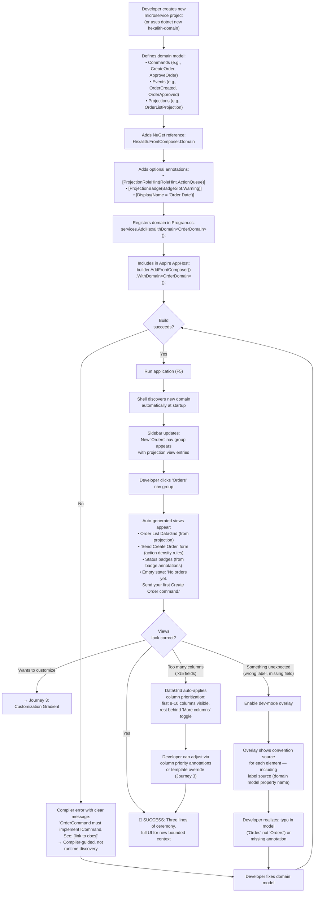
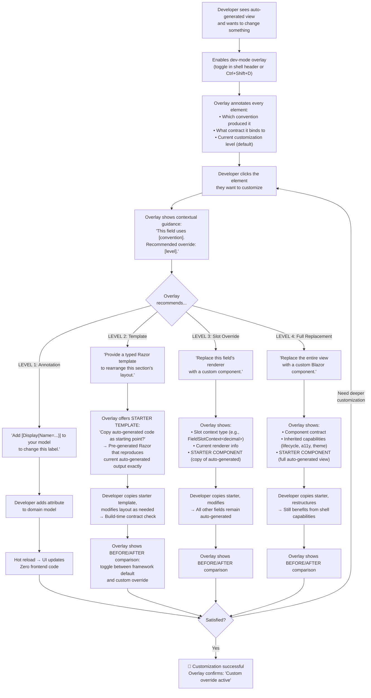
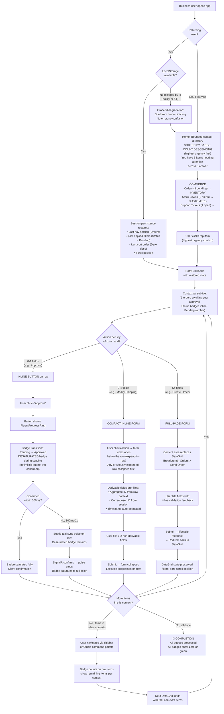
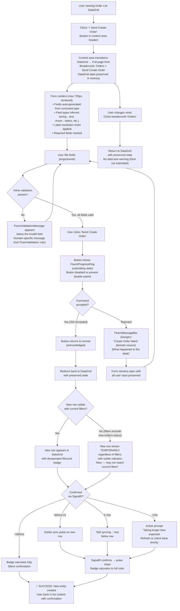

# User Journey Flows

### Journey 1: Developer First-Time Onboarding

**Goal:** From zero to a running composed application in under 5 minutes -- then bridge to the developer's own domain.

**Entry point:** Developer discovers FrontComposer (GitHub, NuGet, word of mouth) and decides to try it.

**Emotional arc:** Curious skepticism → Surprise → Empowerment → Ownership

**Sample domain choice:** The project template ships a **Task Tracker** domain -- not a counter. The Task Tracker demonstrates the full framework pattern at first render: a list with status badges, inline action buttons, a command form, the lifecycle loop, and meaningful empty states. A counter demonstrates arithmetic; a task tracker demonstrates a real application. (The counter remains available as a minimal example in documentation.)

```mermaid
flowchart TD
    A["Developer runs:<br/>dotnet new hexalith-frontcomposer"] --> B{Template<br/>scaffolds<br/>successfully?}
    B -->|Yes| C["Project opens in IDE<br/>Aspire AppHost + Task Tracker domain visible"]
    B -->|No| B_ERR["Clear error message:<br/>'Template not found. Run: dotnet new install<br/>Hexalith.FrontComposer.Templates'<br/>→ Actionable, not cryptic"]
    B_ERR --> A

    C --> D["Developer presses F5<br/>(or dotnet run)"]
    D --> E{Aspire<br/>orchestration<br/>succeeds?}
    E -->|Yes| F["Browser opens automatically<br/>Composed app with Task Tracker domain"]
    E -->|No| E_ERR["Aspire dashboard shows diagnostic:<br/>'DAPR sidecar failed to start.<br/>Ensure Docker is running.'<br/>→ Startup diagnostics, not silent failure"]
    E_ERR --> E_FIX["Developer fixes environment issue"]
    E_FIX --> D

    F --> G["FIRST AHA — Developer sees:<br/>• FluentLayout shell with header + sidebar<br/>• 'Tasks' nav group (auto-discovered)<br/>• Task List DataGrid with seeded sample tasks<br/>• Status badges: To Do (amber), Done (green)<br/>• Inline 'Complete' button on To Do rows<br/>• 'Send Create Task' form"]
    G --> H["Developer clicks 'Complete'<br/>on a sample task row"]
    H --> I["Button shows FluentProgressRing"]
    I --> J["Badge transitions:<br/>To Do (amber) → Done (green)"]
    J --> K["🎯 FIRST AHA MOMENT<br/>'This looks like a real app<br/>and I wrote zero frontend code.'"]

    K --> L["Developer creates a task via<br/>'Send Create Task' form"]
    L --> M["New row appears in DataGrid<br/>with lifecycle feedback"]

    M --> N["SECOND AHA — Developer modifies domain:<br/>Adds ReopenTask command<br/>(1 field: TaskId, derivable from row context)"]
    N --> O{Hot reload<br/>picks up change?}
    O -->|Yes| P["'Reopen' button appears automatically<br/>on Done rows — inline action<br/>per action density rules"]
    O -->|"No (attribute/generic<br/>type change)"| O_NOTE["Developer restarts app<br/>(Blazor hot reload limitation,<br/>not FrontComposer limitation)"]
    O_NOTE --> P
    P --> Q["🎯 SECOND AHA MOMENT<br/>'It adapts when I change the domain.<br/>My domain IS the UI.'"]

    Q --> R["BREAK IT TO TRUST IT —<br/>Developer removes CompleteTask command"]
    R --> S["UI updates: 'Complete' button<br/>disappears from all rows"]
    S --> T["🎯 TRUST MOMENT<br/>'The framework is truly live-composing<br/>from my domain model.'"]

    T --> U["BRIDGE TO REAL WORK —<br/>Developer scaffolds own domain:<br/>dotnet new hexalith-domain -n Orders"]
    U --> V["New project created with<br/>domain model skeleton +<br/>registration instructions"]
    V --> W["Developer defines their own<br/>commands, events, projections"]
    W --> X["Registers with 3 lines of ceremony<br/>→ Own bounded context appears in shell"]
    X --> Y["🎯 OWNERSHIP MOMENT<br/>'I can build my own app with this.'"]
```

**The three aha moments plus trust and ownership:**

| Moment | Trigger | Emotion | What it proves |
|--------|---------|---------|---------------|
| **First aha** | First render shows a real-looking app with badges, inline actions, lifecycle | Surprise → "This actually works" | The framework produces production-worthy UI from domain models |
| **Second aha** | Developer adds a command, UI adapts automatically | Empowerment → "My domain IS the UI" | The framework isn't scaffolding -- it's live composition |
| **Trust moment** | Developer removes a command, UI adapts correctly | Trust → "I can predict what it does" | The framework behaves predictably when broken, not just when followed |
| **Ownership moment** | Developer scaffolds and registers their own domain | Ownership → "I can build my own app" | The bridge from demo to real work is clear and short |

**Critical guardrails:**
- The Task Tracker template must include 3-5 seeded sample tasks across statuses so the first render is not an empty state
- Every failure mode produces an actionable diagnostic, not a silent failure or generic error
- Hot reload works for most domain model changes in Blazor Server mode, but **attribute additions and generic type changes may require a full restart** -- this is a Blazor limitation, not a FrontComposer limitation. The getting-started guide must note this explicitly so developers don't blame the framework
- Edge cases in the sample domain (completing an already-completed task) must be handled gracefully to demonstrate the framework's robustness
- The `dotnet new hexalith-domain` template must exist as the bridge from demo to real work -- without it, the onboarding ends at admiration

**Time budget:**

| Minute | Activity | Failure risk |
|--------|----------|-------------|
| 0:00-0:30 | `dotnet new` + project opens | Template not installed → clear install instruction |
| 0:30-2:00 | Explore project structure in IDE | Unfamiliar Aspire layout → README in project root explains structure |
| 2:00-3:00 | F5 → Aspire starts orchestration | Docker not running → Aspire diagnostic |
| 3:00-4:00 | Browser opens, first aha (real-looking app) | Nothing appears → startup diagnostic in Aspire dashboard |
| 4:00-5:00 | Interact, second aha + trust moment | Hot reload doesn't fire → note in docs: restart for attribute changes |
| 5:00-10:00 | Bridge to real work: scaffold own domain | `hexalith-domain` template missing → must ship with the framework |

---

### Journey 2: Developer Adding a New Microservice

**Goal:** Register a new domain and see its UI appear in the composed shell with zero frontend code.

**Entry point:** Developer has a working FrontComposer shell and wants to add a new bounded context.

**Emotional arc:** Confidence → Validation → Pride

**Three lines of ceremony (explicit and honest):**
1. `dotnet add package Hexalith.FrontComposer.Domain` (NuGet reference)
2. `services.AddHexalithDomain<OrderDomain>();` (registration in Program.cs)
3. `builder.AddFrontComposer().WithDomain<OrderDomain>();` (Aspire AppHost inclusion)

**Auto-generation scale limit:** When a projection has more than 15 fields, auto-generated DataGrids apply column prioritization: the first 8-10 columns (by declaration order, overridable by `[ColumnPriority]` annotation) are visible by default; the remainder are accessible via a "More columns" toggle. This prevents unwieldy 40-column DataGrids while keeping all data accessible. The overlay shows which columns are hidden and why.

**Label source transparency:** The dev-mode overlay shows the source of every label -- property name from the domain model, resource file lookup, or display name annotation. This makes it clear that a typo like "Ordes" is the developer's responsibility, not a framework bug. The overlay is the diagnostic tool, not documentation.

---

### Journey 3: Developer Customization Gradient

**Goal:** Override auto-generated UI at the appropriate granularity -- from a single annotation to a full component replacement.

**Entry point:** Developer sees an auto-generated view and wants to customize part of it.

**Emotional arc:** Curiosity → Discovery → Confidence → "The escape hatch works" → Trust

**Key design decision:** The dev-mode overlay is the **entry point** to customization, not documentation. The developer doesn't need to know the four levels upfront -- the overlay recommends the appropriate level based on what the developer clicks. The customization gradient is discoverable through the product itself.

**Customization decision guide (for documentation, not the primary discovery path):**

| Need | Level | Effort | What stays auto-generated | Business user feedback response time |
|------|-------|--------|--------------------------|-------------------------------------|
| Change a label, hint, or badge | Annotation | Seconds | Everything | "This label is confusing" → fixed in 30 seconds |
| Rearrange fields or sections | Template | Minutes | Field rendering, lifecycle, accessibility | "I need these fields grouped differently" → fixed in 15 minutes |
| Replace one field's input control | Slot | Minutes | All other fields, layout, lifecycle | "This field needs a special input" → fixed in 30 minutes |
| Completely different view | Full replacement | Hours | Lifecycle wrapper, shell integration, theming | "This whole screen needs to work differently" → fixed in hours |

**Critical principle:** Each level inherits everything from the level above. A slot override still gets lifecycle management, accessibility, and theming. A full replacement still gets the lifecycle wrapper and shell integration. Escaping one convention never means escaping all conventions.

**Starter templates eliminate the learning cliff:** The steepest part of the gradient is the jump from Level 1 (add an attribute) to Level 2 (write Razor). The overlay bridges this by offering a starter template -- a copy of the exact auto-generated Razor code that produces the current output. The developer starts from working code, not a blank file. They modify and register; they never write from scratch. This is especially critical for backend developers who are fluent in C# but unfamiliar with Razor component authoring.

**Before/after comparison builds confidence:** When a custom override is active, the overlay offers a toggle to compare the framework's default rendering with the developer's custom version. This answers the question "did I make it better or worse?" without requiring a git stash.

**Relationship payoff is explicit:** Each customization level maps directly to a business user feedback scenario. The developer can tell their business user: "That label change? Give me 30 seconds." The framework transforms the customization conversation from "it'll take a sprint" to "it'll take a minute."

---

### Journey 4: Business User Queue Processing

**Goal:** Process a queue of actionable items across one or more bounded contexts with minimal friction.

**Entry point:** Business user opens the application at the start of their work session.

**Emotional arc:** Orientation → Efficiency → Flow → Completion

**v1 scope: Single expand-in-row.** Only one row can be expanded at a time in v1. Multi-expand interacts with DataGrid virtualization (variable-height rows break constant-item-height assumptions) and multiplies scroll stabilization complexity. For comparison workflows, v2 will explore a selection-based comparison panel as a dedicated view mode rather than stacking expansions.

**Scroll stabilization during serial processing:**
- On expand: row's top edge pinned to current viewport position
- On collapse: scroll adjusts to keep next row at natural attention position
- User processes row 3 → collapse → row 4 appears exactly where expected
- No jumping, no disorientation during rapid queue processing

**Optimistic update visual distinction:** During the syncing window (between optimistic update and SignalR confirmation), status badges use a **subtly desaturated** version of their target color. On confirmation, the badge saturates to full color -- a 200ms transition that is perceptible but not alarming. This prevents deception: a user who sees a desaturated "Approved" badge knows the system is processing; a fully saturated badge means confirmed. The distinction is subtle enough to not disrupt flow but honest enough to not mislead.

**Home directory urgency ranking:** The v1 home page sorts bounded contexts by badge count descending. The user doesn't need to scan and mentally compare "Orders (3)" vs "Tickets (1)" -- the highest-urgency context is at the top. A global subtitle ("You have 6 items needing attention across 3 areas") provides instant orientation for new users and returning users whose session state was cleared.

**Navigation at scale:** At >15 bounded contexts, the sidebar becomes a reference/overview rather than the primary navigation tool. The command palette (Ctrl+K) with badge counts becomes the dominant navigation pattern. The sidebar serves users who need to browse; the command palette serves users who know where they're going.

**Session persistence graceful degradation:** Session persistence uses a compact JSON schema in LocalStorage. If LocalStorage is unavailable (cleared by IT policy, 5MB limit reached, private browsing), the app starts from the home directory without error. The user experiences a cold start, not a broken state.

**v2: Comparison workflows.** When business users need to compare items before acting, a dedicated comparison mode (select 2-3 rows → side-by-side panel) is more appropriate than multi-expand. This avoids the virtualization and scroll stabilization complications while providing a purpose-built comparison experience.

**"Warm system" acknowledgment:** In production with DAPR sidecar hops and event store persistence, the median confirmation time may sit in the 300ms-2s window, making the sync pulse the *normal* experience rather than the exception. The pulse is designed to feel like a natural system heartbeat, not an alarm. If deployment monitoring shows >70% of actions triggering the pulse, the 300ms threshold should be calibrated upward for that deployment to preserve the pulse's signal value.

---

### Journey 5: Business User Complex Command Submission

**Goal:** Submit a command with 5+ fields, with full lifecycle feedback and confident return to context.

**Entry point:** Business user is viewing a projection list and needs to create a new entity or perform a complex action.

**Emotional arc:** Intent → Focus → Confidence → Confirmation

**Key interaction principles:**
- Form never appears without projection context visible via breadcrumb
- All user input preserved on rejection -- never clear the form on error
- Redirect back to DataGrid after success automatically restores filters, sort, scroll
- Double-submission prevented by disabling button during submitting state

**Invisible new item prevention:** After a successful command submission that creates a new entity, the new row is shown in the DataGrid **regardless of current filters** if the entity's initial status doesn't match the active filter criteria. The row appears with a subtle "New -- may not match current filters" indicator that auto-dismisses after 10 seconds or on the next filter change. This prevents the "I just created it, where did it go?" confusion -- the most likely source of post-submission distrust.

---

### Journey 6: Business User Error & Recovery

**Goal:** Handle errors and degraded conditions without confusion, maintaining trust through honest progressive feedback.

**Entry point:** User is performing normal tasks when something goes wrong.

**Emotional arc:** Surprise → Understanding → Trust (never: Surprise → Panic → Distrust)

```mermaid
flowchart TD
    subgraph "Command Rejection"
        CR1["User submits command<br/>(e.g., Approve Order)"] --> CR2["Command rejected by domain:<br/>e.g., insufficient inventory"]
        CR2 --> CR3["FluentMessageBar (Danger):<br/>'Approval failed: insufficient inventory.<br/>The order has been returned to Pending.'"]
        CR3 --> CR4["Row badge reverts:<br/>desaturated 'Approved' → back to 'Pending'<br/>(full saturation, confirmed state)"]
        CR4 --> CR5["User understands what happened<br/>and what to do next"]
    end

    subgraph "Idempotent Outcome"
        IO1["User clicks 'Approve'<br/>on already-approved order<br/>(concurrent user scenario)"] --> IO2["Command rejected but<br/>intent was fulfilled"]
        IO2 --> IO3["FluentMessageBar (Info):<br/>'This order was already approved<br/>(by another user). No action needed.'"]
        IO3 --> IO4["Badge already shows 'Approved'<br/>(full saturation)<br/>Emotional: vindication, not rejection"]
    end

    subgraph "SignalR Disconnection"
        SD1["SignalR connection drops<br/>(network issue, server restart)"] --> SD2{Command<br/>in flight?}
        SD2 -->|"Yes, in syncing state"| SD3["Lifecycle escalates immediately:<br/>'Connection lost — unable to<br/>confirm sync status.'<br/>No infinite pulse"]
        SD2 -->|"No commands in flight"| SD4["Subtle indicator in header:<br/>'Reconnecting...'"]
        SD3 --> SD5["User sees honest status<br/>Can continue browsing cached data"]
        SD4 --> SD5
    end

    subgraph "Reconnection Reconciliation"
        RR1["SignalR reconnects"] --> RR2["Client re-queries visible projections<br/>via ETag-diffed requests"]
        RR2 --> RR3{Stale items<br/>detected?}
        RR3 -->|Yes| RR4["Batch-update all stale items<br/>with single animation sweep<br/>(not per-row flashes)"]
        RR3 -->|"No (data current)"| RR5["Silent reconnection<br/>No visual disruption"]
        RR4 --> RR6["Brief auto-dismissing toast:<br/>'Reconnected — data refreshed'<br/>(3 second auto-dismiss)"]
        RR5 --> RR7["Header indicator clears<br/>'Reconnecting...' disappears"]
        RR6 --> RR7
    end

    subgraph "Schema Evolution (Deployment)"
        SE1["Projection type changed<br/>after deployment"] --> SE2["Framework detects mismatch<br/>at startup"]
        SE2 --> SE3["Affected section shows:<br/>'This section is being updated.'<br/>Instead of empty/stale data"]
        SE3 --> SE4["ETag caches invalidated<br/>for affected projection type"]
        SE4 --> SE5["Diagnostic logged for developer<br/>Business user sees graceful degradation"]
    end
```

**Reconnection implementation:** On SignalR reconnect, the client issues ETag-conditioned queries for all currently visible projections. The server returns `304 Not Modified` for unchanged data (zero payload) and full responses for changed data. This creates a brief query burst on reconnect but requires no server-side change log. The UX implication: reconnection with no stale data is invisible (best case); reconnection with stale data shows a brief delay (ETag round-trips) before the batch sweep animation. For most reconnection scenarios (seconds-long gaps), the data will be unchanged and the reconnection will be silent.

**Concurrent access gap (v1 honest scoping):** v1 does not include real-time multi-user presence awareness. Two users can view and act on the same item simultaneously without knowing the other is present. The mitigation is the **idempotent outcome handler**: when concurrent actions create conflicts, the domain resolves them, and the UI communicates the outcome honestly ("already approved by another user"). v2 will explore presence indicators (subtle "also viewing: [user]" on expanded detail views) if adoption patterns reveal frequent concurrent access friction.

**Error message format (non-negotiable):** `[What failed]: [Why]. [What happened to the data].`

**Recovery design by regression trigger:**

| Error Scenario | Visible Feedback | Recovery Path | Target Emotion |
|---|---|---|---|
| Command rejection | Domain-specific FluentMessageBar + badge revert to confirmed state | User reads reason, adjusts approach, retries | Understanding → Trust |
| Idempotent outcome | Info MessageBar acknowledging intent fulfilled | No action needed -- intent was achieved | Vindication |
| SignalR disconnect during sync | Immediate escalation message, no infinite pulse | User continues with cached data, waits for reconnect | Patience |
| SignalR reconnect (stale data) | ETag diff → batch sweep + auto-dismiss toast | Automatic -- user sees brief refresh delay | Calm resolution |
| SignalR reconnect (no changes) | Silent -- header indicator clears | Automatic -- user notices nothing | Invisible |
| Stale data (ETag mismatch) | Projection refreshes silently via ETag check | Automatic -- user sees fresh data | Invisible |
| Schema evolution | "Section being updated" placeholder | Automatic after deployment completes | Graceful degradation |
| New entity invisible after creation | Temporary row shown regardless of filters | Automatic -- "New" indicator auto-dismisses | Confidence preserved |

---

### Journey Patterns

Across these six journeys, the following reusable patterns emerge:

**Navigation Patterns:**
- **Context-preserving navigation:** DataGrid state (filters, sort, scroll, expanded rows) is always preserved when navigating away and back -- whether via breadcrumb, sidebar, or command palette
- **Badge-driven priority routing:** Badge counts on nav items, in the command palette, and on the home directory guide users to where action is needed. Home sorts by badge count descending for instant urgency orientation
- **Session restoration with graceful degradation:** Returning users land where they left off. If LocalStorage is unavailable, the app starts from the home directory without error
- **Scale-aware navigation:** At >15 bounded contexts, the command palette becomes the primary navigation method; the sidebar becomes a reference overview

**Decision Patterns:**
- **Action density auto-determination:** The framework decides inline button vs. compact form vs. full-page form based on non-derivable field count -- the developer never configures this, and the business user gets the optimal interaction for each command
- **Derivable field pre-fill:** Context-available values (aggregate ID, current user, timestamps) are pre-filled automatically, reducing user input to only what the system cannot infer

**Discovery Patterns:**
- **Overlay-driven customization:** The dev-mode overlay is the primary entry point for customization, not documentation. It recommends the appropriate customization level, offers starter templates as copy-and-modify starting points, and shows before/after comparisons when overrides are active
- **Three-aha onboarding:** First aha (real-looking app from domain model alone) establishes credibility; second aha (UI adapts when domain changes) establishes empowerment; trust moment (UI adapts when domain is broken) establishes predictability; bridge to real work (scaffold own domain) establishes ownership

**Feedback Patterns:**
- **Progressive lifecycle visibility:** Nothing (<300ms) → pulse (300ms-2s) → text (2-10s) → action prompt (>10s). Never jump from "fine" to "broken." Sync pulse threshold is calibratable per deployment if median confirmation times sit persistently in the pulse window
- **Desaturated optimistic updates:** Optimistic badge transitions use subtly desaturated color during syncing, saturating fully on confirmation. Honest without being alarming
- **Domain-specific error language:** Every error names the entity, the reason, and the data state. No generic "Action failed" messages
- **Optimistic update with honest rollback:** Show the expected outcome immediately with visual distinction; if wrong, revert with explanation

**Recovery Patterns:**
- **Immediate escalation on connection loss:** Never leave a lifecycle pulse running when SignalR is disconnected -- escalate immediately with honest status
- **ETag-diffed reconciliation on reconnect:** Re-query visible projections with ETag conditions; silent when nothing changed, batch sweep when data is stale. Brief auto-dismissing toast, not celebration
- **Input preservation on rejection:** Command forms retain all user input when a command is rejected. The user fixes and retries without re-entering data
- **Invisible new item prevention:** After creating a new entity, show it in the DataGrid regardless of current filters with a temporary "New" indicator

### Flow Optimization Principles

1. **Minimize context switches, not clicks.** Three clicks within the same visual context (expand → edit → submit inline) is less friction than two clicks that navigate to a different page. Action density rules enforce this.

2. **Pre-fill everything derivable.** The framework knows the aggregate ID from the row context, the user ID from the session, the timestamp from the system. Only ask the user for what the system genuinely cannot infer.

3. **Progressive feedback, never silent.** Every user action produces a visible response within 300ms. The system communicates its state honestly at every moment -- even "I'm working on it" is better than silence. Optimistic updates are visually distinct from confirmed states.

4. **Error recovery preserves intent.** When a command fails, the user's input is preserved and the error explains what happened in domain language. The user adjusts and retries; they never start over.

5. **Teach through the product, not through docs.** The dev-mode overlay is the customization entry point. Starter templates eliminate the learning cliff. Empty states explain next actions. Compiler errors guide setup. The framework is self-documenting at every layer.

6. **Session persistence is a v1 requirement with graceful degradation.** A business user who processes 50 items across 3 bounded contexts daily cannot afford to re-apply filters and re-navigate every session. When LocalStorage is unavailable, the app starts from the home directory without error.

7. **Compiler-guided for developers, affordance-guided for business users.** Developers get type-safe contracts, build-time warnings, starter templates, and IntelliSense. Business users get visible affordances, domain labels, urgency-sorted home pages, and empty states with clear next actions. Two audiences, one principle: never leave either guessing.

8. **Calibrate thresholds per deployment.** The 300ms sync pulse threshold is a sensible default but may need adjustment in production environments where DAPR sidecar hops and event store persistence push median confirmation times higher. Framework configuration should expose this as a deployment-level setting.

